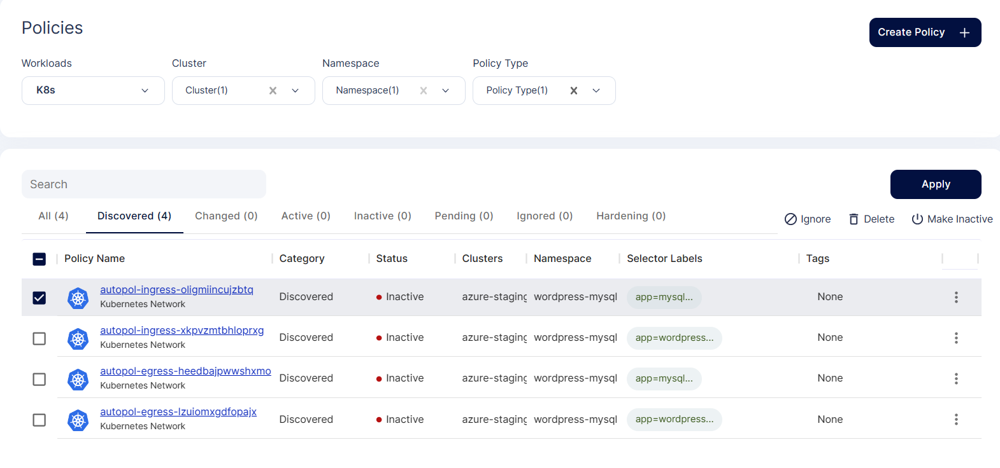
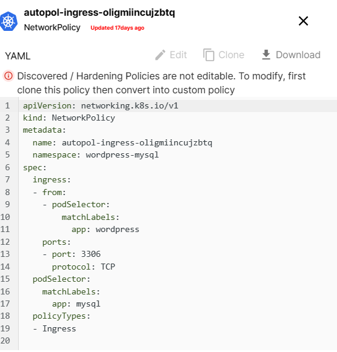
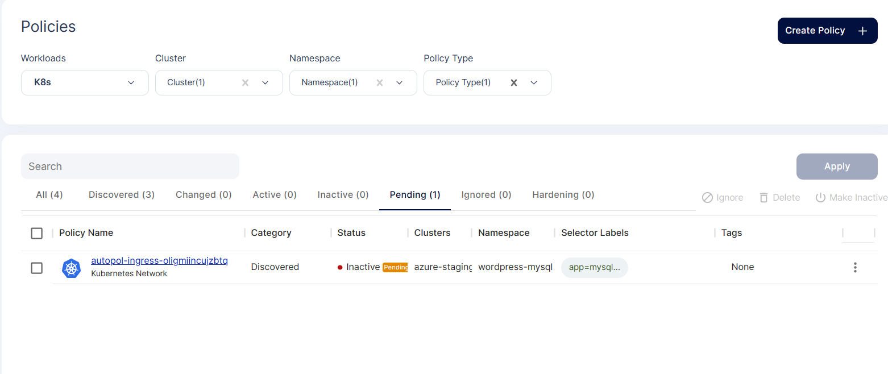
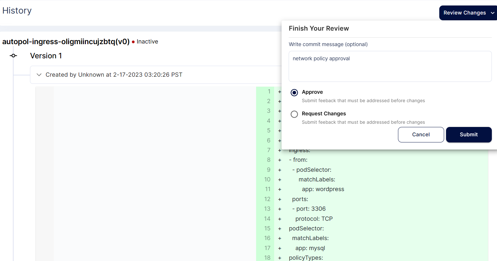
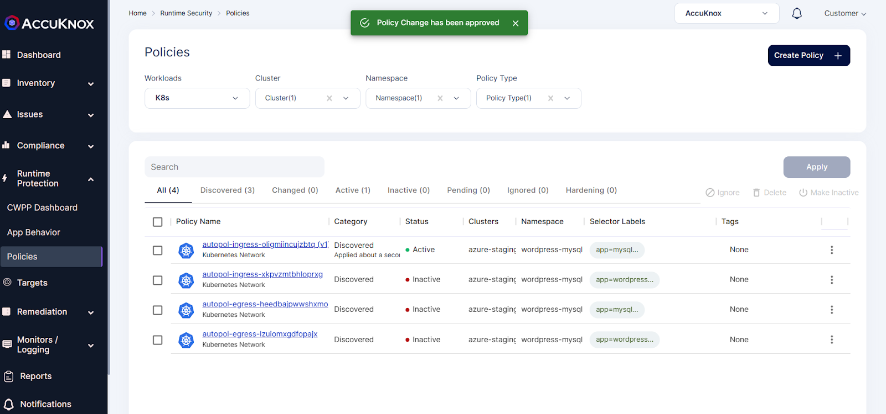

# Network Segmentation
Identity-aware Policy Discovery and microsegmentation enables security teams such as SOC, DevSecOps teams to logically seggregate workloads into distinct security segments and have more granular control over those segments. For example segregation based on application tiers, compliance etc.

Network segmentation is a way to have protection in east-west traffic control to prevent lateral movement within a cluster as by default, Kubernetes is a open system. AccuKnox’s CWPP provides micro-segmentation at the lowest possible granularity level which is also a smallest execution unit in Kubernetes i.e. Pods. We will help you to identify process execution request emanating from a Pod, network connections its trying to make internally and externally as well as files-system its accessing. Based on the behavior of a particular pod and restricting the behavior to the expected flow of process/events/traffic, one can develop a least permissive security posture from creating a whitelisting policies and auditing/denying everything else.

Lets understand this with an use-case example - **Network Segmentation for sample app - Wordpress-mysql**

1.Review the auto discovered network policy generated for the wordpress-mysql application

2.Select the below network policy from All Policies screen

3.Applying the network policy

4.Select the network policy you want apply from the Policies screen

5.After applying the policy, it goes into pending state

6.To make it active the user needs to approve

7.After approval the policy goes into active state

- - -
[SCHEDULE DEMO](https://www.accuknox.com/contact-us){ .md-button .md-button--primary }
