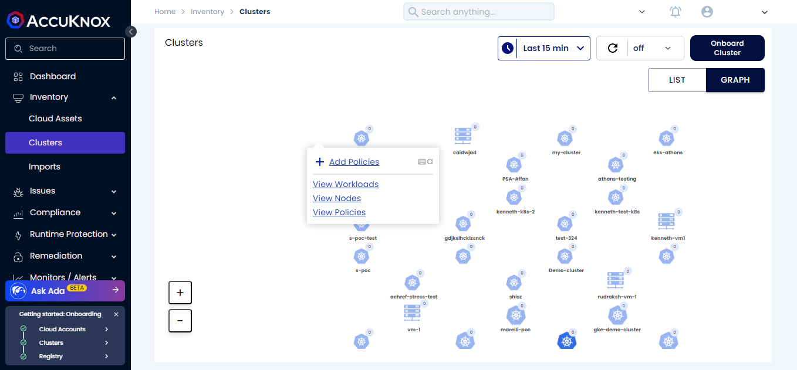
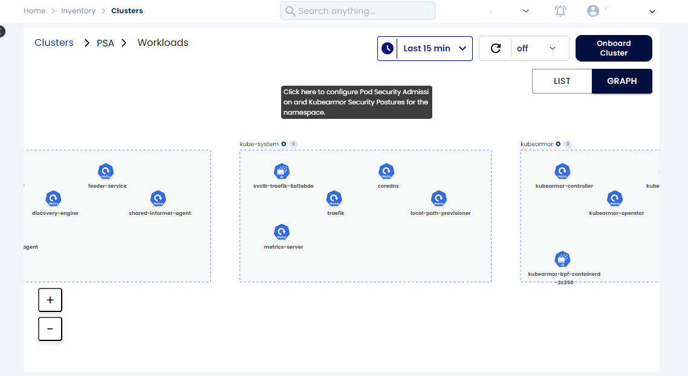
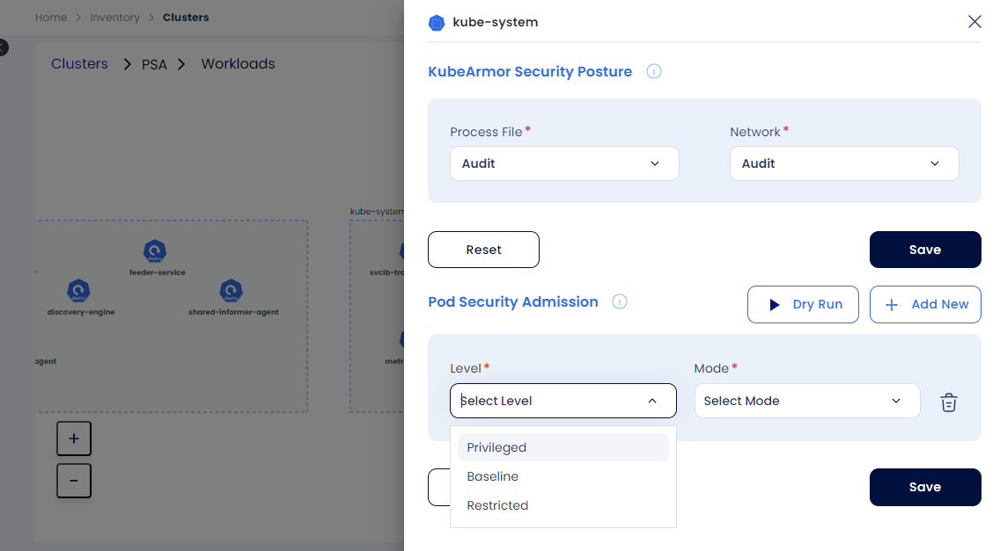
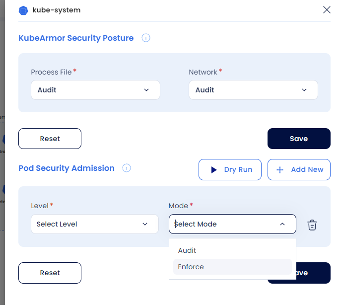
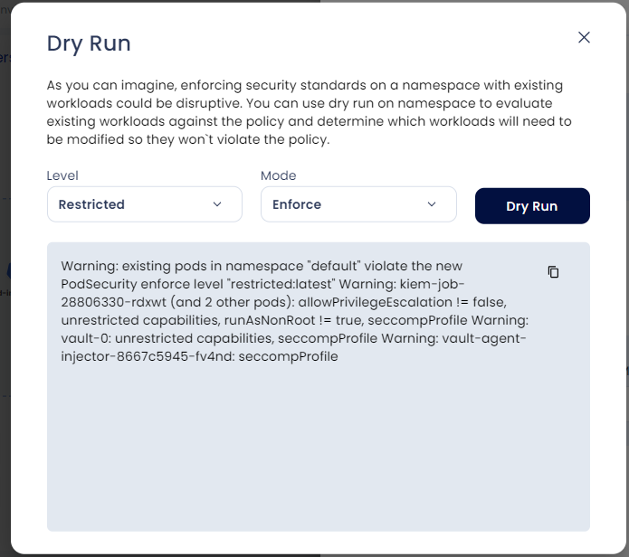

# Pod Security Admission Controller

Pod Security Admission (PSA) enforces security standards on a Pod's Security Context and related fields based on three levels defined by the Pod Security Standards:

1. **Privileged**: Unrestricted policy, allows known privilege escalations.
2. **Baseline**: Minimally restrictive policy, allows default (minimally specified) Pod configuration.
3. **Restricted**: Heavily restricted policy, adhering to current Pod hardening best practices.

PSA can be enabled in two modes:

1. **Enforce**: Policy violations will cause the pod to be rejected.
2. **Audit**: Policy violations will trigger an alert but still allow the pod.

## Enabling Pod Security Admission (PSA)

1. Navigate to **Inventory → Clusters** and click on the cluster, then select **View Workloads**.

   

2. Click on the **cog icon** next to the namespace.

   

3. Select the desired **PSA Level** and click **Save**.

   

4. Select the desired **Mode** for PSA.

   

5. If using **Enforce** mode, click on **Dry Run** to preview potential effects before applying.

   

The **Dry Run** mode allows users to confirm potential effects of the PSA. Once reviewed and acceptable, click **Save** to apply the PSA.

## PSA Protection Example

After setting PSA to enforce the **restricted** level, attempt to run a privileged Pod in the cluster:

```bash
root@demo:~# kubectl run nginx --image=nginx
```

An error will be returned as shown below:

```bash
Error from server (Forbidden): pods "nginx" is forbidden: violates PodSecurity "restricted:latest": allowPrivilegeEscalation != false (container "nginx" must set securityContext.allowPrivilegeEscalation=false), unrestricted capabilities (container "nginx" must set securityContext.capabilities.drop=["ALL"]), runAsNonRoot != true (pod or container "nginx" must set securityContext.runAsNonRoot=true), seccompProfile (pod or container "nginx" must set securityContext.seccompProfile.type to "RuntimeDefault" or "Localhost")
```

Since the **restricted** PSA label was applied to the namespace, attempting to create a pod with excessive privileges results in this error, successfully preventing the privileged pod from running.