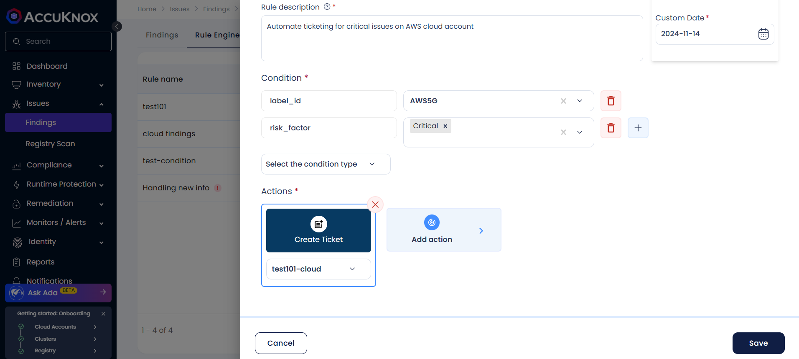

# Automated Ticket Creation using Rules Engine

The Rules Engine allows users to customize and automate ticket creation by selecting the data type, defining the criticality, and configuring specific ticket settings. This ensures that customized tickets are created whenever the selected criteria is met, providing more control over the ticketing process.

In this section we can find the steps to create a ticket using Rule Engine in the AccuKnox platform.

## Prerequisites

A ticketing platform integrated to AccuKnox with a ticketing configuration created

**Note:** If the ticketing platform is not integrated yet, please follow the steps specified in the [Ticketing section](https://help.accuknox.com/integrations/jira-cloud/ "https://help.accuknox.com/integrations/jira-cloud/") for the platform you are using.

## Steps to set up Automated Ticket Creation

**Step 1:** Log in to the AccuKnox platform and navigate to Issues → Findings

**Step 2:** Hover over to **Rule Engine** in Findings (Issues>Findings>Rule Engine)

**Step 3:** Click on **Create Rule** to create an automated rule.

**Step 4:** Provide the necessary details

- **Name**: A name to uniquely identify the rule

- **Description**: A few words to help understand the functionality of the rule

- **Condition**: The criteria to be checked against findings to apply the rule. Multiple conditions can be specified in a single rule and all the conditions must match for the rule to be applicable.

- **Expiration**: The time when this rule will become inactive, can be set to custom date. The rule will need to be updated after expiration.

**Step 5:** Click on **Add Action.** In the Action tab, select **Create Ticket** and close.

**Step 6:** After confirming the action, select the ticket configuration to be used to create the ticket from the dropdown.

**Step 7:** The Save button is enabled after all the fields have been filled. Click on Save

The rule has been created successfully and will create tickets for all findings that match the condition.
