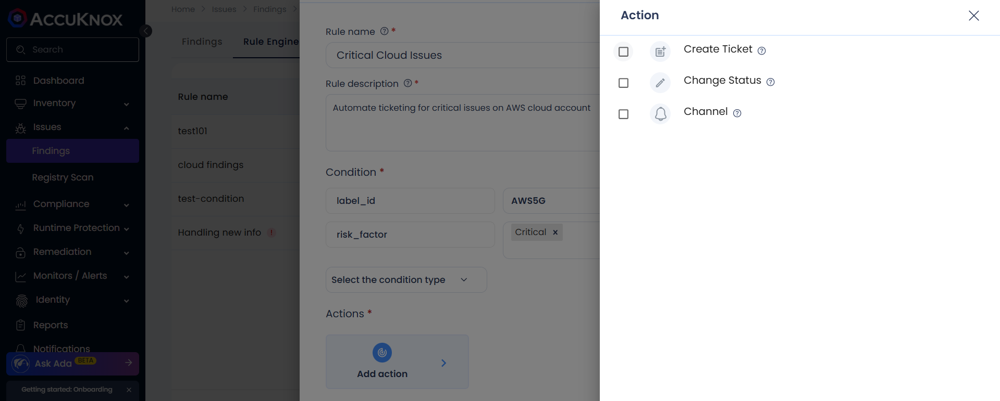

# Automated Ticket Creation using Rules Engine

The Rules Engine allows users to customize and automate ticket creation by selecting the data type, defining the criticality, and configuring specific ticket settings. This ensures that tickets are created based on the selected criteria, providing more control over the ticketing process.

In this section we can find the steps to create a ticket using Rule Engine in the AccuKnox SaaS platform:

**Step 1:** Log in to [app.demo.accuknox.com](https://app.demo.accuknox.com/ "https://app.demo.accuknox.com") and navigate to the CNAPP dashboard.

**Step 2:** Hover over to **Rule Engine** in Findings (Issues>Findings>Rule Engine)

**Step 3:** Click on **Create Rule** to create an automated rule.

**Step 4:** Provide the necessary details, including the rule name, rule description, condition type (true or false), and click on "Action" to add the specific action.\
Clicking on the condition type will trigger the action that is required, it is crucial to to select the condition type as per the rule created and the description of it.

**Step 5:** Click on **Create Ticket** to initiate creation of ticket when a finding with a matching the is found.

**Step 6:** After finalizing the condition, select the ticketing template from the drop down and save it to execute.

**Step 7:** User needs to create the ticketing configuration via [Fresh Service Integration](https://help.accuknox.com/integrations/freshservice-cspm/ "https://help.accuknox.com/integrations/freshservice-cspm/"), which helps in automating the process of generating Freshservice "Problem alerts" with the existing security workflow.

## Integration of Freshservice

### **a. Prerequisites**

- You need a Company domain , Email & API key (secret) for this integration.

- You can find your API key in profile settings in the right side column.

### **b. Steps to Integrate:**

- Go to Channel Integration → CSPM.

- Click on add connector and select Freshservice

Make sure to follow the link [Freshservice](https://help.accuknox.com/integrations/freshservice-cspm/) to configure the fresh service integration.

**Step 8:** To view the ticketing integrations, hover over to CSPM in integrations and select the respective integration.**(Home>Settings>Integrations>CSPM)**

**Step 9:** Click on the desired integration, fill in the required details, and hit **add configuration** to create the ticket.

**Step 10:** Review the ticket configuration and save the details. The ticket will be created automatically, and the rule will be applied.

