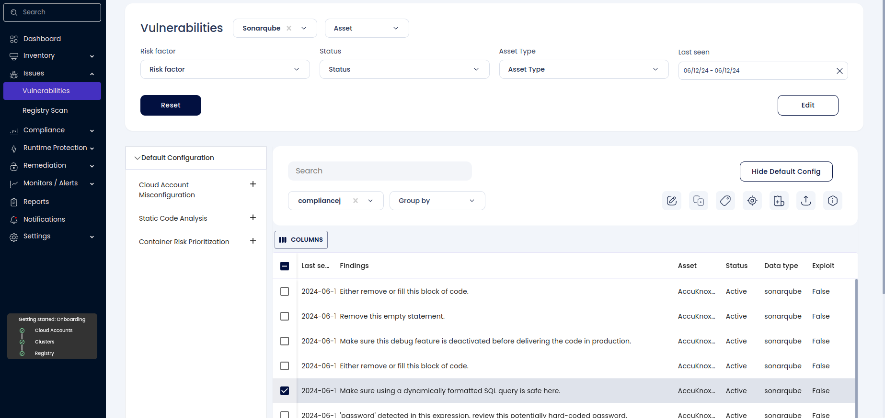
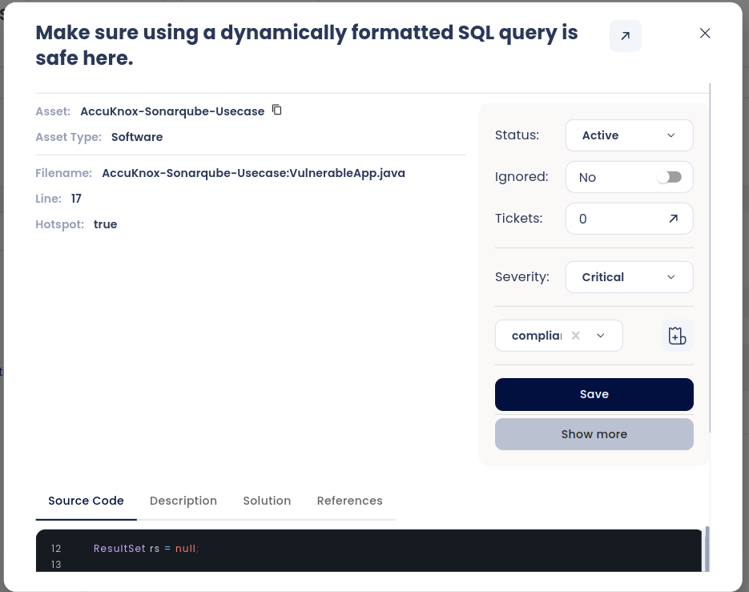
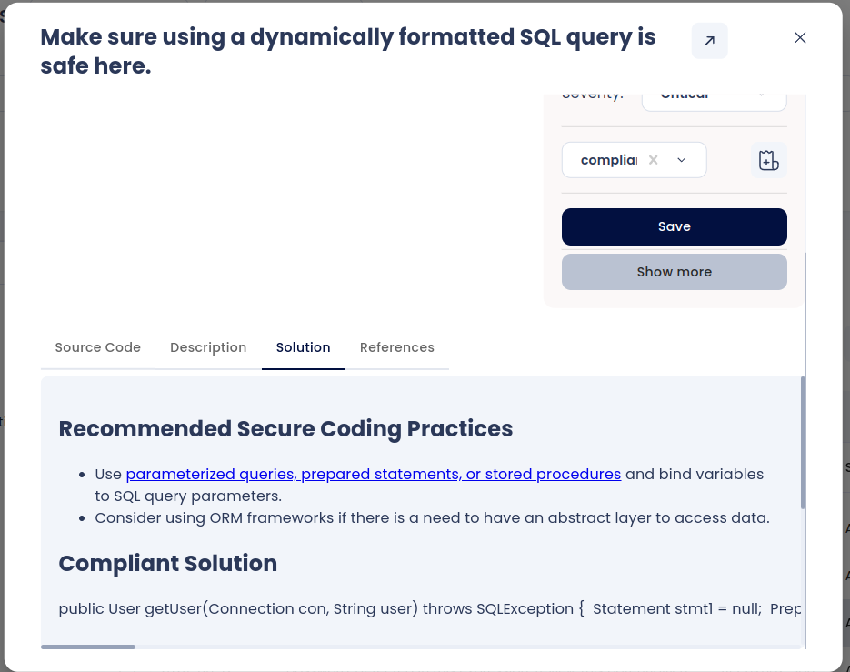

# SQL Injection Scanning with SAST Scan

## Introduction

SQL Injection is a common security vulnerability found in web applications. It occurs when an attacker can manipulate a SQL query by injecting malicious input into the query string. This use case demonstrates how to identify and fix an SQL Injection vulnerability using SonarQube integrated with GitHub Actions and pushing the results to AccuKnox SaaS.

## Step-by-Step Guide

Example Vulnerable Code (```VulnerableApp.java```) for Demonstration:

```java
import java.sql.Connection;
import java.sql.DriverManager;
import java.sql.ResultSet;
import java.sql.SQLException;
import java.sql.Statement;
public class VulnerableApp {
    public static void main(String[] args) {
        String user = args[0]; // User input should be sanitized
        Connection conn = null;
        Statement stmt = null;
        ResultSet rs = null;
        try {
            conn = DriverManager.getConnection("jdbc:mysql://localhost/test?user=root&password=root");
            stmt = conn.createStatement();
            rs = stmt.executeQuery("SELECT * FROM users WHERE username = '" + user + "'"); // Vulnerable to SQL Injection
            while (rs.next()) {
                System.out.println("User: " + rs.getString("username"));
            }
        } catch (SQLException e) {
            e.printStackTrace();
        } finally {
            try { if (rs != null) rs.close(); } catch (Exception e) {};
            try { if (stmt != null) stmt.close(); } catch (Exception e) {};
            try { if (conn != null) conn.close(); } catch (Exception e) {};
        }
    }
}
```

**Step 1**: Configure SonarQube and GitHub Actions

1. Create a ```sonar-project.properties``` File:

    - Place this file in the root of your GitHub repository.

```sh
# Required metadata
sonar.projectKey=github_sonar_example
sonar.projectName=GitHub Sonar Example
sonar.projectVersion=1.0
# Path to source directories (required)
sonar.sources=.
# Encoding of the source files
sonar.sourceEncoding=UTF-8
# Additional settings
sonar.host.url=<http://your_sonarqube_server:9000>
sonar.login=your_project_token
```

2.Add SonarQube and AccuKnox Tokens to GitHub Secrets:

- Navigate to your GitHub repository > Settings > Secrets > Actions.

- Add the following secrets:

  - ```SONAR_TOKEN```: Your SonarQube project token.

  - ```SQ_URL```: Your SonarQube URL.

  - ```AK_URL```: The AccuKnox URL (```cspm.accuknox.com```).

  - ```TENANT_ID```: Your AccuKnox Tenant ID.

  - ```AK_TOK```: The artifact token received from AccuKnox management plane.

3.Create GitHub Actions Workflow:

- Add a new file ```.github/workflows/sonarqube.yml```:



```yaml
name: SonarQube and AccuKnox SAST Integration
on:
  push:
    branches:
      - main
  pull_request:
    branches:
      - main
jobs:
  sonarqube_sast:
    runs-on: ubuntu-latest
    steps:
      - uses: actions/checkout@v4
        with:
          fetch-depth: 0  # Shallow clones should be disabled for a better relevancy of analysis
      - uses: sonarsource/sonarqube-scan-action@master
        env:
          SONAR_TOKEN: ${{ secrets.SONAR_TOKEN }}
          SONAR_HOST_URL: ${{ secrets.SQ_URL }}
      - name: Run AccuKnox SAST job
        env:
          SQ_URL: ${{ secrets.SQ_URL }}
          SQ_AUTH_TOKEN: ${{ secrets.SONAR_TOKEN }}
        run: |
          docker run --rm \
            -e SQ_URL=${{ secrets.SQ_URL }} \
            -e SQ_AUTH_TOKEN=${{ secrets.SONAR_TOKEN }} \
            -e REPORT_PATH=/app/data/ \
            -e SQ_PROJECTS="^github_sonar_example$" \
            -v $PWD:/app/data/ \
            accuknox/sastjob:latest
      - name: Upload SAST reports
        env:
          AK_URL: ${{ secrets.AK_URL }}
          TENANT_ID: ${{ secrets.TENANT_ID }}
          AK_TOK: ${{ secrets.AK_TOK }}
        run: |
          cd ${GITHUB_WORKSPACE}
          for file in `ls -1 SQ-*.json`; do
            curl --location --request POST "<https://$AK_URL/api/v1/artifact/?tenant_id=$TENANT_ID&data_type=SQ&save_to_s3=false>" \
              --header "Tenant-Id: $TENANT_ID" \
              --header "Authorization: Bearer $AK_TOK" \
              --form "file=@\"$file\""
          done
```



**Step 2**: Push Changes and Trigger Scan

- Commit the ```sonar-project.properties```, ```.github/workflows/sonarqube.yml```, and ```VulnerableApp.java``` files to your repository and push the changes to GitHub.

- The workflow will be triggered automatically on push or pull request events.

**Step 3**: Review the Results in AccuKnox SaaS

- After the workflow completes, navigate to the AccuKnox SaaS dashboard.

- Go to **Issues** > **Vulnerabilities** and select **Data Type** as **SonarQube** to view the identified vulnerabilities, including the SQL Injection vulnerability in ```VulnerableApp.java```.



- Click on the Vulnerability to view more details



**Step 4**: Fix the Vulnerability

To fix the SQL Injection vulnerability, use prepared statements instead of concatenating user input directly into the SQL query as seen in the Solutions tab.



Secure Java Code Example (To be saved as ```SecureApp.java```)

```java
import java.sql.Connection;
import java.sql.DriverManager;
import java.sql.PreparedStatement;
import java.sql.ResultSet;
import java.sql.SQLException;
public class SecureApp {
    public static void main(String[] args) {
        String user = args[0]; // User input should be sanitized
        Connection conn = null;
        PreparedStatement pstmt = null;
        ResultSet rs = null;
        try {
            conn = DriverManager.getConnection("jdbc:mysql://localhost/test?user=root&password=root");
            String query = "SELECT * FROM users WHERE username = ?";
            pstmt = conn.prepareStatement(query);
            pstmt.setString(1, user);
            rs = pstmt.executeQuery(); // Secure against SQL Injection
            while (rs.next()) {
                System.out.println("User: " + rs.getString("username"));
            }
        } catch (SQLException e) {
            e.printStackTrace();
        } finally {
            try { if (rs != null) rs.close(); } catch (Exception e) {};
            try { if (pstmt != null) pstmt.close(); } catch (Exception e) {};
            try { if (conn != null) conn.close(); } catch (Exception e) {};
        }
    }
}
```

**Step 5**: Re-Analyze the Code

1. **Update the Code**: Replace ```VulnerableApp.java``` with the secure version ```SecureApp.java```.

2. **Run SonarQube Scanner Again**: Push the updated code to the repository. GitHub Actions will automatically trigger the SonarQube scan and AccuKnox SAST job.

**Step 6**: Review the Updated Results

- After the workflow completes, navigate to the AccuKnox SaaS dashboard.

- Go to **Issues** > **Vulnerabilities** and select **Data Type** as **SonarQube** to verify that the SQL Injection vulnerability has been resolved.

## Conclusion

By following these steps, you can leverage SonarQube integrated with GitHub Actions and AccuKnox SaaS to identify and fix security vulnerabilities in your codebase. This process ensures that your code maintains high quality and security standards, and any potential vulnerabilities are promptly addressed.

