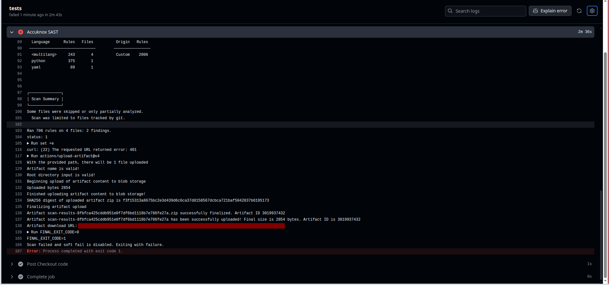
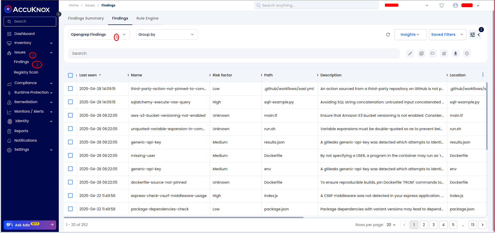
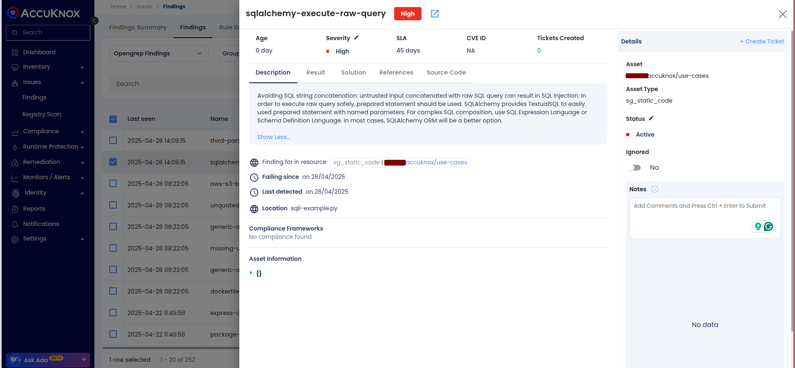
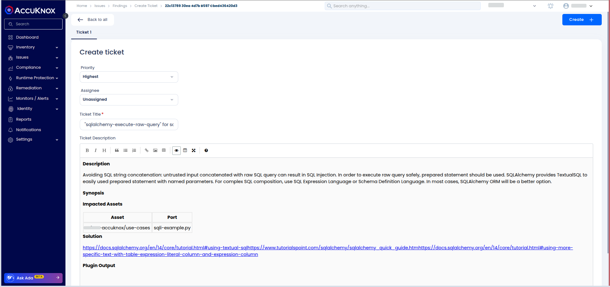

# SAST with Opengrep and AccuKnox: Detecting SQL Injection Vulnerabilities

In this guide, we'll walk through integrating **Opengrep** for Static Application Security Testing (SAST) and **AccuKnox** for continuous security monitoring of Python code to detect **SQL Injection** vulnerabilities in your CI/CD pipeline.

🔗 **Check it out on GitHub Marketplace:** [**AccuKnox-Opengrep SAST Scanner**](https://github.com/marketplace/actions/accuknox-sast-opengrep "https://github.com/marketplace/actions/accuknox-sast-opengrep")

## Scenario

You are maintaining a Python application, and your CI/CD pipeline automatically deploys changes to your application. You want to ensure that your code is checked for security vulnerabilities, especially **SQL Injection** attacks, which can compromise your application and data.

The solution is to integrate **Opengrep** for scanning the Python code in your CI/CD pipeline and forward the results to **AccuKnox** for further analysis and issue tracking.

## Objective

Integrate **Opengrep** into your CI/CD pipeline to detect **SQL Injection** vulnerabilities in Python code. Forward the scan results to **AccuKnox** to help track and manage security issues.

## Tools

- **AccuKnox** -- CNAPP platform

- **GitHub Actions** -- CI/CD platform (similar to GitLab CI, Jenkins, etc.)

## Steps

### 1. Vulnerable Python Code Example

This Python code contains a **SQL Injection** vulnerability where user input is concatenated directly into a SQL query, allowing an attacker to manipulate the query.

```python
import sqlite3

def get_user_data(username):
    conn = sqlite3.connect('database.db')
    cursor = conn.cursor()

    # VULNERABLE SQL QUERY: User input is directly injected into the query.
    query = "SELECT * FROM users WHERE username = '" + username + "';"

    cursor.execute(query)
    user_data = cursor.fetchall()

    conn.close()

    return user_data

# Example of how the vulnerable function could be called
username_input = input("Enter your username: ")
print(get_user_data(username_input))

```

**Explanation**:

- The code directly injects user input into the SQL query, which opens the door for **SQL Injection** attacks.

- An attacker can provide input like `" OR '1'='1"` to manipulate the query and gain unauthorized access to data.

### 2. GitHub Actions Workflow Integration

Create a GitHub Actions workflow at `.github/workflows/sast.yml`:



```yaml
name: AccuKnox SAST Scan Workflow

on:
  push:
    branches:
      - sast

jobs:
  tests:
    runs-on: ubuntu-latest
    steps:
      - name: Checkout code
        uses: actions/checkout@main

      - name: Accuknox SAST
        uses: accuknox/sast-scan-opengrep-action@1.0.0
        with:
          accuknox_token: ${{ secrets.ACCUKNOX_TOKEN }}
          accuknox_endpoint: ${{ secrets.ACCUKNOX_ENDPOINT }}
          accuknox_tenant: ${{ secrets.ACCUKNOX_TENANT_ID }}
          accuknox_label: ${{ secrets.ACCUKNOX_LABEL }}
          input_soft_fail: false
```



- Triggers on **push** or **pull request** to the `main` branch.

- Runs the **Opengrep** scan on the code.

- Uploads the results to AccuKnox for further analysis.

### 4. Before AccuKnox Integration

Without **AccuKnox** in your pipeline, any push containing the above vulnerable Python code would be deployed without any security checks, potentially exposing your application to **SQL Injection** attacks.

### 5. After AccuKnox Integration

Once the **AccuKnox** scan is integrated:

- Every push or pull request to `main` triggers the scan.

- **SQL Injection** vulnerabilities will be detected and flagged.

- Results are uploaded to **AccuKnox** for detailed analysis and remediation tracking.



#### Viewing the Results in AccuKnox

- Log into **AccuKnox** and navigate to **Issues → Findings**.

- Filter by **Data Type: Opengrep SAST Scan** and search for the findings related to your repository.



- Detailed information will be provided, including the severity of the vulnerability and suggested remediation.



### 6. Remediating the Vulnerability

#### 6.1 Create a Ticket

- You can **create a ticket directly from AccuKnox Findings** by integrating your organization's ticketing system (**Jira**, **ServiceNow**, etc.) with AccuKnox.

- This ensures vulnerabilities detected during scans are **automatically or manually ticketed** for tracking and resolution.

- Refer to the integration guide for setup:
  🔗 [**AccuKnox Jira Cloud Integration Guide**](https://help.accuknox.com/integrations/jira-cloud/ "https://help.accuknox.com/integrations/jira-cloud/")



#### 6.2 Fix the Code

- After fixing the vulnerability, rerun the pipeline.

- Navigate to the AccuKnox dashboard and verify that the vulnerability has been resolved.

## Conclusion

By integrating **Opengrep** for SAST scans and forwarding the results to **AccuKnox**, you can automate the detection and resolution of security vulnerabilities like **SQL Injection** in your Python codebase. This setup ensures that potential security risks are caught early in the CI/CD pipeline, providing a robust defense for your application.
