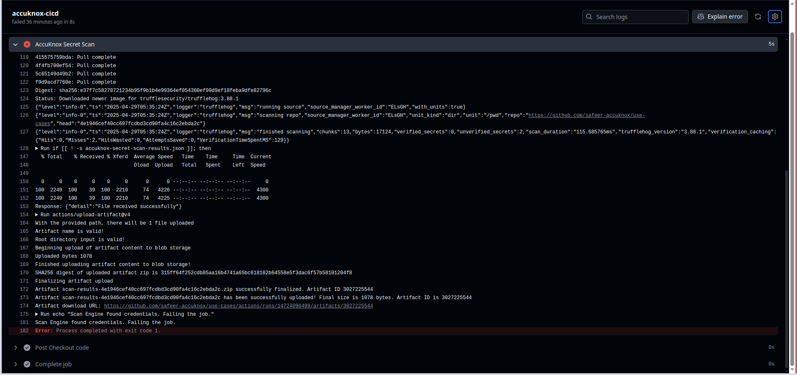
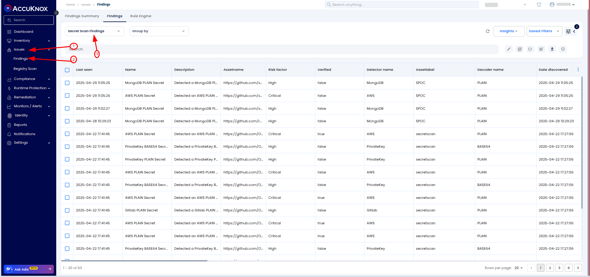
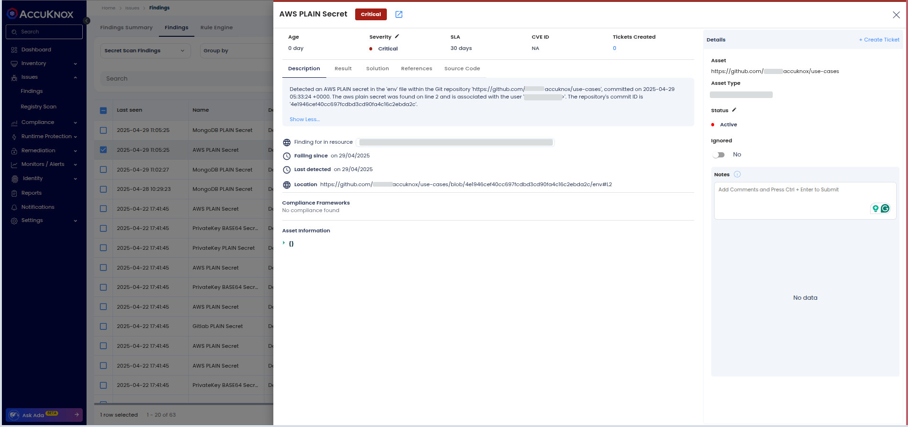
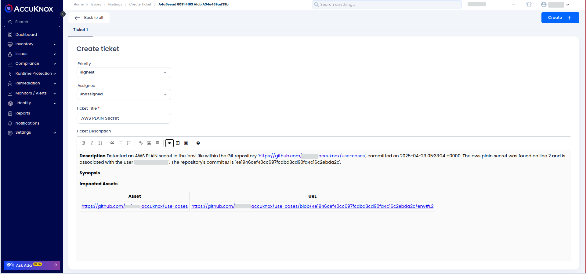

# How to Prevent AWS Key Leaks: Secret Scanning in CI/CD Pipeline

Exposing credentials in public repositories is not a theoretical risk --- it causes real financial damage.
This guide shows how to integrate **AccuKnox Secret Scanning** into GitHub Actions to **proactively catch secrets before they leak**, using a real AWS breach incident as a case study.

🔗 **Check it out on GitHub Marketplace:** [**AccuKnox Secret Scanner**](https://github.com/marketplace/actions/accuknox-secret-scan "https://github.com/marketplace/actions/accuknox-secret-scan")

## Scenario: AWS S3 Keys Committed to GitHub → $45,000 Loss

An engineering team mistakenly committed AWS S3 access keys into their GitHub repository.
Although the repository was private initially, a misconfigured settings change made it public for several hours.
In that window, attackers found the keys, deployed unauthorized EC2 instances for crypto mining, and ran up **$45,000** in AWS charges.

**Key mistakes:**

- No automated secret scanning in CI/CD.

- Manual code review missed the committed keys.

- Delay in detecting leaked secrets.

## Objective: Prevent Secret Leaks

The goal is to **automatically detect** and **prevent** the exposure of sensitive data (e.g., AWS keys) in your codebase by integrating **AccuKnox Secret Scanning** into your CI/CD pipeline. This ensures secrets are caught early, reducing risk and preventing potential exploitation.

## Steps Overview

- **Manual Setup: Detect Secrets in Code**

- **Integrate AccuKnox Secret scanning into** the **CI/CD Pipeline**

- **Before vs After Integration**

- **Viewing Findings: Analyze Results**

- **Remediation Workflow**

### 1. Why Manual Secret Detection Fails

Manual methods (grep commands, peer reviews) are unreliable at scale:

- Developers can overlook sensitive patterns.

- Reviewers focus on functionality, not hidden secrets.

- Fast development cycles make mistakes inevitable.

**Automation is the only scalable defense.**

### 2. GitHub Actions Integration: AccuKnox Secret Scanning Setup

We will configure GitHub Actions to automatically scan for secrets on every code change.

Create a GitHub Actions workflow at `.github/workflows/secret.yml`:



```yaml
name: AccuKnox Secret Scan Workflow

on:
  push:
    branches:
      - secret

jobs:
  accuknox-cicd:
    runs-on: ubuntu-latest
    steps:
      - name: Checkout code
        uses: actions/checkout@main

      - name: AccuKnox Secret Scan
        uses: accuknox/secret-scan-action@v1.0.1
        with:
          token: ${{ secrets.ACCUKNOX_TOKEN }}
          tenant_id: ${{ secrets.ACCUKNOX_TENANT_ID }}
          label: ${{ secrets.ACCUKNOX_ENDPOINT }}
          endpoint: ${{ secrets.ACCUKNOX_LABEL }}
          fail: true
          use_extended_ruleset: false
```



#### How It Works

- **Checkout:** Clones the full repo (including history) to detect secrets in past commits.

- **Scan:** Runs AccuKnox Secret Scanning using your tenant's API token and endpoint.

- **Fail:** If secrets are found, the build fails immediately to block unsafe merges.

**Result:** Developers get immediate feedback before secrets hit production.

### 3. Risks Without Integration

If you skip secret scanning:

- Leaked credentials can be exploited within minutes.

- You risk cloud abuse, ransomware, or compliance penalties

- Damage control is expensive and time-consuming.

### 4. Benefits After Integration

With AccuKnox Secret Scanning:

- Automatic secret detection on every PR and push.

- Faster incident prevention --- catch issues before they escalate.

- Better compliance posture

- Cleaner, safer repositories with no embedded secrets.



### 5. Viewing Findings in the AccuKnox Dashboard

After a scan:

1.  Log into **AccuKnox** and navigate to **Issues → Findings**.

2.  Filter by **Data Type: Secret Scan** and search for the findings related to your repository.
    

3.  View detailed reports with:

        - Detected secret type (AWS Key, Database Password, etc.)

        - File path

        - Commit SHA

        - Developer responsible

    

### 6. Remediating Detected Secrets

#### 6.1 Create a Ticket

- You can **create a ticket directly from AccuKnox Findings** by integrating your organization's ticketing system (**Jira**, **ServiceNow**, etc.) with AccuKnox.

- This ensures vulnerabilities detected during scans are **automatically or manually ticketed** for tracking and resolution.

- Refer to the integration guide for setup:
  🔗 [**AccuKnox Jira Cloud Integration Guide**](https://help.accuknox.com/integrations/jira-cloud/ "https://help.accuknox.com/integrations/jira-cloud/")



### 6.2: Revoke and Rotate Credentials

- Immediately revoke compromised keys (AWS IAM, database, etc.).

- Rotate secrets and update configurations safely (using Vault, AWS Secrets Manager, etc.).

- Remove secrets from commit history (use `git filter-repo` or `BFG Repo Cleaner`).

### 6.3: Rerun Scans and Verify

- Recommit and push the clean changes.

- Trigger a new GitHub Actions pipeline run.

- Confirm **no secrets are detected** by AccuKnox.

- Update the Jira ticket with verification details.

## Conclusion: Stop Secrets Before They Leak

In today's fast-moving development pipelines, accidents happen. The difference between a minor issue and a $45,000 disaster is **how fast you detect and remediate secret leaks**. AccuKnox Secret Scanning integrates seamlessly into your GitHub Actions workflows to give you early, automated protection.
