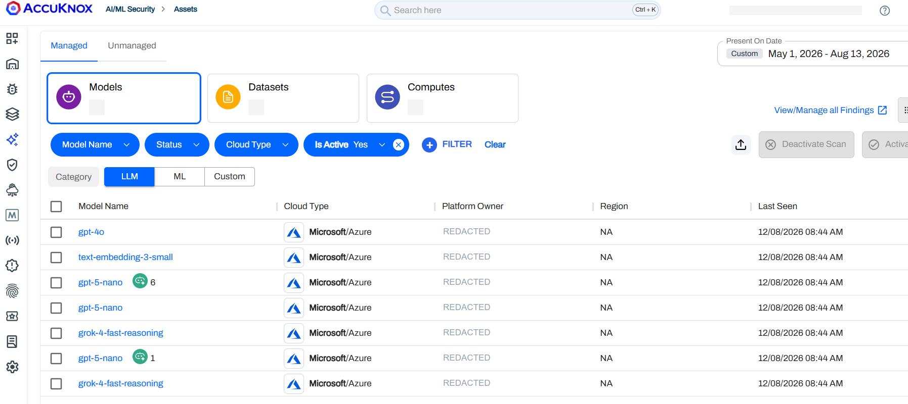
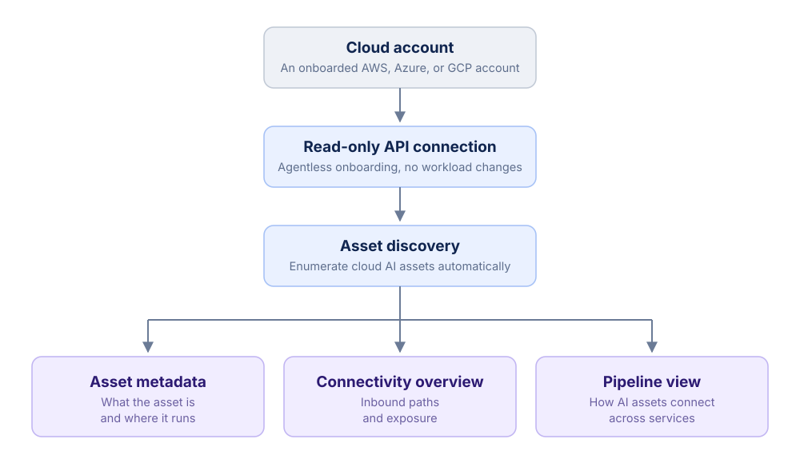
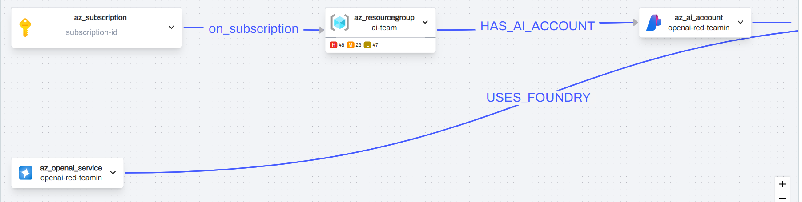
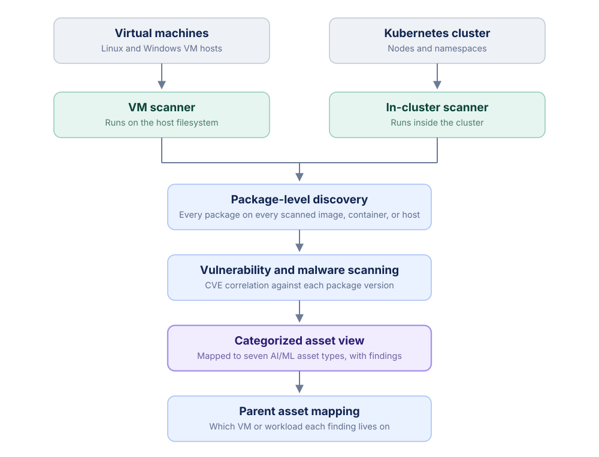
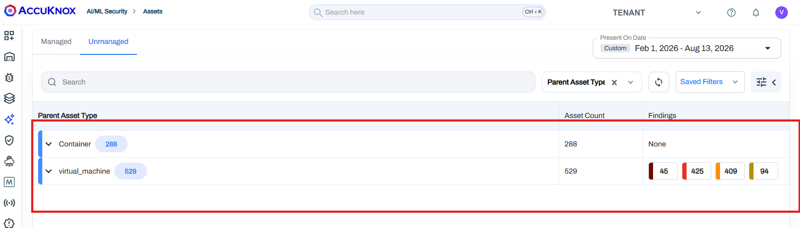
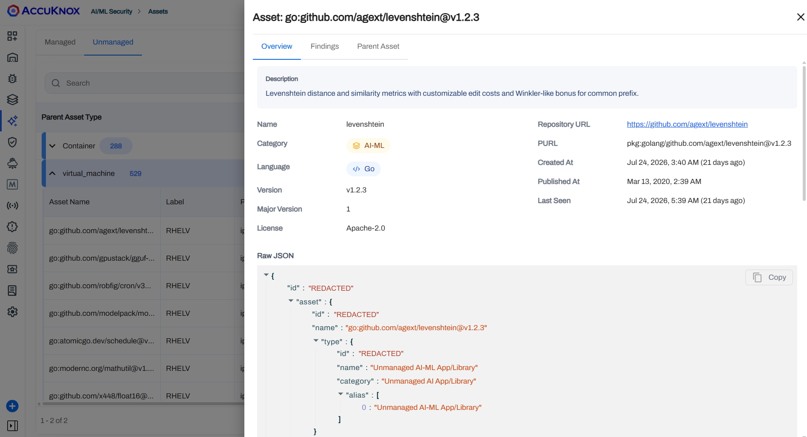
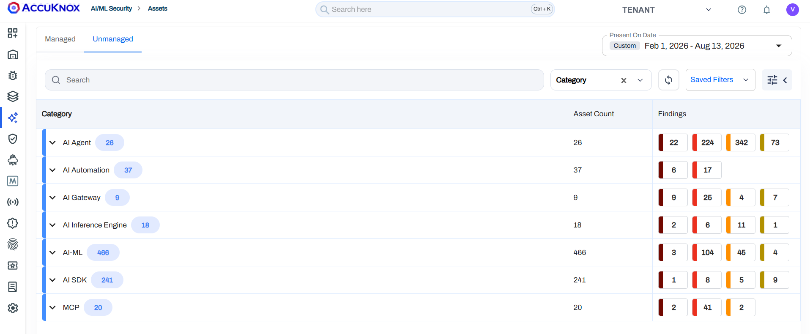

# Shadow AI Discovery: Uncovering and Categorizing AI Assets in Cloud and On-Prem Environments

Shadow AI Discovery finds and classifies AI assets across cloud and on-prem infrastructure, including VMs and Kubernetes. It discovers assets automatically instead of reading a declared inventory, and maps each asset to a type: AI Agent, AI Automation, AI Gateway, AI Inference Engine, AI-ML, AI SDK, or MCP.

## What Shadow AI Discovery Is

Shadow AI Discovery covers three things: discovery, scanning, and containment. It detects AI frameworks, agents, SDKs, and libraries wherever they run.

In cloud environments, it connects agentlessly through a read-only API and returns asset metadata, a connectivity overview, and a pipeline view. On premises, it runs scanners inside your infrastructure for package-level discovery, performs vulnerability and malware scans, and ties each finding back to its parent asset. A browser plugin extends the same visibility to GenAI usage from the browser.

Cloud and on-prem use different discovery mechanisms. Cloud assets appear under the **Managed** tab, and on-prem assets appear under the **Unmanaged** tab.

*The Managed tab groups cloud-discovered assets into Models, Datasets, and Computes, filterable by category, cloud type, and scan status.*

## Cloud Discovery

After onboarding, the cloud discovery path builds a pipeline view around each AI asset:

- **Normalized metadata** to identify what the asset is and where it runs.
- **Connectivity context** to show inbound paths and exposure.
- **Pipeline mapping** to trace how AI assets connect across services, instead of treating them as isolated resources.

*Cloud discovery, from read-only onboarding through to metadata, connectivity, and the pipeline view.*

The cloud AI pipeline view shows discovered managed assets with their metadata, connectivity paths, exposure context, and service relationships. You can see where each asset runs, how it is reachable, and which cloud components it connects to.

*The pipeline graph traces relationships between cloud AI assets, so a model endpoint is shown with the subscription, resource group, and services it is reachable through.*

!!! info "Cloud onboarding guides"
    Follow the provider-specific guide to enable Shadow AI Discovery on your cloud account:

    - [AWS AI/ML Cloud Onboarding](../how-to/aiml-aws-onboard.md)
    - [Azure AI/ML Cloud Onboarding](../how-to/aiml-azure-onboard.md)
    - [GCP AI/ML Cloud Onboarding](../how-to/aiml-gcp-onboard.md)

## On-Prem Discovery

On-prem assets appear under the **Unmanaged** tab. Discovery is scanner-driven. AccuKnox runs a VM scanner on virtual machine hosts and an in-cluster scanner inside Kubernetes. Both read the deployed and running state on the host or cluster directly, so results reflect live infrastructure rather than a declared manifest.

*On-prem discovery, from the in-cluster and VM scanners through to categorized findings with parent asset context.*

*The Unmanaged tab groups discovered on-prem assets by parent asset type, so you can see how many AI components sit on VMs versus containers, and the findings attached to each.*

### Where the Scanners Run

The in-cluster scanner runs inside the Kubernetes cluster and walks nodes and namespaces, reading container images and the workloads scheduled on them. The VM scanner runs against the VM host and reads the host filesystem and its installed packages. Between the two, every VM and every containerized workload in scope is covered by a scanner with direct access to it.

### Package-Level Discovery

Each scanner performs package-level discovery. Instead of looking for a fixed list of known AI product names, it inventories every package present on the scanned image, container, or host filesystem, across language ecosystems and OS package managers. For each package it records three things:

- **Package identity**, the name and version.
- **Known vulnerability data** associated with that package version.
- **Artifact metadata**, the source and the image or host where the package was found.

### Map Packages to Asset Types

AccuKnox sends package inventory, vulnerability details, and artifact metadata to the classification service through the artifact API. The classification service compares detected package names and known library families against AccuKnox AI/ML classification rules, then assigns each package to an asset type.

This finds AI components even when they sit inside a custom wrapper or application. A workload that includes a model-serving runtime is classified as an **AI Inference Engine**. A workload that includes a vendor model client is classified as an **AI SDK**.

Representative package families for each asset type:

| Asset type | Representative packages |
| --- | --- |
| AI Agent | Agent frameworks and runtimes, for example LangChain agents, CrewAI, AutoGen |
| AI Automation | AI workflow and orchestration tools, for example Flowise, Langflow |
| AI Gateway | LLM gateway and proxy packages, for example LiteLLM, Portkey |
| AI Inference Engine | Model serving runtimes, for example vLLM, TGI, Triton, llama.cpp, Ollama |
| AI-ML | General ML and deep learning libraries, for example PyTorch, TensorFlow, scikit-learn, Transformers |
| AI SDK | Vendor model SDKs, for example OpenAI, Anthropic, Cohere, Google GenAI |
| MCP | Model Context Protocol server and client packages |

The asset detail view shows the detected AI/ML packages, the associated findings, severity, and the parent VM or Kubernetes workload, so you can trace every piece of evidence back to its source.

*Each discovered package opens into an asset detail view with its category, version, license, and the raw classification payload, plus Findings and Parent Asset tabs for tracing the evidence.*

### Onboarding Steps

!!! info "On-prem onboarding guides"
    Follow the guide that matches your infrastructure to enable Shadow AI Discovery on-prem:

    - Windows VM: [Agent-Based VM Scanning for Windows](../how-to/vm-security/agent-based/windows.md)
    - Linux VM: [Agent-Based VM Scanning for Linux](../how-to/vm-security/agent-based/linux.md)
    - Kubernetes: [In-cluster container image scanning](../how-to/k8s-security-onboarding.md#in-cluster-container-image-scanning)

## On-Prem Asset Categories

**Asset Categories** groups scanner-derived AI/ML evidence into normalized technical classifications inside the **Unmanaged** view. Instead of exposing raw package names only, AccuKnox maps detected components into categories such as AI/ML libraries, AI SDKs, AI gateways, agent frameworks, MCP components, model clients, and runtime packages.

The category distribution gives you prevalence and governance context across scanned workloads. Broad categories highlight widespread AI/ML framework or SDK usage. Focused categories such as AI Gateway, Agent, and MCP identify specialized integration patterns that may need ownership review, policy validation, or deeper risk investigation.

*Scanner output rolled up into the seven AI/ML asset categories, each with its asset count and findings broken out by severity.*

## What Shadow AI Discovery Can Do

Shadow AI Discovery extends inventory visibility into day-to-day security workflows across cloud and on-prem environments.

### See Usage of Known GenAI Services

Shadow AI Discovery detects access to known GenAI services such as ChatGPT, Claude, Gemini, and Copilot. It records usage context including user identity, timestamp, and accessed domain. That gives you audit evidence, governance review material, and policy violation detection.

### Auto-Discover AI Frameworks, Agents, and Libraries

It auto-discovers AI frameworks, agent frameworks, SDKs, libraries, and binaries wherever they run, for example PyTorch, TensorFlow, HuggingFace libraries, and local model runners. Nothing is declared. Assets show up because their packages are physically present on the host, and the inventory captures version information for CVE correlation.

### Find Agentic AI Instances as Unmanaged Assets

Agentic AI runtimes are installed the same way any other package is, so they show up through the same package-level scan. AccuKnox scans VMs for OpenClaw instances and reports each one under the **Unmanaged** tab, alongside the parent host and its findings.

This matters because agentic runtimes rarely go through a procurement or approval path. A developer installs one on a workstation or a build VM, it starts calling models and touching the filesystem, and it never appears in any asset register. Package-level discovery finds it anyway, and gives you the host, the version, and the associated vulnerability data to act on.
