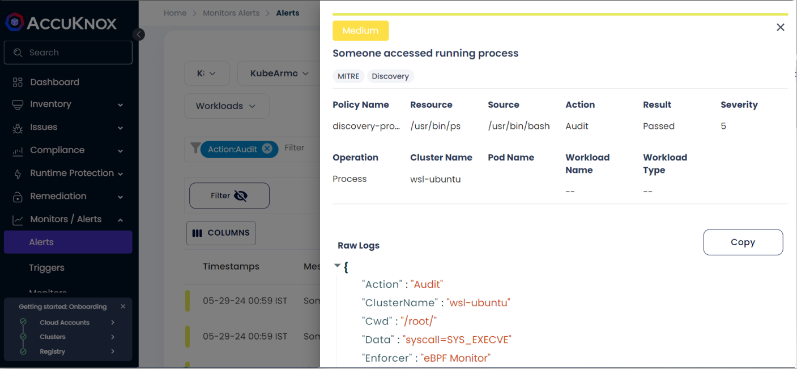
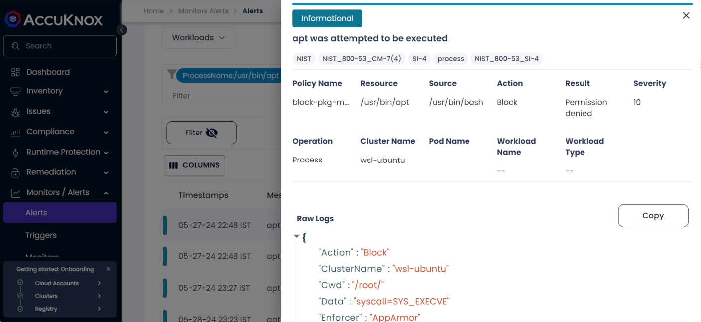
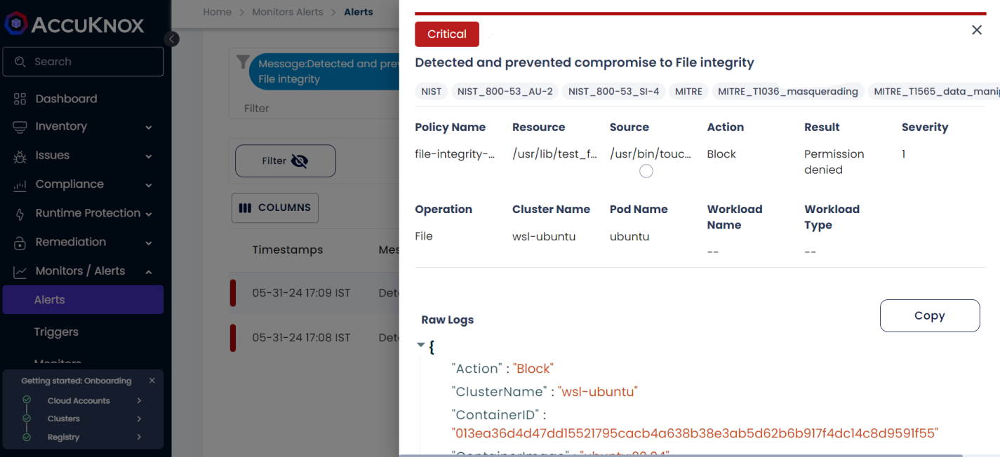

# **Auditing & Log Management**

## Overview

AccuKnox shows Kubearmor logs under the alerts tab in our SaaS which can help to visualize the granular details to investigate an attack scenario. Let's take the below example -

Attackers can use the `ps`, `pgrep`, `top`, and other commands to enumerate the running processes on a system. Then, using that data, they can filter and pinpoint crucial processes that could be the focus of an attack. KubeArmor can be set to audit the following process: `/bin/ps`, `/usr/bin/ps`, `/usr/bin/pgrep`, `/usr/bin/top`, and `/usr/bin/htop` by using the below policy.

## Active Policy

```yaml
apiVersion: security.kubearmor.com/v1
kind: KubeArmorHostPolicy
metadata:
  name: ksp-discovery-process-discovery
spec:
  severity: 5
  tags:
  - MITRE
  - Discovery
  message: Someone accessed running process
  nodeSelector:
    matchLabels:
      kubearmor.io/hostname: ubuntu-2gb-hel1-1
  action: Audit
  process:
    matchPaths:
    - path: /bin/ps
    - path: /usr/bin/ps
    - path: /usr/bin/pgrep
    - path: /usr/bin/top
    - path: /usr/bin/htop
```

This will allow KubeArmor to detect suspicious activities involving these tools, such as attempts to enumerate or exploit running processes. We can further investigate the attack by using the alert history from the SaaS.

Telemetry data is generated in Alerts when using the **ps** command.

```sh
$ ps
    PID TTY          TIME CMD
 130025 pts/1    00:00:00 bash
 130034 pts/1    00:00:00 ps
```

Users can view the detailed logs of every process execution, File accessed, and Network connection by Navigating to AccuKnox Saas > Monitors/Alerts > Alerts



## **Kubearmor logs**

```json
{
"Action":"Audit"
"ClusterName":"wsl-ubuntu"
"Cwd":"/root/"
"Data":"syscall=SYS_EXECVE"
"Enforcer":"eBPF Monitor"
"HostName":"ubuntu-2gb-hel1-2"
"HostPID":130034
"HostPPID":130025
"Message":"Someone accessed running process"
"Operation":"Process"
"PID":130034
"PPID":0
"ParentProcessName":"/usr/bin/bash"
"PolicyName":"discovery-process-discovery"
"ProcessName":"/usr/bin/ps"
"Resource":"/usr/bin/ps"
"Result":"Passed"
"Severity":"5"
"Source":"/usr/bin/bash"
"TTY":"pts1"
"Tags":"MITRE,Discovery"
"Timestamp":1717156232
"Type":"MatchedHostPolicy"
"UID":0
"cluster_id":"27273"
"component_name":"kubearmor"
"instanceGroup":"0"
"instanceID":"0"
"workload":"1"
}
```

### **More Examples**

#### **Process getting executed in VM**



```json
{
"Action":"Block"
"ClusterName":"wsl-ubuntu"
"Cwd":"/root/"
"Data":"syscall=SYS_EXECVE"
"Enforcer":"AppArmor"
"HostName":"ubuntu-2gb-hel1-1"
"HostPID":15117
"HostPPID":15043
"Message":"apt was attempted to be executed"
"Operation":"Process"
"PID":15117
"PPID":0
"ParentProcessName":"/usr/bin/bash"
"PolicyName":"block-pkg-mgmt-tools"
"ProcessName":"/usr/bin/apt"
"Resource":"/usr/bin/apt"
"Result":"Permission denied"
"Severity":"10"
"Source":"/usr/bin/bash"
"TTY":"pts2"
"Tags":"NIST,NIST_800-53_CM-7(4),SI-4,process,NIST_800-53_SI-4"
"Timestamp":1716918832
"Type":"MatchedHostPolicy"
"UID":0
"cluster_id":"27273"
"component_name":"kubearmor"
"instanceGroup":"0"
"instanceID":"0"
"workload":"1"
}
```

#### **File accessed in VM**



```json
{
"Action":"Block"
"ClusterName":"wsl-ubuntu"
"ContainerID":"013ea36d4d47dd15521795cacb4a638b38e3ab5d62b6b917f4dc14c8d9591f55"
"ContainerImage":"ubuntu:20.04"
"ContainerName":"ubuntu"
"Cwd":"/"
"Data":"syscall=SYS_OPENAT fd=-100 flags=O_WRONLY|O_CREAT|O_NOCTTY|O_NONBLOCK"
"Enforcer":"AppArmor"
"HostName":"ubuntu-2gb-hel1-2"
"HostPID":129898
"HostPPID":129853
"Labels":"org.opencontainers.image.ref.name=ubuntu,org.opencontainers.image.vers..."
"Message":"Detected and prevented compromise to File integrity"
"NamespaceName":"container_namespace"
"Operation":"File"
"PID":12
"PPID":1
"ParentProcessName":"/usr/bin/bash"
"PodName":"ubuntu"
"PolicyName":"file-integrity-monitoring"
"ProcessName":"/usr/bin/touch"
"Resource":"/usr/lib/test_file"
"Result":"Permission denied"
"Severity":"1"
"Source":"/usr/bin/touch /usr/lib/test_file"
"TTY":"pts0"
"Tags":"NIST,NIST_800-53_AU-2,NIST_800-53_SI-4,MITRE,MITRE_T1036_masquerading,..."
"Timestamp":1717155559
"Type":"MatchedPolicy"
"UID":0
"cluster_id":"27273"
"component_name":"kubearmor"
"instanceGroup":"0"
"instanceID":"0"
"workload":"1"
}
```

On the `Alerts` page, we can filter the logs using different parameters e.g. Message, ClusterName, Action, Severity, Operation, Pod Name, ContainerID, Enforcer, PID, HostName, etc and this can also be forwarded to the integrated SIEM tools for further analysis.
