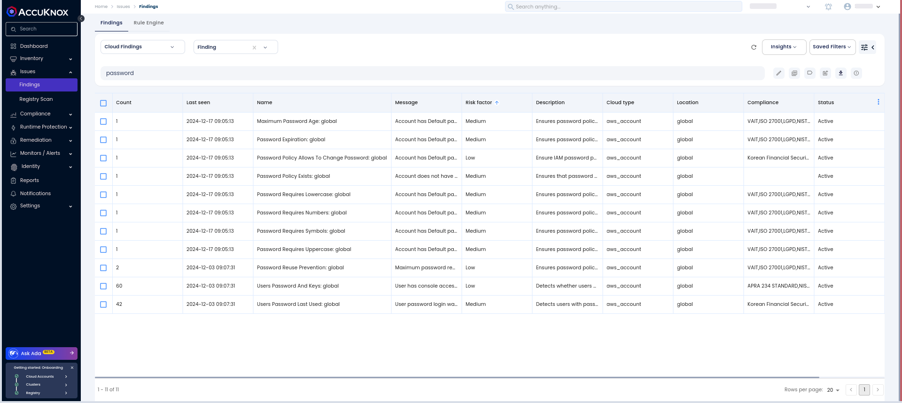
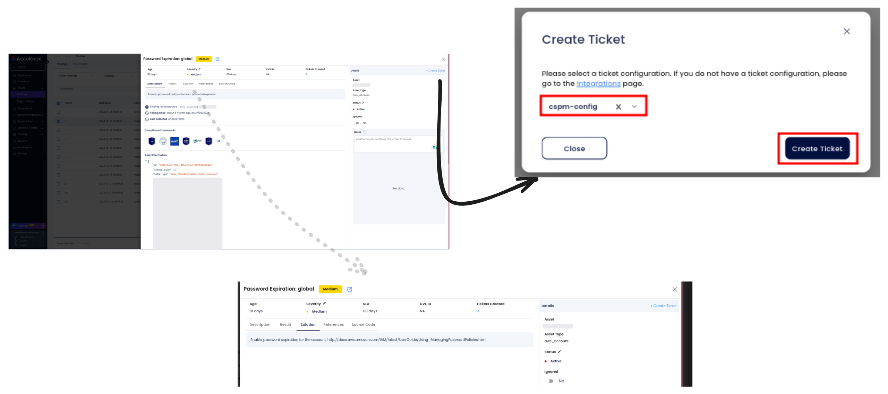
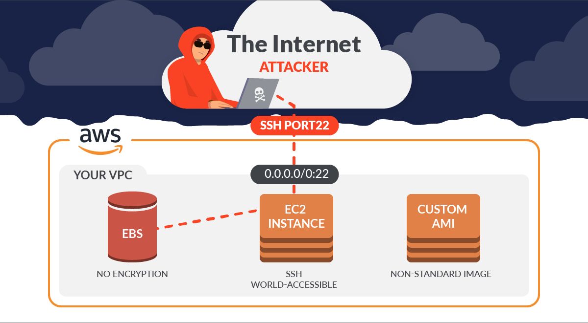
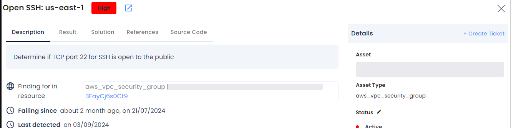
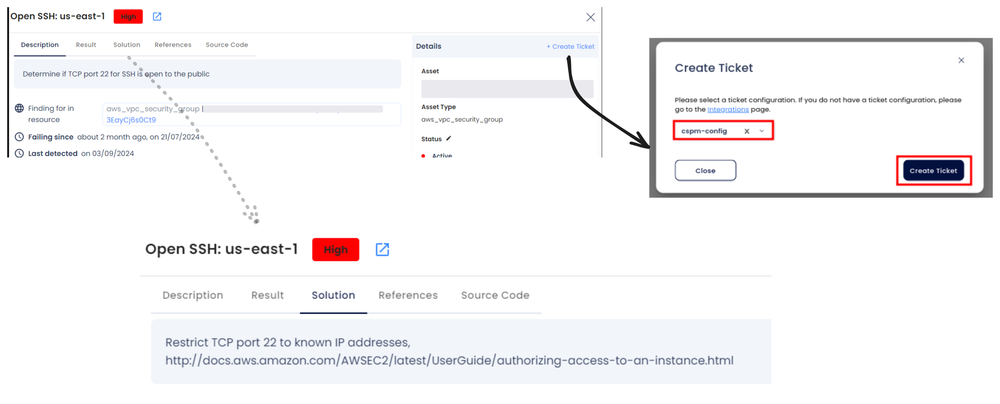
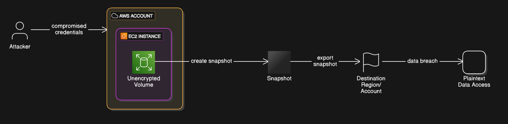
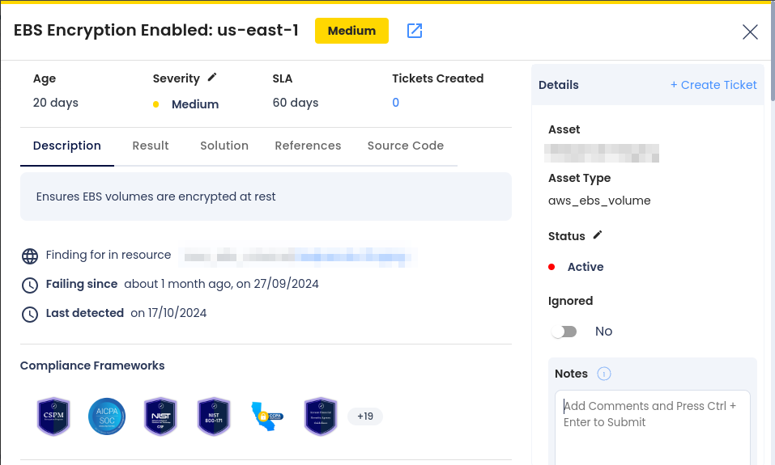
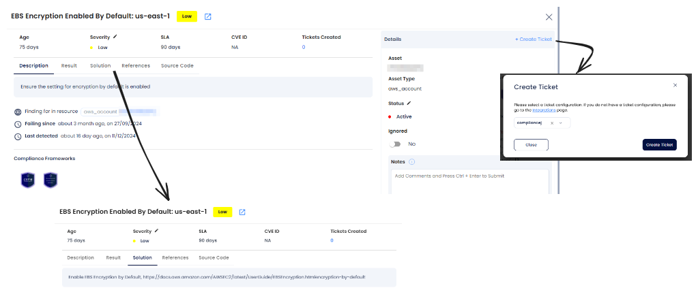

# VM Security Misconfigurations on AWS

## IAM Security

One common IAM misconfiguration is the use of **weak passwords** or **lack of multi-factor authentication** (MFA) for critical user accounts. Without strong credentials and MFA in place, attackers can easily compromise IAM accounts, gaining unauthorized access to sensitive AWS resources. This highlights the importance of enforcing robust password policies and enabling MFA for all users with access to critical infrastructure.

### Why Weak IAM Credentials are a Risk

When IAM credentials are weak, attackers can easily exploit them to gain unauthorized access to AWS resources. This opens the door to various security threats, including:

- **Unauthorized Access:** Weak passwords or improper credential management can allow attackers to gain control of critical resources.

- **Privilege Escalation:** Attackers can leverage weak credentials to escalate privileges and gain broader access within the AWS environment.

- **Data Breaches:** Attackers exploiting weak IAM credentials can access, steal, or manipulate sensitive data, resulting in significant operational and financial damage.

### Attack Scenario

An attacker scans for weak IAM credentials and attempts to brute-force passwords using tools like Hydra. If the password is weak or default, the attacker can gain unauthorized access to the AWS environment. Once inside, they could escalate privileges to access more sensitive resources or launch attacks, such as data exfiltration or manipulation.

### How to Identify and Remediate Weak IAM Credentials with AccuKnox

1. **Navigate to Findings**: Go to the AccuKnox portal and access `Issues > Findings`.

2. **Apply Filters**: Use the **cloud findings** filter and search for the keyword **password** to list relevant findings.

3. **Review Findings:** Assess the severity of findings related to weak credentials, including lack of multi-factor authentication (MFA) or poor password complexity requirements.

4. **Take Action:** Follow the remediation guidance provided within the platform to enforce strong IAM credentials and ensure MFA is enabled.

### Remediation Steps

1. **Navigate to Issues > Findings** in the AccuKnox portal.

2. **Select the finding related to weak IAM credentials** or non-compliance with password policies.

3. **Create a ticket** to track the remediation process.

4. **Follow recommended steps** and security references linked within the findings to strengthen IAM credential security, including implementing MFA and enforcing complex password policies.

### Best Practices to Avoid Weak IAM Credential Risks

- **Enforce Strong Password Policies:** Ensure that IAM users follow strict password length, complexity, and expiration rules.

- **Enable MFA:** Require multi-factor authentication for all IAM users and accounts.

- **Regularly Audit IAM Permissions:** Continuously review and audit IAM user roles and permissions to ensure least-privilege access.

- **Monitor IAM Security Continuously:** Use AccuKnox CSPM to monitor IAM configurations for real-time detection and remediation of misconfigurations.

By proactively addressing weak IAM credentials and following best practices, you can significantly reduce the risk of unauthorized access and maintain a secure AWS environment.

## Network Security

One major security challenge with AWS Network Security is the exposure of **Open SSH ports**. Misconfigurations in security group settings or improperly secured SSH access can allow attackers to exploit these open ports, potentially gaining unauthorized access to critical systems. It is essential to address these vulnerabilities proactively to safeguard your environment from brute force attacks, unauthorized access, and lateral movement within your network.

### **Why Open SSH Ports are a Risk**

When SSH ports are publicly exposed, attackers can exploit them to:

- **Brute Force Attacks**: Attackers use tools to guess SSH credentials, gaining unauthorized access.

- **Resource Hijacking**: Compromised machines can be used for malicious activities like crypto mining or botnets.

- **Lateral Movement**: Once inside, attackers can move laterally within your environment to access more systems.

### **Attack Scenario**

An attacker scans for publicly exposed SSH ports using tools like **Nmap** or **Shodan**. If the SSH configuration lacks strong authentication, they launch brute-force attacks using tools like **Hydra** or **Medusa** to crack credentials. Once successful, the attacker gains control over the EC2 instance, compromising its resources and potentially infiltrating the entire network.

### **How to Identify and Remediate Open SSH Ports with AccuKnox**

1. **Navigate to Findings**: Go to the **AccuKnox portal** and access **Issues > Findings**.

2. **Apply Filters**: Use the **Cloud Findings** filter and search for the keyword **"ssh"** to locate findings related to open SSH ports.

3. **Group Findings**: Group the findings to identify all publicly exposed SSH ports for efficient analysis.

4. **Review Findings** Analyze the severity of each finding and assess the potential risk

### **Remediation Steps**

1. **Identify Open SSH Ports**: Select the findings related to **publicly exposed SSH ports**.

2. **Create a Ticket**: Create a ticket to track the resolution process.

3. **Follow Guidance**: Follow the recommended security steps provided within the platform to restrict access to SSH ports.

4. **Verify Configuration**: Ensure that SSH ports are no longer publicly accessible and have strong authentication mechanisms enabled.

### **Best Practices to Avoid Open SSH Port Risks**

- Restrict SSH access to **trusted IP addresses** using security groups.

- Use **key-based authentication** instead of passwords to secure SSH access.

- Monitor SSH login attempts and set up **fail2ban** or similar tools to prevent brute-force attacks.

- Continuously monitor your environment with **AccuKnox CSPM** for real-time detection and remediation of misconfigurations.

## Disk Security

A common misconfiguration in cloud environments is the use of unencrypted Elastic Block Store (EBS) volumes. EBS volumes that lack encryption expose sensitive data to unauthorized access if compromised. This issue underscores the necessity of encrypting EBS volumes to protect data at rest.

### Why Unencrypted EBS Volumes are a Risk

Unencrypted EBS volumes pose several security risks:

- **Data Exposure**: Data stored in unencrypted volumes is accessible in plaintext, increasing the likelihood of data leaks in case of unauthorized access.

- **Regulatory Non-Compliance**: Many compliance frameworks mandate encryption of data at rest, and unencrypted volumes can result in non-compliance penalties.

- **Increased Attack Surface**: Without encryption, attackers gaining access to snapshots or backups can easily read sensitive data.

### Attack Scenario

An attacker gains access to an AWS account due to compromised credentials. They identify an unencrypted EBS volume attached to an EC2 instance hosting sensitive data. The attacker creates a snapshot of the volume and exports it to another region or account, where they access the plaintext data, leading to a data breach.

### How to Identify and Remediate Unencrypted EBS Volumes with AccuKnox

1. **Navigate to Findings**: Log in to the AccuKnox portal and access the **Issues > Findings** section.

2. **Apply Filters**: Use the cloud findings filter and search for the keyword `EBS encryption` to identify non-compliant volumes.

3. **Review Findings**: Assess the severity of findings related to unencrypted EBS volumes, including details about the impacted resources.

4. **Take Action**: Follow the remediation guidance within the platform to enable encryption for all EBS volumes.

### Remediation Steps

1. **Identify Unencrypted EBS Volume**: Select the findings related to **Unencrypted EBS Volume**.

2. **Create a Ticket**: Create a ticket to track the resolution process.

3. **Follow Guidance**: Follow the recommended security steps provided within the platform to **Encrypted EBS Volume**

4. **Verify Configuration**: Ensure that EBS Volume are no longer unencrypted.

### Best Practices to Avoid Unencrypted EBS Volume Risks

- **Enable Default Encryption**: Configure default encryption for EBS volumes in each AWS region.

- **Monitor Continuously**: Use tools like AccuKnox CSPM to detect and remediate unencrypted volumes in real-time.

- **Automate Compliance**: Employ AWS Config rules or security automation to enforce encryption standards.

- **Regular Audits**: Periodically review your EBS volumes and snapshots to ensure compliance with encryption policies.

By addressing the risk of unencrypted EBS volumes and adhering to best practices, you can safeguard sensitive data and maintain a secure cloud environment.
