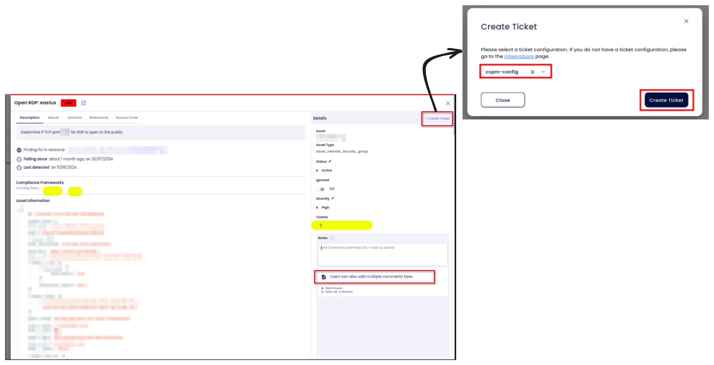
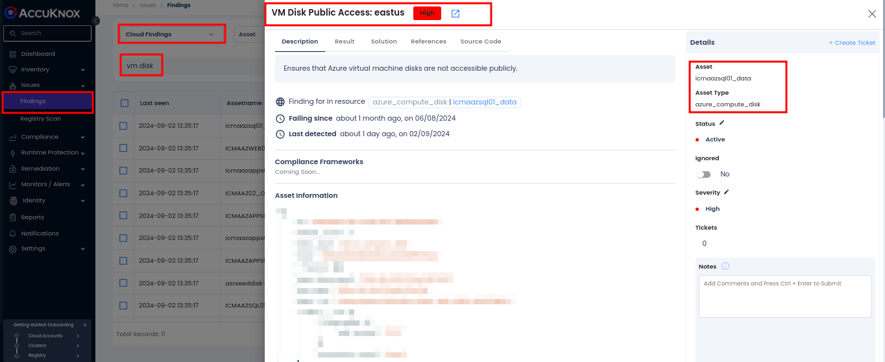

# VM Security Misconfigurations on Azure

## Network Security

As organizations increasingly adopt cloud services, securing their cloud networks is essential. In Azure, misconfigurations in network security settings can lead to significant security risks. Publicly exposed network ports, misconfigured security groups, or open firewall rules can all serve as entry points for attackers. Ensuring a robust Azure Network Security posture is crucial for protecting resources, preventing unauthorized access, and ensuring the overall security of cloud applications.

### Attack Scenario

Azure Network Security misconfigurations present various vulnerabilities. Below are some common issues:

1. **Exposed RDP Ports**: Leaving Remote Desktop Protocol (RDP) ports (default port 3389) open in Azure Network Security Groups (NSGs) increases the risk of brute-force attacks, unauthorized entry, and malware deployment.

### **How to Identify and Remediate Open RDP Ports in Azure NSGs**

1. **Navigate to Findings**: Go to the AccuKnox portal and access `Issues > Findings`.

2. **Apply Filters**: Use the **cloud findings** filter and search for the keyword **RDP** to list relevant findings.

3. **Review Findings**: Analyze identified Open RDP access and assess the associated risk severity.

4. **Take Action**: Follow the remediation guidance provided within the platform

### **Remediation Steps**

1. Navigate to `Issues > Findings` in the AccuKnox portal.

2. Select the finding related to **Open RDP**

3. Create a ticket to track the resolution process.

4. Follow the recommended steps and security references linked within the findings for precise remediation.

### **Best Practices**

- Avoid exposing RDP ports directly to the public internet; use VPNs or Azure Bastion for secure access.

- Regularly audit NSG rules to identify and remove unnecessary open ports.

- Monitor all port configurations using **AccuKnox CSPM** for real-time detection and remediation.

## Storage Security

### **Publicly exposed VM disks**

One major security challenge with Azure VMs lies in **publicly exposed VM disks**. These misconfigurations can leave sensitive data vulnerable to exploitation, making it essential to address them proactively.

### **Why is VM Disk Public Access a Risk**

When a VM disk is publicly exposed, it becomes a target for malicious attackers. Unauthorized access can lead to:

- **Data Exposure**: Sensitive data can be copied or leaked.

- **Malicious Modifications**: Attackers may alter files, plant malware, or tamper with critical system configurations.

- **Compliance Violations**: Exposure violates compliance standards like GDPR, HIPAA, or ISO, leading to potential legal and financial repercussions.

### **Attack Scenario**

An attacker uses scanning tools to scan the Internet for publicly accessible VM disks. Upon finding a vulnerable disk, they gain access, exfiltrate sensitive data, or plant malicious files. This can result in data breaches, operational disruptions, or financial losses.

### **How to Identify and Remediate VM Disk Public Access with AccuKnox**

1. **Navigate to Findings**: Go to the AccuKnox portal and access `Issues > Findings`.

2. **Apply Filters**: Use the **cloud findings** filter and search for the keyword **vm disk** to list relevant findings.

3. **Review Findings**: Analyze identified public VM disk access and assess the associated risk severity.

4. **Take Action**: Follow the remediation guidance provided within the platform to secure exposed disks.

### **Remediation Steps**

1. Navigate to `Issues > Findings` in the AccuKnox portal.

2. Select the finding related to **VM Disk Public Access**.

3. Create a ticket to track the resolution process.

4. Follow the recommended steps and security references linked within the findings for precise remediation.

### **Best Practices to Avoid VM Disk Public Access**

- Regularly audit VM disk permissions and ensure they are not publicly accessible.

- Apply **least-privilege access** principles to restrict disk access.

- Monitor your cloud environment continuously using AccuKnox CSPM for real-time detection of misconfiguration

-
