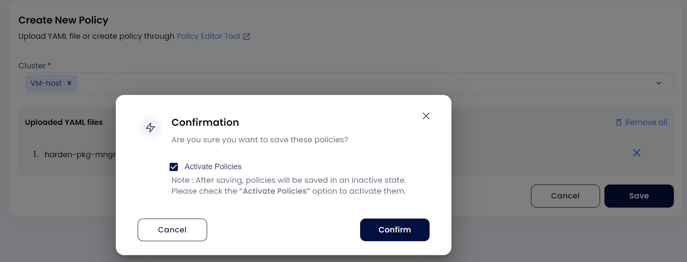
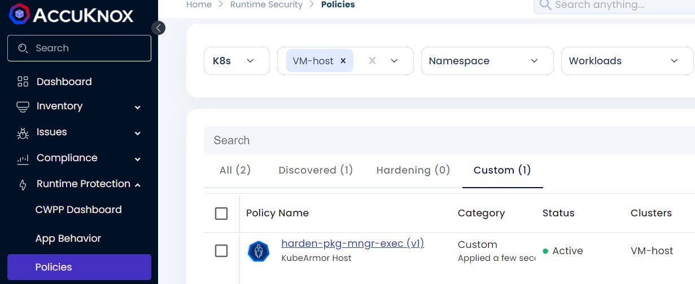
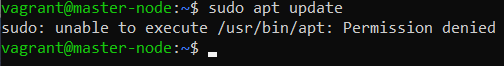
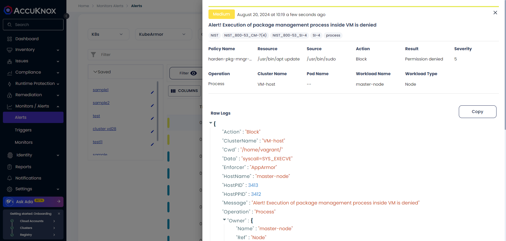

# Use Case: Blocking Execution of Package Managers

## **Purpose**

Attackers might attempt to download additional tools or downgrade packages to a vulnerable version. Blocking the execution of package managers enhances security by preventing such actions. Commonly targeted package managers include `apt`, `yum`, `dnf`, and `pip`.

## **Steps to Implement**

1. Replace `<vm-hostname>` with the target VM's hostname in the policy configuration.

2. Define paths to target specific package managers.

```yaml
apiVersion: security.kubearmor.com/v1
kind: KubeArmorHostPolicy
metadata:
  name: block-pkg-mgmt-tools
spec:
  severity: 10
  message: "Alert! Execution of package management process is denied"
  nodeSelector:
    matchLabels:
      kubearmor.io/hostname: <vm-hostname>
  process:
   matchPaths:
    - execname: apt-get
    - execname: apt
    - execname: dnf
    - execname: dpkg
    - execname: gdebi
    - execname: make
    - execname: makepkg
    - execname: pacman
    - execname: rpm
    - execname: yaourt
    - execname: yum
    - execname: zypper

  action:
    Block
  tags:
   - NIST
   - NIST_800-53_CM-7(4)
   - SI-4
   - process
   - NIST_800-53_SI-4
```

3. Upload and activate the policy to block the execution of package managers on the VM.




## **Expected Outcome**

- Package manager execution attempts are blocked.

- Alerts are logged and visible in the SaaS platform's "Policy Violations" section.

## **Scenario**

An attacker attempts to use `apt` to install a malicious package. The execution is blocked, and an alert is generated for the security team to investigate.

## **Verification Steps**

1. Open a new terminal session on the VM.

2. Try executing a blocked package manager command.


3. Confirm:

    - Execution is blocked.

    - Alert details are displayed on the SaaS platform.

