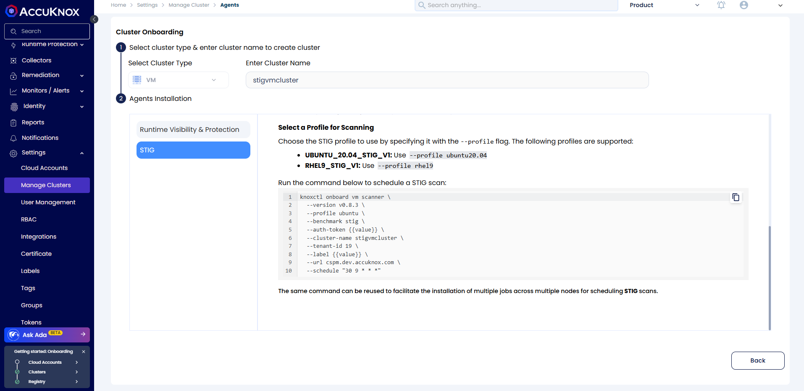
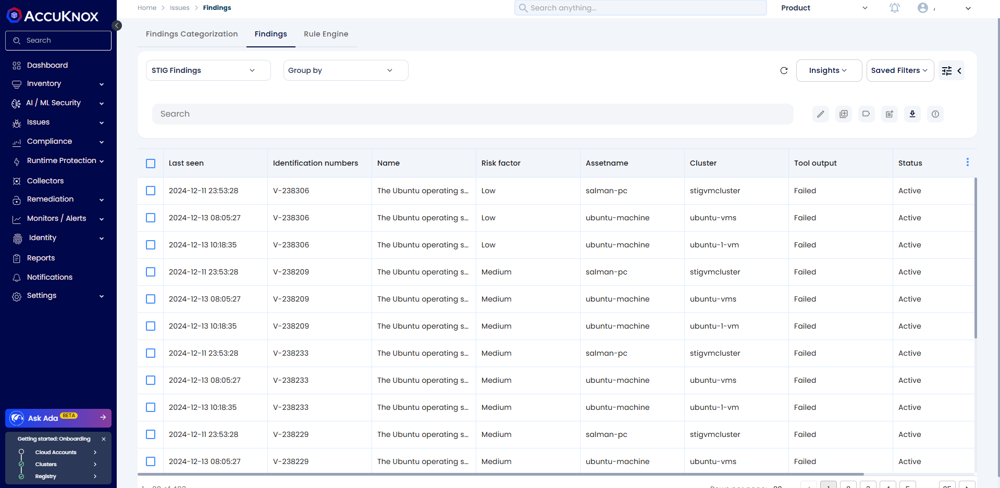
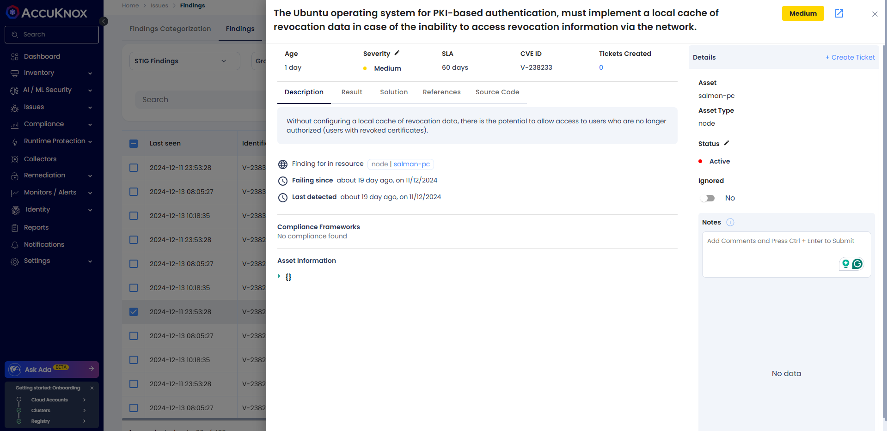

# Compliance Benchmarking and Risk Assessment

## Overview

CWPP supports compliance benchmarking for VM as a part of VM security to ensure components within VMs adhere to regulatory compliance like CIS and STIGs.

## **Benefits of Compliance in VMs**

- **Risk Reduction**: Minimizes exposure to vulnerabilities and attacks.

- **Regulatory Adherence**: Avoids fines and penalties for non-compliance.

- **Improved Security Posture**: Strengthens defenses against cyber threats.

- **Operational Efficiency**: Streamlines auditing and reporting processes.

AccuKnox provides CIS and STIG benchmark checks for VMs to assist users in maintaining a good security and compliance posture

### **Pre-requisite**

1. Install [Knoxctl](https://help.accuknox.com/how-to/vm-onboard-deboard-systemd/#install-knoxctlaccuknox-cli "https://help.accuknox.com/how-to/vm-onboard-deboard-systemd/#install-knoxctlaccuknox-cli")

2. Create [Label](https://help.accuknox.com/how-to/how-to-create-labels/ "https://help.accuknox.com/how-to/how-to-create-labels/")

3. Create [Token](https://help.accuknox.com/how-to/how-to-create-tokens/ "https://help.accuknox.com/how-to/how-to-create-tokens/") or [Access Keys](https://help.accuknox.com/how-to/create-access-keys/ "https://help.accuknox.com/how-to/create-access-keys/")

4. Tenant id

### **Steps**

1. Navigate to Settings > ManageCluster on AccuKnox Saas

2. Click on Onboard Now and Select Cluster Type as **VM**

3. Enter Cluster/VM Name and click on Save & Next

4. Choose STIG from the option shown on UI and follow the instruction on UI to install VM Scanner using Knoxctl

Once the VM Scanner is installed, It will perform the checks based on the crown schedule and Users can see the findings on AccuKnox Saas

### **Findings**

1. Navigate to Issues > Findings and Select **STIG** from the findings type filter

1. Click on any of the findings to view the details

Users can create a ticket for the remediation manually or by using the rule engine, and then automate the ticketing.
