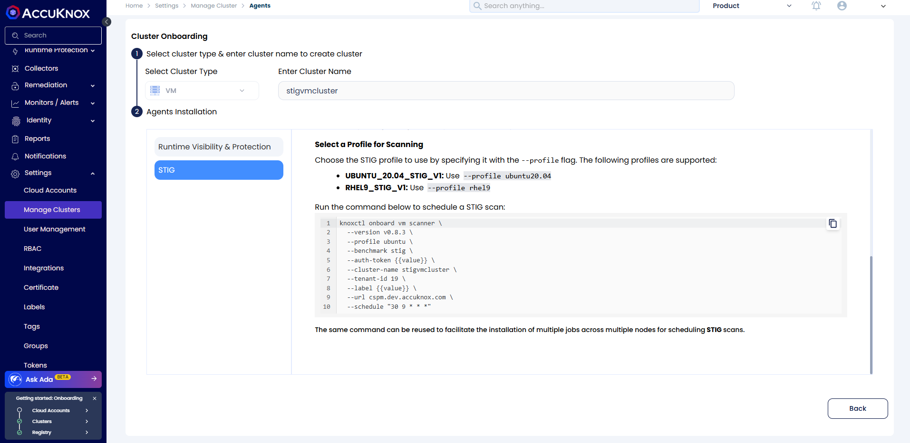
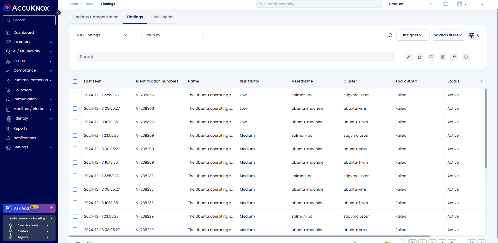
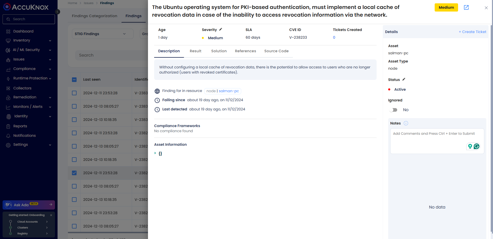

# Compliance Benchmarking and Risk Assessment

## Overview

CWPP supports compliance benchmarking for VM as a part of VM security to ensure components within VMs adhere to regulatory compliance like CIS and STIGs.

## **Benefits of Compliance in VMs**

- **Risk Reduction**: Minimizes exposure to vulnerabilities and attacks.

- **Regulatory Adherence**: Avoids fines and penalties for non-compliance.

- **Improved Security Posture**: Strengthens defenses against cyber threats.

- **Operational Efficiency**: Streamlines auditing and reporting processes.

AccuKnox provides CIS and STIG benchmark checks for VMs to assist users in maintaining a good security and compliance posture

## Supported Benchmarks and Coverage

The VM Scanner ships with the following benchmark profiles for Ubuntu. Each profile maps to a specific published benchmark version, so the checks match exactly what the auditors expect.

| Profile | Benchmark source | Controls | Automated | Manual review |
|---|---|--:|--:|--:|
| Ubuntu 22.04 — STIG | DISA STIG V2R8 | 188 | 108 | 80 |
| Ubuntu 24.04 — STIG | DISA STIG V1R5 | 194 | 101 | 93 |
| Ubuntu 22.04 — CIS | CIS Benchmark v3.0.0 | 306 | 128 | 178 |
| Ubuntu 24.04 — CIS | CIS Benchmark v2.0.0 | 332 | 142 | 190 |
| **Total** | | **1020** | **479** | **541** |

Across the four profiles, 479 of the 1020 controls run as automated checks today. The remaining 541 are controls that need human judgement (for example, reviewing documented mission requirements or site-specific policy) and are surfaced for manual review.

!!! info "How checks are evaluated"
    - **Pass / Fail** — controls with an automated check run a read-only command against the VM using standard OS tools and report a clear pass or fail.
    - **Skipped** — controls that require manual review are reported as *skipped*, never as a pass. The scanner does not mark an unverified control as compliant, so a passing scan reflects only what was actually checked.

### **Pre-requisite**

1. Install [Knoxctl](https://help.accuknox.com/how-to/vm-onboard-deboard-systemd/#install-knoxctlaccuknox-cli "https://help.accuknox.com/how-to/vm-onboard-deboard-systemd/#install-knoxctlaccuknox-cli")

2. Create [Label](https://help.accuknox.com/how-to/how-to-create-labels/ "https://help.accuknox.com/how-to/how-to-create-labels/")

3. Create [Token](https://help.accuknox.com/how-to/how-to-create-tokens/ "https://help.accuknox.com/how-to/how-to-create-tokens/") or [Access Keys](https://help.accuknox.com/how-to/create-access-keys/ "https://help.accuknox.com/how-to/create-access-keys/")

4. Tenant id

### **Steps**

1. Navigate to Settings > ManageCluster on AccuKnox Saas

2. Click on Onboard Now and Select Cluster Type as **VM**

3. Enter Cluster/VM Name and click on Save & Next

4. Choose STIG from the option shown on UI and follow the instruction on UI to install VM Scanner using Knoxctl

Once the VM Scanner is installed, It will perform the checks based on the cron schedule and Users can see the findings on AccuKnox Saas

### **Findings**

1. Navigate to Issues > Findings and Select **STIG** from the findings type filter

1. Click on any of the findings to view the details

Users can create a ticket for the remediation manually or by using the rule engine, and then automate the ticketing.
