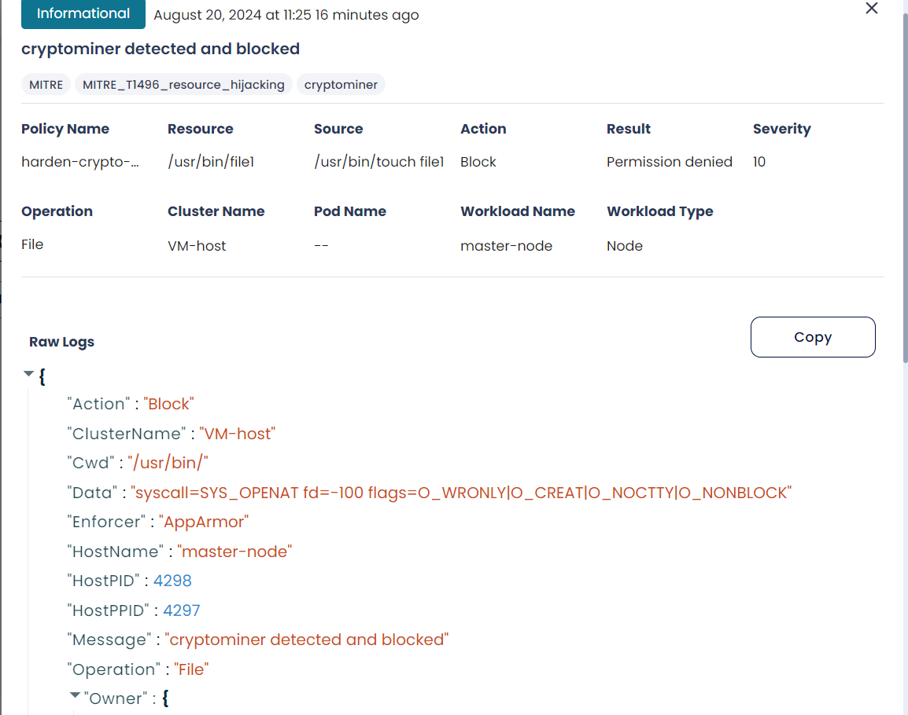
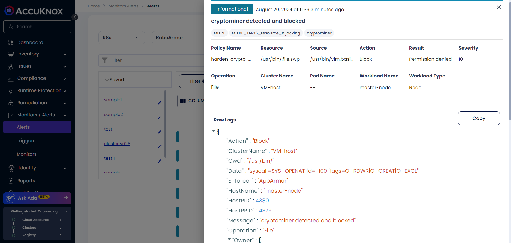

# Preventing Cryptominers Execution

## **Purpose**

AccuKnox is designed to prevent the execution of known cryptominers, block unauthorized binaries from running in the /tmp directory, and protect sensitive files from tampering, thereby mitigating cryptojacking threats that can lead to resource depletion and unauthorized data exposure.

## **Steps**

1. Replace `<vm-hostname>` with the target VM's hostname in the policy configuration.

2. Upload and activate the policy to:

    - Block execution of known cryptominer binaries, such as `xmrig`, `dero-miner-linux-amd64`, `masscan`, and `zgrab2`.

    - Prevent execution of any binaries from the `/tmp` directory.

    - Protect sensitive files and directories from tampering, including `/bin/`, `/usr/bin/`, and `/var/local/bin/`.

```yaml
apiVersion: security.kubearmor.com/v1
kind: KubeArmorHostPolicy
metadata:
  name: harden-crypto-miners
Spec:
  nodeSelector:
    matchLabels:
      kubearmor.io/hostname: vm-name
  action: Block
  file:
    matchDirectories:
    - dir: /bin/
      readOnly: true
      recursive: true
    - dir: /boot/
      readOnly: true
      recursive: true
    - dir: /sbin/
      readOnly: true
      recursive: true
    - dir: /usr/bin/
      readOnly: true
      recursive: true
    - dir: /usr/local/bin/
      readOnly: true
      recursive: true
    - dir: /var/local/bin/
      readOnly: true
      recursive: true
  message: cryptominer detected and blocked
  process:
    matchDirectories:
    - dir: /tmp/
      recursive: true
    matchPaths:
    - execname: apk
    - execname: apt
    - execname: dero-miner-linux-amd64
    - execname: dero-wallet-cli-linux-amd64
    - execname: dero
    - execname: derod-linux-amd64
    - execname: masscan
    - execname: nmap
    - execname: ntpdate
    - execname: xmrig
    - execname: zgrab2
  severity: 10
```

## **Protected Directories and Actions**

- **Critical Directories (Read-Only Mode):**

    - `/bin/`

    - `/boot/`

    - `/sbin/`

    - `/usr/bin/`

    - `/usr/local/bin/`

    - `/var/local/bin/`

- **Blocked Processes:**

    - Execution of binaries in `/tmp/`.

    - Execution of cryptominer binaries, including:

        - `apk`

        - `apt`

        - `dero-miner-linux-amd64`

        - `xmrig`

        - `masscan`

        - `zgrab2`

## **Scenario**

Imagine an attacker deploys a cryptomining binary like `xmrig` in the `/tmp/` directory. The policy will immediately block the execution and generate an alert with severity 10 on the SaaS platform.

## **Verification**

1. Open a new terminal session on the VM.

2. Try tampering the files in /bin/ directory or executing a blocked process

3. Confirm that:

    - Actions are blocked.

    - Alerts with severity 10 are visible on the SaaS platform, displaying specific details about the attempted action and the policy triggered.




