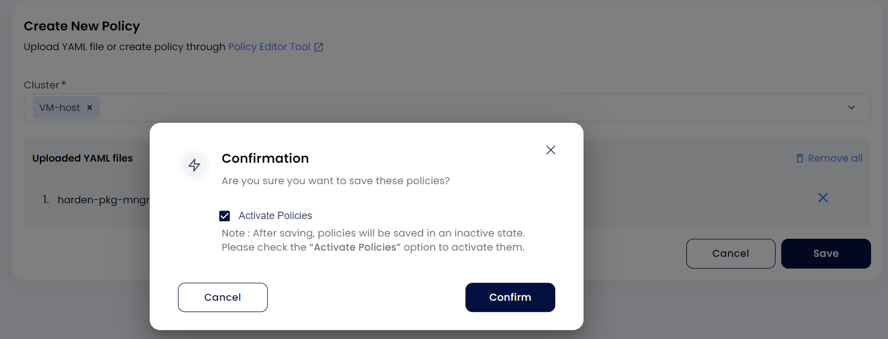
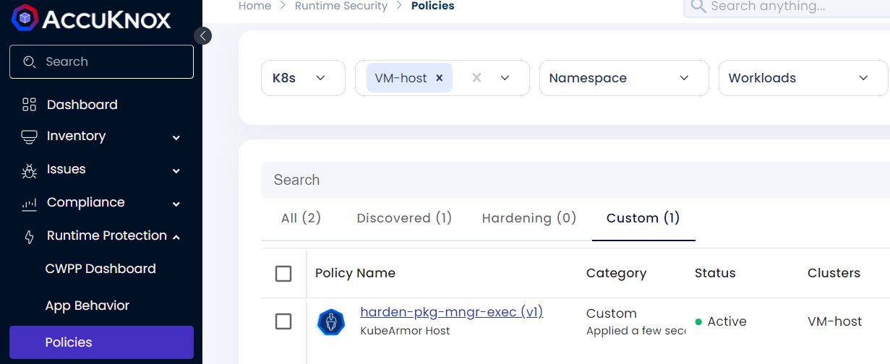
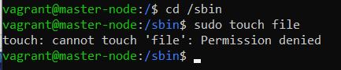
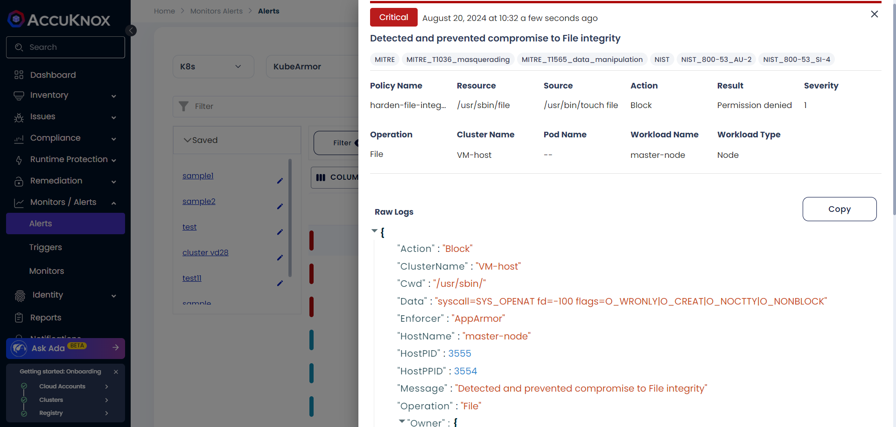

# Use Case: File Integrity Monitoring

## **Purpose**

To safeguard critical system paths, such as binaries, configuration files, and credential directories, from unauthorized modifications, ensuring system integrity.

AccuKnox actively monitors and blocks unauthorized changes to these critical system paths, protecting against any alterations that could compromise system integrity.

## **Steps to Implement**

1. Replace `<vm-hostname>` with the target VM's hostname in the policy configuration.

2. Specify directories and files to protect.

```yaml
apiVersion: security.kubearmor.com/v1
kind: KubeArmorHostPolicy
metadata:
  name: hsp-File-Integrity-Monitoring
spec:
  nodeSelector:
    matchLabels:
      kubernetes.io/hostname: vm-name
  severity: 5
  message: Detected and prevented compromise to File integrity
  File:
    matchDirectories:
     - dir: /sbin/
       readOnly: true
       recursive: true
     - dir: /usr/bin/
       readOnly: true
       recursive: true
     - dir: /usr/lib/
       readOnly: true
       recursive: true
     - dir: /usr/sbin/
       readOnly: true
       recursive: true
     - dir: /bin/
       readOnly: true
       recursive: true
     - dir: /boot/
       readOnly: true
       recursive: true
  action: Block
```

3. Upload and activate the policy.





## **Protected Directories**

- System binary folders: `/sbin/`, `/usr/bin/`, `/usr/lib/`, `/usr/sbin/`, `/bin/`, `/boot/`

- All directories are protected in read-only mode with recursive protection applied.

## **Expected Outcome**

- Unauthorized write attempts to protected files are blocked.

- Alerts are triggered and logged in the SaaS platform.

## **Scenario**

A malicious script attempts to modify or create a file in `/sbin`. The write action is blocked, preserving system security, and an alert is sent to the monitoring dashboard.

## **Verification Steps**

1. Open a new terminal session on the VM.

2. Attempt to modify a file or create a file in a protected directory.



1. Confirm:

    - Write attempt is blocked.

    - Alerts appear on the SaaS platform with details of the action.


