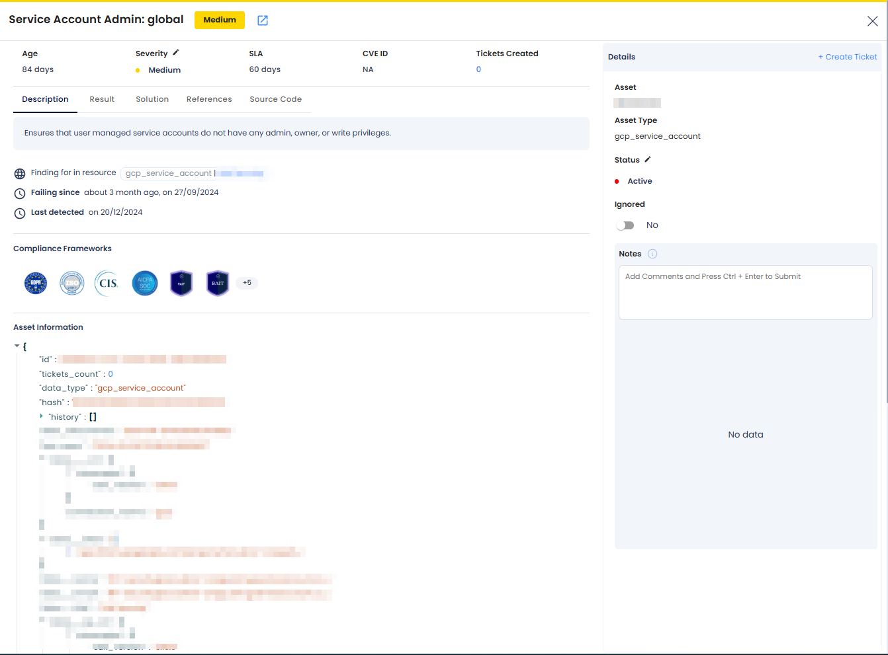
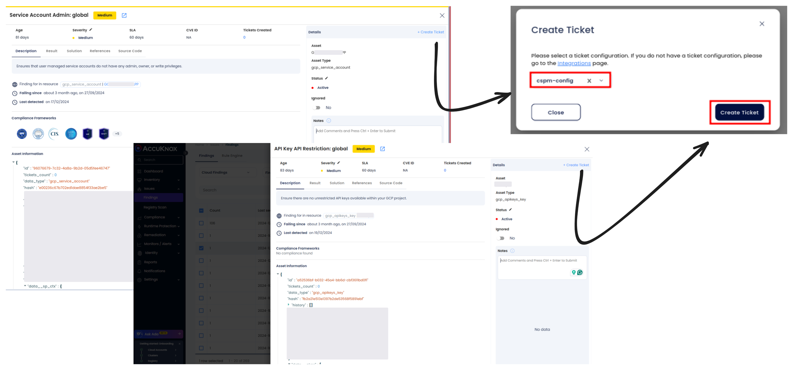
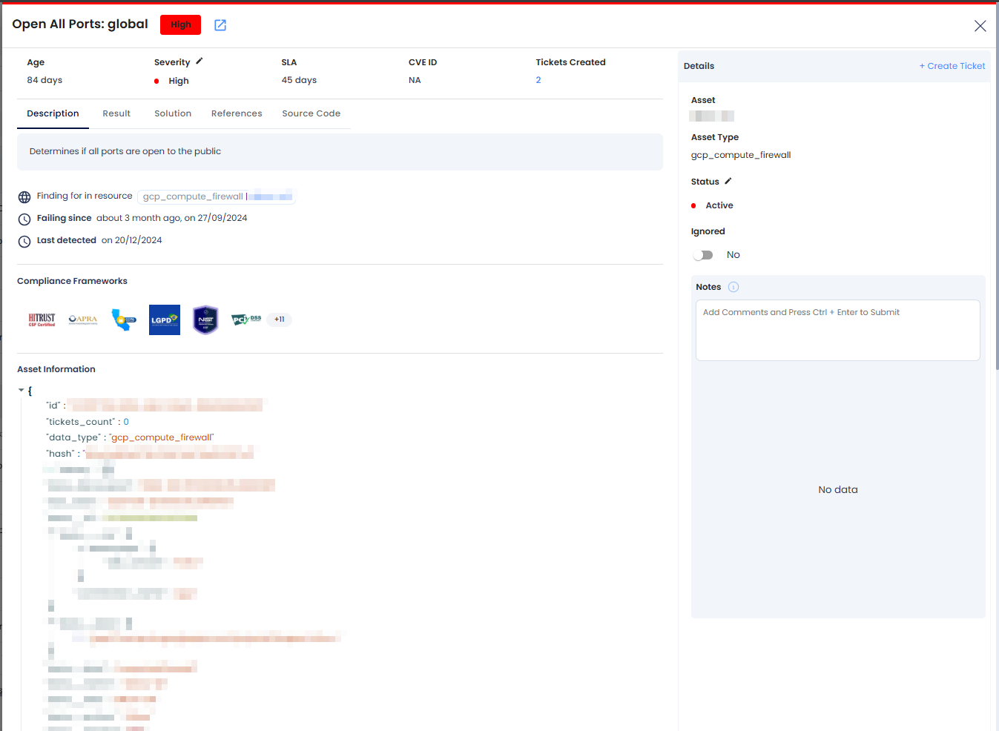
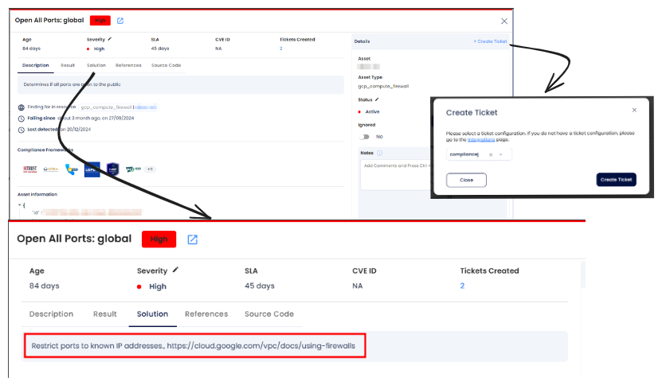
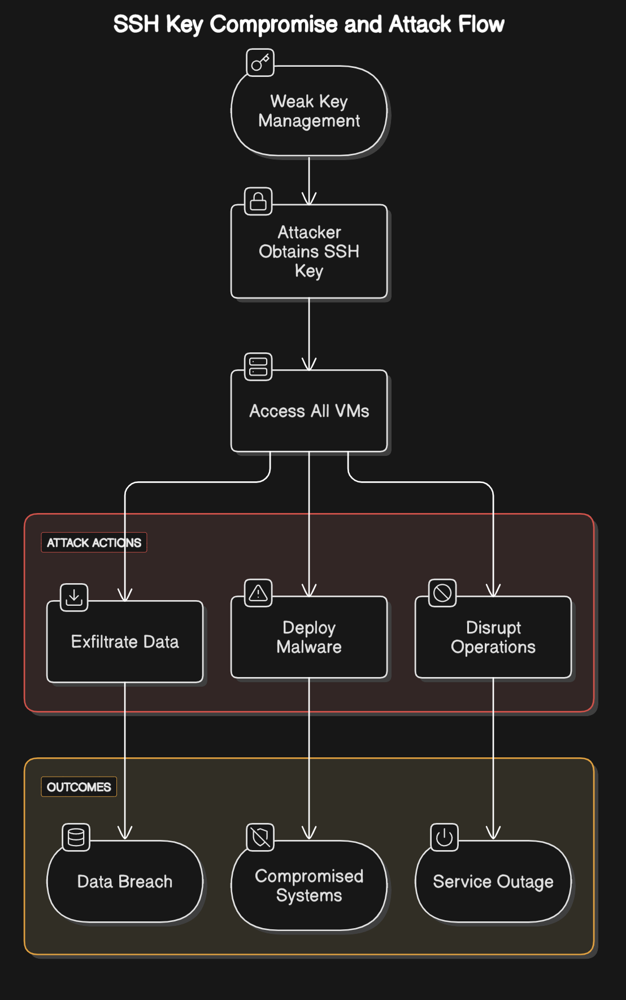
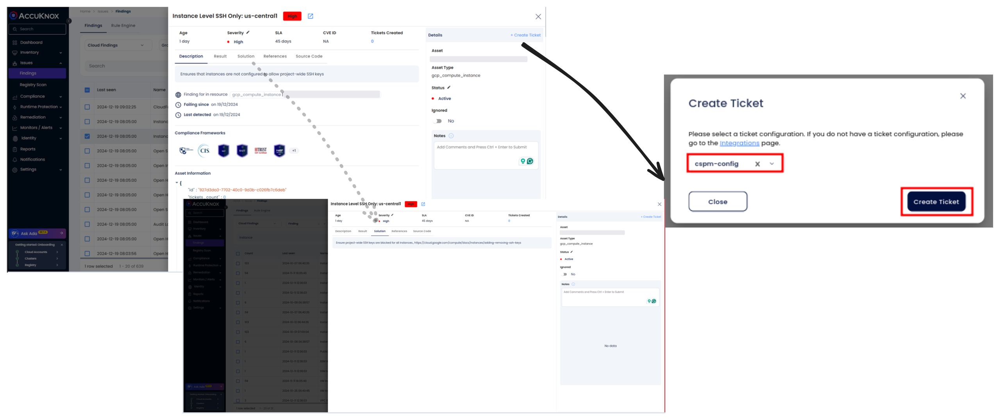
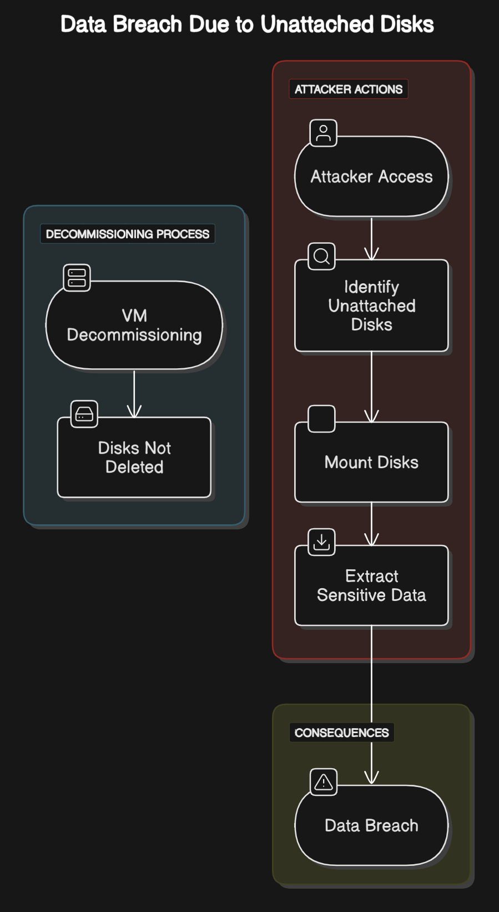

# VM Security Misconfigurations on Google Cloud Platform (GCP)

## IAM Security

### **Common Misconfigurations in GCP IAM**

**Service Account Admin: Global**
Service accounts with overly broad permissions (admin or owner roles) pose significant security risks. These accounts may have more privileges than required for their purpose, making them prime targets for attackers. Misconfigured service accounts can be exploited to escalate privileges, manipulate resources, or exfiltrate sensitive data.

### **Why Excessive Permissions in IAM and Service Accounts Are a Risk**

Excessive IAM permissions and improperly configured service accounts can lead to:

- **Unauthorized Access:** Service accounts with admin, owner, or write permissions can be exploited by attackers to gain control over GCP resources.

- **Privilege Escalation:** Misconfigured IAM roles can allow attackers to escalate privileges within the environment, gaining broader access to critical resources.

- **Resource Misuse:** Compromised service accounts can manipulate, delete, or steal sensitive data and resources, leading to operational disruptions.

- **Compliance Violations:** Excessive permissions can result in violations of frameworks such as GDPR, HIPAA, or ISO, leading to legal and financial penalties.

### **Attack Scenario**

An attacker identifies a service account with admin privileges, either through direct access or exploiting weak security practices like weak credentials or lack of MFA. The attacker uses these privileges to escalate access, modify GCP configurations, or exfiltrate sensitive data.

### **How to Identify and Remediate Excessive Permissions with AccuKnox**

1. **Navigate to Findings:** Go to the AccuKnox portal and access Issues > Findings.

2. **Filter Results:** Use the cloud findings filter and search for "service account" to identify misconfigured service accounts.

3. **Review Findings:** Analyze the identified findings to assess the risk associated with excessive permissions in service accounts that are not restricted properly.

### **Remediation Steps for Service Account Admin**

1. **Identify the Finding:**
   Locate the findings related to misconfigured service accounts with excessive permissions (e.g., Service Account Admin).

2. **Create a Ticket:**
   Create a ticket to track the remediation process and ensure visibility of the issue.

3. **Follow Remediation Guidance:**

   - **Service Account Admin:**
     Remove unnecessary admin, owner, or write privileges from service accounts. Apply the principle of least privilege to limit access only to the necessary resources.

   - **Verify Resolution:**
     Confirm that the issue has been remediated by reviewing updated IAM roles, service account configurations in the AccuKnox portal.

### **Best Practices for GCP IAM Security**

- **Apply Least Privilege:**
  Always ensure that service accounts and IAM roles are granted the minimum permissions required for their tasks. Avoid granting admin or owner roles unless absolutely necessary.

- **Regularly Audit IAM Roles and Service Accounts:**
  Continuously review and audit IAM roles and permissions to ensure compliance with the principle of least privilege. Regularly check service account configurations to ensure they have appropriate, minimal access.

- **Monitor IAM Security Continuously:**
  Use **AccuKnox CSPM** to continuously monitor IAM configurations and detect any misconfigurations, excessive permissions, or unauthorized access attempts.

- **Enable Multi-Factor Authentication (MFA):**
  Enable MFA for all IAM users and service accounts with access to critical resources to add an extra layer of protection.

By proactively managing IAM configurations, limiting permissions, and applying security best practices, organizations can significantly reduce the risks associated with misconfigured IAM roles and service accounts in GCP, ensuring a secure and compliant cloud environment.

## Network Security

**Common Network Misconfigurations in GCP**

### **All Ports Open to the Public**

Allowing all ports to be open to the public creates an attack surface that hackers can exploit. Restricting access to only necessary ports, and ensuring that unused ports are closed or restricted, minimizes exposure and reduces the risk of attacks.

### **Why These Network Misconfigurations Are a Risk**

- **Unauthorized Access:** Unrestricted SSH access or open ports allow attackers to exploit vulnerabilities, potentially gaining control over your instances.

- **Data Exfiltration or Malicious Use:** Public-facing open ports can be targeted for attacks such as DDoS, data theft, or data interception.

- **Compliance Violations:** Exposing sensitive services to the public internet can violate data protection regulations like GDPR, HIPAA, or ISO standards, leading to penalties.

### **Attack Scenario**

**Open Ports Vulnerability:**
All ports are open to the public, allowing an attacker to probe the environment and exploit exposed services. The attacker could target vulnerable services running on unused ports, gaining unauthorized access to sensitive resources.

### **How to Identify and Remediate Network Misconfigurations with AccuKnox**

1. **Navigate to Findings:** Go to the AccuKnox portal and access Issues > Findings.

2. **Filter Results:** Use the cloud findings filter and search for keywords like port 80, or open ports to identify instances with misconfigurations.

3. **Review Findings:** Analyze the identified findings related to open ports, and SSH misconfigurations. Assess the risk associated with each finding.

### **Remediation Steps for Network Security Issues**

1. **Identify the Finding:**
   Locate the findings related to publicly exposed open ports.

2. **Create a Ticket:**
   Create a ticket to track the remediation process and assign the appropriate team for resolution.

3. **Follow Remediation Guidance:**

   - **All Ports Open to the Public:**
     Restrict unnecessary ports, allowing access only from specific, trusted IP addresses or networks. Review the firewall and network access control lists (ACLs) regularly.

4. **Verify Resolution:**
   Confirm that the misconfigurations have been remediated by reviewing updated firewall rules and network configurations access settings.

### **Best Practices for GCP Network Security**

- **Limit Public Access to Critical Ports:**
  Restrict access to sensitive ports to known IP addresses or trusted networks. Ensure that only necessary services are exposed to the internet.

- **Use Firewalls and ACLs:**
  Continuously configure and audit firewall rules and network access control lists (ACLs) to block unnecessary ports and limit access based on IP address or range.

- **Monitor Network Security Continuously:**
  Use AccuKnox CSPM to monitor your network security continuously for any misconfigurations or unauthorized access attempts, ensuring timely remediation.

- **Implement Zero Trust Networking:**
  Adopt a zero-trust model for your network by verifying every connection, ensuring that only authenticated and authorized users or devices can access resources.

## **Project level SSH for VM**

A common security misconfiguration in Google Cloud Platform (GCP) environments is enabling project-wide SSH keys. This practice allows SSH access to all instances within a project using the same keys, which increases the risk of unauthorized access and reduces control over access management. Disabling project-wide SSH keys in favor of instance-specific keys or IAM-based access is essential for secure operations.

### Why Project-Wide SSH Keys are a Risk

Project-wide SSH keys introduce several risks:

- **Unauthorized Access**: If a project-wide key is compromised, an attacker gains access to all instances in the project.

- **Reduced Accountability**: Using the same key across multiple instances makes it challenging to trace access back to individual users.

- **Compliance Violations**: Many compliance standards require granular control and auditing of access, which is undermined by project-wide SSH keys.

### Attack Scenario

An attacker obtains a project-wide SSH private key due to weak key management practices. With the compromised key, they gain access to all virtual machines (VMs) in the project. This access allows the attacker to exfiltrate data, deploy malware, or disrupt operations across multiple instances simultaneously.

### How to Identify and Remediate Project-Wide SSH Keys with AccuKnox

1. **Navigate to Findings**: Access the AccuKnox portal and go to **Issues > Findings**.

2. **Apply Filters**: Use the GCP findings filter and search for the keyword `SSH keys` to identify non-compliant configurations.

3. **Review Findings**: Examine the findings to locate projects where project-wide SSH keys are enabled.

4. **Take Action**: Follow the remediation guidance provided in the platform to disable project-wide SSH keys.

### Detailed Remediation Steps

1. **Identify Affected Projects**: Use the GCP console or CLI to check for projects with SSH keys enabled.

   `gcloud compute project-info describe --project=<project-id>`

   Look for `commonInstanceMetadata` and verify if the `ssh-keys` metadata field is present.

2. **Remove Project-Wide SSH Keys**:

   `gcloud compute project-info remove-metadata --project=<project-id> --keys=ssh-keys`

3. **Implement Instance-Specific Keys**: Configure SSH keys at the instance level to limit access scope.

   `gcloud compute instances add-metadata <instance-name> --metadata ssh-keys="<username>:<public-key>"`

4. **Adopt IAM-Based Access**: Use IAM roles and OS Login to manage SSH access securely.

   `gcloud compute project-info add-metadata --metadata enable-oslogin=TRUE`

   

### Best Practices to Avoid Project-Wide SSH Key Risks

- **Disable Project-Wide SSH Keys**: Always disable project-wide SSH keys and use instance-specific configurations.

- **Enable OS Login**: Use IAM-based OS Login for centralized and auditable SSH access management.

- **Enforce Strong Key Management**: Regularly rotate SSH keys and ensure they meet length and complexity requirements.

- **Continuous Monitoring**: Use AccuKnox CSPM to detect and remediate misconfigurations in real-time.

- **Audit Access Regularly**: Periodically review and audit SSH key configurations and access policies.

By eliminating project-wide SSH keys and following best practices, you can significantly reduce the attack surface and enhance the security of your GCP environment.

## Storage Security

A frequent misconfiguration in GCP environments is the presence of unused compute disks. These unattached or orphaned disks often go unnoticed, resulting in unnecessary costs and potential security risks. Managing and cleaning up unused compute disks is crucial for cost optimization and ensuring data security.

### Why Unused Compute Disks are a Risk

Unused compute disks pose several risks:

- **Increased Costs**: Unattached disks continue to incur storage charges, contributing to unnecessary cloud spending.

- **Data Breaches**: Orphaned disks may contain sensitive data that can be accessed if not securely deleted.

- **Operational Overhead**: Accumulation of unused resources complicates resource management and auditing.

### Attack Scenario

An organization forgets to delete disks after decommissioning several virtual machines (VMs). An attacker with access to the cloud account identifies these unattached disks, mounts them to their own instances, and extracts sensitive data, leading to a data breach.

### How to Identify and Remediate Unused Compute Disks with AccuKnox

1. **Navigate to Findings**: Access the AccuKnox portal and go to Issues > Findings.

2. **Apply Filters**: Use the cloud findings filter and search for the keyword `orphaned disks` to locate unused disks.

3. **Review Findings**: Assess the details of identified disks, including their creation date, last attached instance, and associated cost.

4. **Take Action**: Follow the remediation guidance in the platform to delete or repurpose unused compute disks.

### Detailed Remediation Steps

1. **List Unattached Disks**: Use GCP's CLI to list unattached disks:

   `gcloud compute disks list --filter="users=[]"`

2. **Evaluate Disk Usage**: Review each unattached disk to determine if it contains critical data.

3. **Backup Important Data**: If necessary, create snapshots of the disks before deletion for backup purposes.

4. **Delete Unused Disks**:

   `gcloud compute disks delete <disk-name>`

5. **Implement Policies for Disk Management**: Use labels to track disk ownership and automate cleanup processes.

### Best Practices to Avoid Unused Compute Disk Risks

- **Automate Disk Cleanup**: Implement scripts or tools to identify and delete unattached disks periodically.

- **Enable Alerts**: Use GCP Monitoring to notify you of unattached disks.

- **Tag Resources**: Apply consistent labels to all resources for better tracking and management.

- **Regular Audits**: Periodically review disk usage and remove unused resources.

- **Implement Policies**: Use GCP Policy Analyzer to enforce rules for disk management.

By proactively identifying and managing unused compute disks, organizations can optimize cloud costs, reduce security risks, and maintain a streamlined resource inventory.
