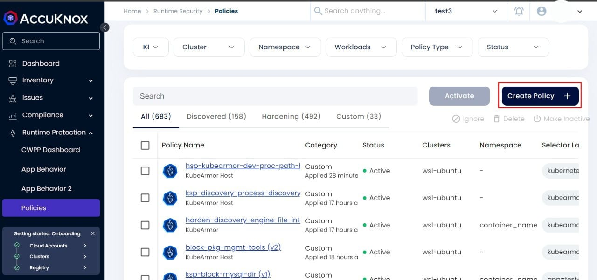
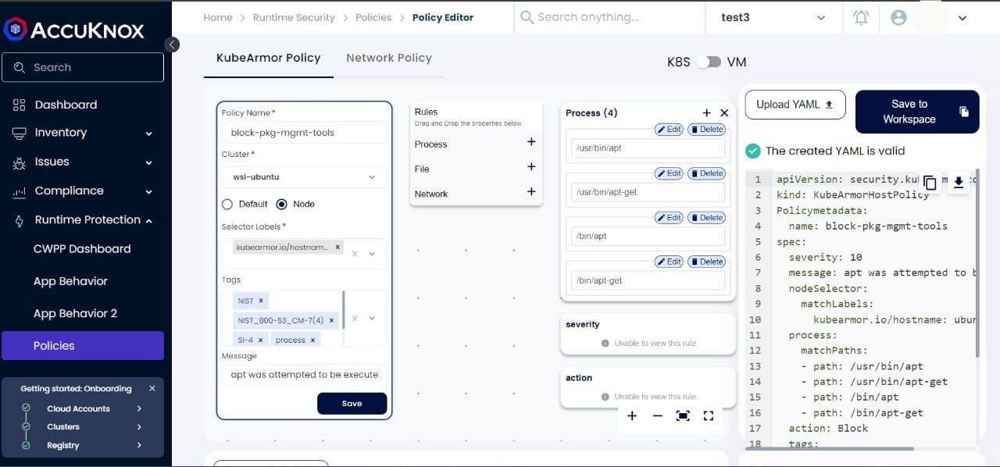
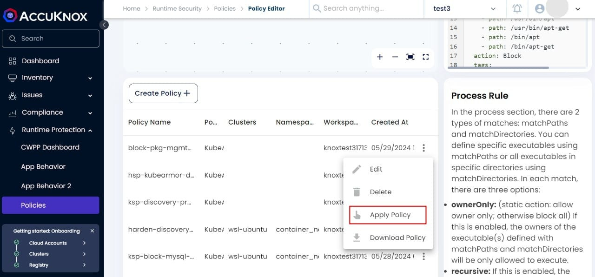
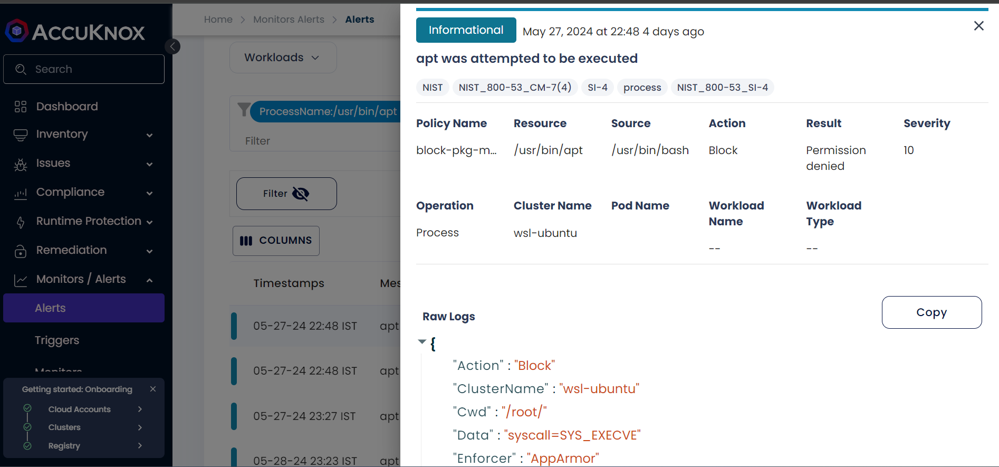
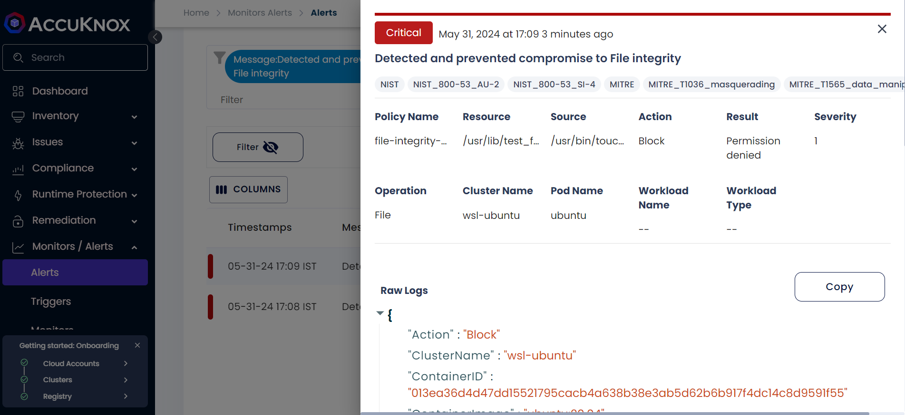
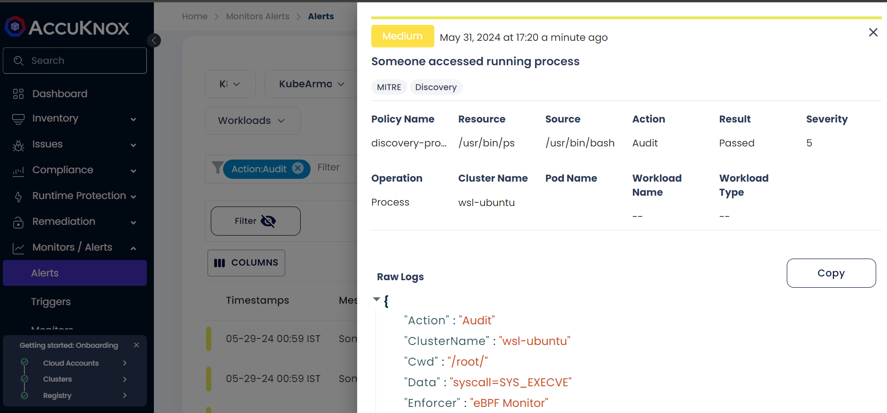
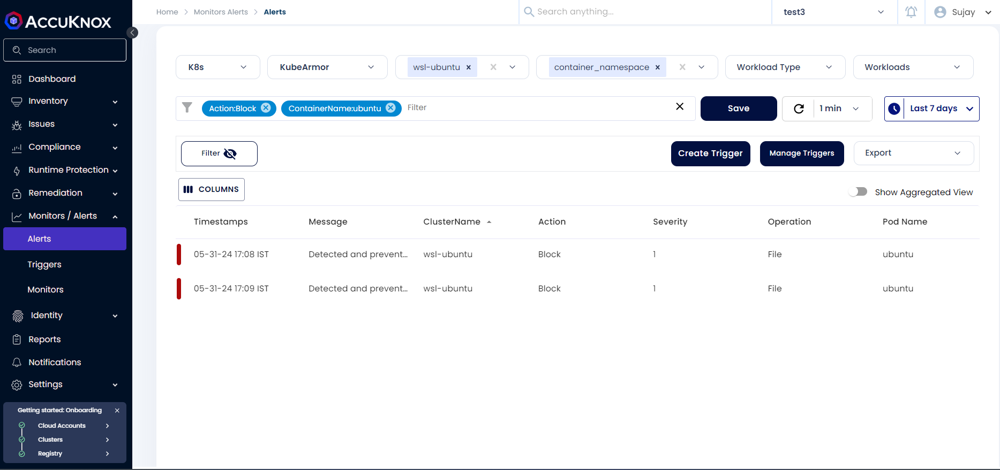

---
hide:
 - toc
---

## VM Onboarding
Onboarding your workloads to AccuKnox is the initial step to monitor, strengthen, and secure your infrastructure. We have two requirements for onboarding VMs in our SaaS.

1. Kubearmor
2. Accuknox-agents

Kuberarmor is our runtime security enforcement tool to apply the policies at runtime. On top of that, AccuKnox agents are used to extend the functionality into our SaaS. Both can run as containers and systemd services. They can be installed using the knoxctl CLI command from the onboarding page. For more details on onboarding, see the [VM onboarding guide](https://help.accuknox.com/getting-started/vm-onboarding/).

## VM Hardening
VM hardening reduces the system's attack surface by limiting potential weaknesses, e.g. unneeded packages and dependencies, misconfiguration, etc. Based on the standard security compliances, AccuKnox recommends hardening policies and further enforcing them using our open-source tool Kubearmor. This helps organizations to harden their infrastructure and become more compliant with the frameworks they care about.

## VM Enforcement & Diagnostic
In a virtual machine, there can be 2 types of policies

1. Host Policy
1. Container Policy

### Host Policy
Host policies secure the system on top of which all the processes and containers are running. Let’s look into the below attack scenario -

#### **Block Execution of package management binaries**

In an attack scenario, adversaries may use package managers to install packages for reconnaissance and escalate their privileges by downloading additional tooling from remote servers. These tools can help them gain valuable information about the system and its vulnerabilities, allowing them to carry out further attacks. It's important to be vigilant about such activities and implement security measures to prevent such attacks.

```
apiVersion: security.kubearmor.com/v1
kind: KubeArmorHostPolicy
Policymetadata:
  name: block-pkg-mgmt-tools
spec:
  severity: 10
  message: apt was attempted to be executed
  nodeSelector:
    matchLabels:
      kubearmor.io/hostname: ubuntu-2gb-hel1-1  #replace with your hostname
  process:
    matchPaths:
    - path: /usr/bin/apt
    - path: /usr/bin/apt-get
    - path: /bin/apt
    - path: /bin/apt-get
    - path: /usr/bin/dpkg
    - path: /bin/dpkg
    - path: /usr/bin/gdebi
    - path: /bin/gdebi
    - path: /usr/bin/make
    - path: /bin/make
    - path: /usr/bin/yum
    - path: /bin/yum
    - path: /usr/bin/rpm
    - path: /bin/rpm
    - path: /usr/bin/dnf
    - path: /bin/dnf
    - path: /usr/bin/pacman
    - path: /usr/sbin/pacman
    - path: /bin/pacman
    - path: /sbin/pacman
    - path: /usr/bin/makepkg
    - path: /usr/sbin/makepkg
    - path: /bin/makepkg
    - path: /sbin/makepkg
    - path: /usr/bin/yaourt
    - path: /usr/sbin/yaourt
    - path: /bin/yaourt
    - path: /sbin/yaourt
    - path: /usr/bin/zypper
    - path: /bin/zypper
  action: Block
  tags:
  - NIST
  - NIST_800-53_CM-7(4)
  - SI-4
  - process
  - NIST_800-53_SI-4
metadata:
  name: block-pkg-mgmt-tools
```
The above policy blocks the execution of the package manager in the host whose hostname is ubuntu-2gb-hel1-1. For this, we define `kubearmor.io/hostname: ubuntu-2gb-hel1-1` in nodeSelector → matchLabels, and the specific paths ('/bin/apt-get', '/bin/apt-get', 'usr/bin/apt-get' and 'usr/bin/apt-get') in process → matchPaths. Also, we put Block as the action for this policy.

As you can see below, we can execute apt and install packages before applying the policy.

```
$ sudo apt install nginx
Reading package lists... Done
Building dependency tree... Done
Reading state information... Done
The following additional packages will be installed:
  libdeflate0 libgd3 libjbig0 libjpeg-turbo8 libjpeg8
  libnginx-mod-http-geoip2 libnginx-mod-http-image-filter
  libnginx-mod-http-xslt-filter libnginx-mod-mail
  libnginx-mod-stream libnginx-mod-stream-geoip2 libtiff5
  libwebp7 libxslt1.1 nginx-common nginx-core
Suggested packages:
  libgd-tools fcgiwrap nginx-doc ssl-cert
The following NEW packages will be installed:
...
```

**Applying a policy**

Policies can be applied using the policies section from the SaaS. Under Runtime Protection, select Create Policy


Upload the yaml file and select the cluster name. The other fields will be auto-populated from the yaml. Now click on `Save` and `Save to Workspace`.


Once it is created, go to the policy, and click on `Apply Policy`.


**Violation** -

After the policy is applied successfully, we get `Permission denied` when we try to violate it. Even if the attacker has root access, they can’t execute the blocked processes.
```
root@ubuntu-2gb-hel1-1:~# apt install nginx
-bash: /usr/bin/apt: Permission denied
root@ubuntu-2gb-hel1-1:~# apt-get install nginx
-bash: /usr/bin/apt-get: Permission denied
```
For each violation attempt, alerts are generated under the `Alerts` section


**Kubearmor logs** -
```
{
"Action":"Block"
"ClusterName":"wsl-ubuntu"
"Cwd":"/root/"
"Data":"syscall=SYS_EXECVE"
"Enforcer":"AppArmor"
"HostName":"ubuntu-2gb-hel1-1"
"HostPID":15117
"HostPPID":15043
"Message":"apt was attempted to be executed"
"Operation":"Process"
"PID":15117
"PPID":0
"ParentProcessName":"/usr/bin/bash"
"PolicyName":"block-pkg-mgmt-tools"
"ProcessName":"/usr/bin/apt"
"Resource":"/usr/bin/apt"
"Result":"Permission denied"
"Severity":"10"
"Source":"/usr/bin/bash"
"TTY":"pts2"
"Tags":"NIST,NIST_800-53_CM-7(4),SI-4,process,NIST_800-53_SI-4"
"Timestamp":1716918832
"Type":"MatchedHostPolicy"
"UID":0
"cluster_id":"27273"
"component_name":"kubearmor"
"instanceGroup":"0"
"instanceID":"0"
"workload":"1"
}
```
### Container Policy
Container policies are applied to the container workloads running inside your host. Let’s take an example of container policy -
#### **File Integrity Monitoring**

Changes to system binary folders, configuration paths, and credentials paths must be monitored for change. With KubeArmor, one can monitor for changes and block any write attempts in the sensitive files and folders. This can prevent attackers from injecting or modifying system binaries, configurations, and credentials. Compliance frameworks such as PCI-DSS, NIST, and CIS recommend FIM.
```
apiVersion: security.kubearmor.com/v1
kind: KubeArmorPolicy
metadata:
  annotations:
    app.accuknox.com/source: Discovery Engine
    app.accuknox.com/type: harden
  name: harden-file-integrity-monitoring
  namespace: container_namespace
spec:
  action: Block
  file:
    matchDirectories:
    - dir: /sbin/
      readOnly: true
      recursive: true
    - dir: /usr/bin/
      readOnly: true
      recursive: true
    - dir: /usr/lib/
      readOnly: true
      recursive: true
    - dir: /usr/sbin/
      readOnly: true
      recursive: true
    - dir: /bin/
      readOnly: true
      recursive: true
    - dir: /boot/
      readOnly: true
      recursive: true
  message: Detected and prevented compromise to File integrity
  selector:
    matchLabels:
      kubearmor.io/container.name: ubuntu  #replace with your container name
  severity: 1
  tags:
  - NIST
  - NIST_800-53_AU-2
  - NIST_800-53_SI-4
  - MITRE
  - MITRE_T1036_masquerading
  - MITRE_T1565_data_manipulation
```
Before applying the policy we can write to any of those directories e.g. creating a new binary file inside `/usr/bin`.
```
root@1340edc9ff42:/# touch usr/bin/antivirus
root@1340edc9ff42:/# ls -al antivirus
-rwxr--r-- 1 root root 0 May 28 18:39 antivirus
root@1340edc9ff42:/# ls -al usr/bin/antivirus
-rw-r--r-- 1 root root 0 May 28 18:41 usr/bin/antivirus
root@1340edc9ff42:/# chmod 744 /usr/bin/antivirus
root@1340edc9ff42:/# ls -al usr/bin/antivirus
-rwxr--r-- 1 root root 0 May 28 18:41 usr/bin/antivirus
```
But once the policy is applied, we can’t modify anything inside those directories. To show it in action, we first created a test file containing EICAR signature and tried to place it inside `usr/bin` directory but got `Permission denied`. Next, we used the `touch` command to create a file inside `usr/lib` directory, which also gave a `Permission denied` error.
```
root@1340edc9ff42:/# echo 'X5O!P%@AP[4\PZX54(P^)7CC)7}$EICAR-STANDARD-ANTIVIRUS-TEST-FILE!$H+H*' > test_file
root@1340edc9ff42:/# cat test_file
X5O!P%@AP[4\PZX54(P^)7CC)7}$EICAR-STANDARD-ANTIVIRUS-TEST-FILE!$H+H*
root@1340edc9ff42:/# mv test_file /usr/bin/test
mv: cannot move 'test_file' to '/usr/bin/test': Permission denied
root@1340edc9ff42:/# touch /usr/lib/test_file
touch: cannot touch '/usr/lib/test_file': Permission denied
```
Below alerts were generated for the policy violation.


**Kubearmor logs** -
```
{
"Action":"Block"
"ClusterName":"wsl-ubuntu"
"ContainerID":"013ea36d4d47dd15521795cacb4a638b38e3ab5d62b6b917f4dc14c8d9591f55"
"ContainerImage":"ubuntu:20.04"
"ContainerName":"ubuntu"
"Cwd":"/"
"Data":"syscall=SYS_OPENAT fd=-100 flags=O_WRONLY|O_CREAT|O_NOCTTY|O_NONBLOCK"
"Enforcer":"AppArmor"
"HostName":"ubuntu-2gb-hel1-2"
"HostPID":129898
"HostPPID":129853
"Labels":"org.opencontainers.image.ref.name=ubuntu,org.opencontainers.image.vers..."
"Message":"Detected and prevented compromise to File integrity"
"NamespaceName":"container_namespace"
"Operation":"File"
"PID":12
"PPID":1
"ParentProcessName":"/usr/bin/bash"
"PodName":"ubuntu"
"PolicyName":"file-integrity-monitoring"
"ProcessName":"/usr/bin/touch"
"Resource":"/usr/lib/test_file"
"Result":"Permission denied"
"Severity":"1"
"Source":"/usr/bin/touch /usr/lib/test_file"
"TTY":"pts0"
"Tags":"NIST,NIST_800-53_AU-2,NIST_800-53_SI-4,MITRE,MITRE_T1036_masquerading,..."
"Timestamp":1717155559
"Type":"MatchedPolicy"
"UID":0
"cluster_id":"27273"
"component_name":"kubearmor"
"instanceGroup":"0"
"instanceID":"0"
"workload":"1"
}
```
## VM Forensics
AccuKnox shows Kubearmor logs under the alerts tab in our SaaS which can help to visualize the granular details to investigate an attack scenario. Let’s take the below example -

Attackers can use the `ps`, `pgrep`, `top`, and other commands to enumerate the running processes on a system. Then, using that data, they can filter and pinpoint crucial processes that could be the focus of an attack. KubeArmor can be set to audit the following process: `/bin/ps`, `/usr/bin/ps`, `/usr/bin/pgrep`, `/usr/bin/top`, and `/usr/bin/htop` by using the below policy.
```
apiVersion: security.kubearmor.com/v1
kind: KubeArmorHostPolicy
metadata:
  name: ksp-discovery-process-discovery
spec:
  severity: 5
  tags:
  - MITRE
  - Discovery
  message: Someone accessed running process
  nodeSelector:
    matchLabels:
      kubearmor.io/hostname: ubuntu-2gb-hel1-1
  action: Audit
  process:
    matchPaths:
    - path: /bin/ps
    - path: /usr/bin/ps
    - path: /usr/bin/pgrep
    - path: /usr/bin/top
    - path: /usr/bin/htop
```
This will allow KubeArmor to detect suspicious activities involving these tools, such as attempts to enumerate or exploit running processes. We can further investigate the attack by using the alert history from the SaaS.

For using the `ps` command, telemetry data is generated in `Alerts`.
```
$ ps
    PID TTY          TIME CMD
 130025 pts/1    00:00:00 bash
 130034 pts/1    00:00:00 ps
```

**Kubearmor logs** -
```
{
"Action":"Audit"
"ClusterName":"wsl-ubuntu"
"Cwd":"/root/"
"Data":"syscall=SYS_EXECVE"
"Enforcer":"eBPF Monitor"
"HostName":"ubuntu-2gb-hel1-2"
"HostPID":130034
"HostPPID":130025
"Message":"Someone accessed running process"
"Operation":"Process"
"PID":130034
"PPID":0
"ParentProcessName":"/usr/bin/bash"
"PolicyName":"discovery-process-discovery"
"ProcessName":"/usr/bin/ps"
"Resource":"/usr/bin/ps"
"Result":"Passed"
"Severity":"5"
"Source":"/usr/bin/bash"
"TTY":"pts1"
"Tags":"MITRE,Discovery"
"Timestamp":1717156232
"Type":"MatchedHostPolicy"
"UID":0
"cluster_id":"27273"
"component_name":"kubearmor"
"instanceGroup":"0"
"instanceID":"0"
"workload":"1"
}
```
On the `Alerts` page, we can filter the logs using different parameters e.g. Message, ClusterName, Action, Severity, Operation, Pod Name, ContainerID, Enforcer, PID, HostName, etc and this can also be forwarded to the integrated SIEM tools for further analysis.



Performing IaC scans for GitHub using AccuKnox SaaS ensures your infrastructure code is secure, compliant, and free from vulnerabilities. This process not only helps in early detection and remediation of issues but also integrates seamlessly into your CI/CD pipeline, making security an integral part of your development workflow.