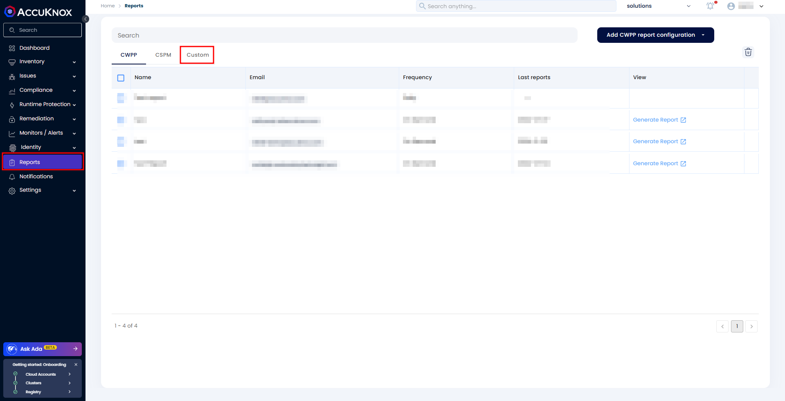
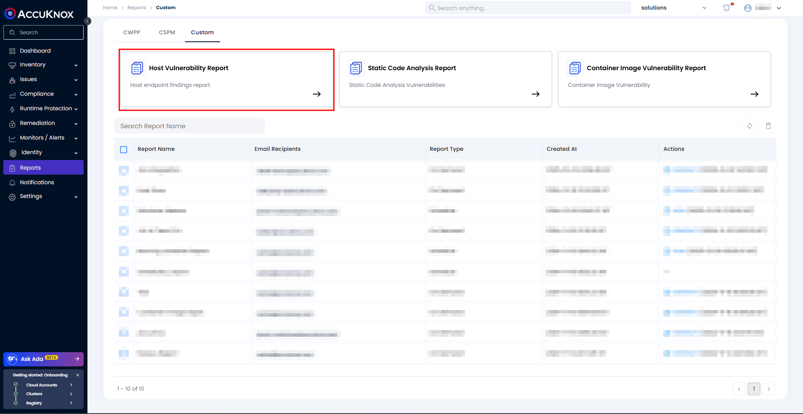
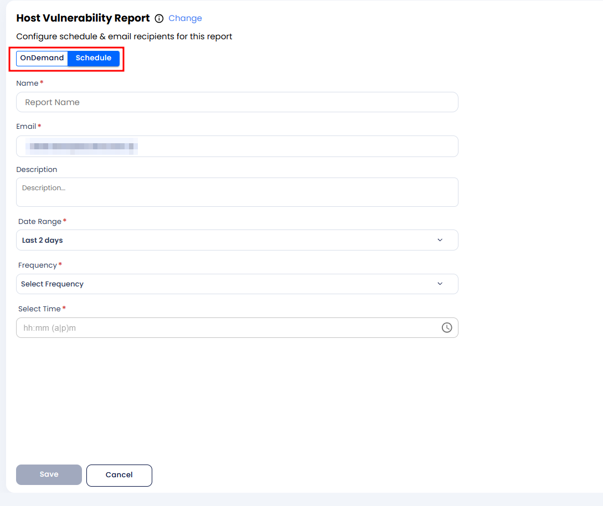
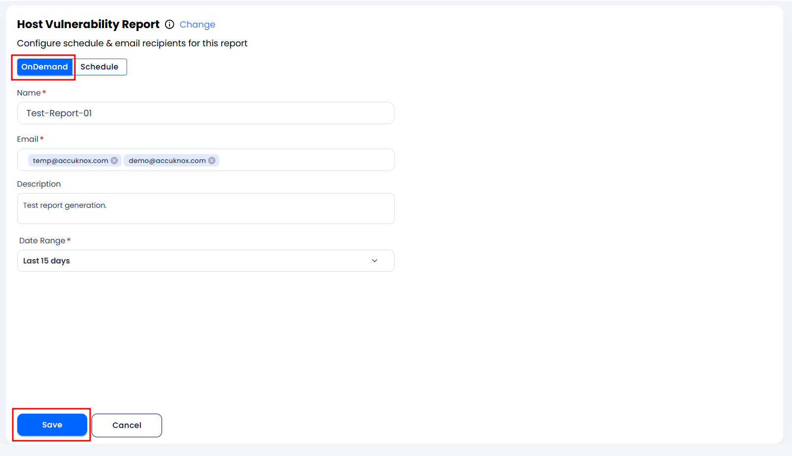
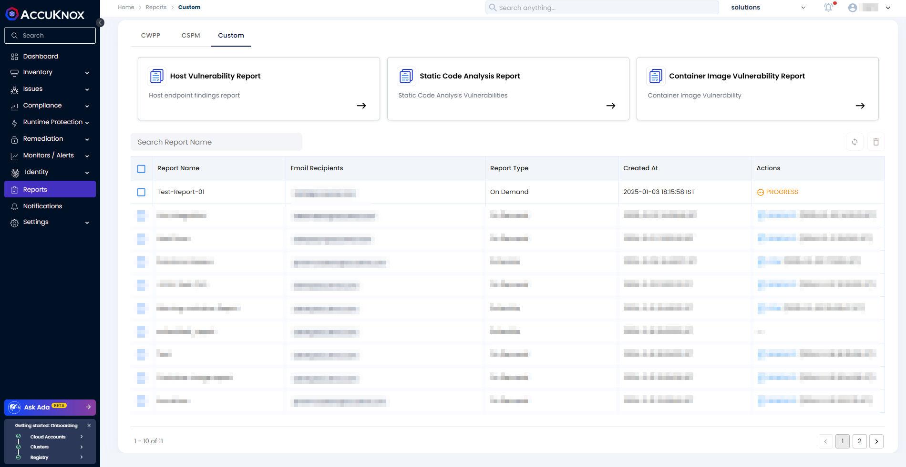
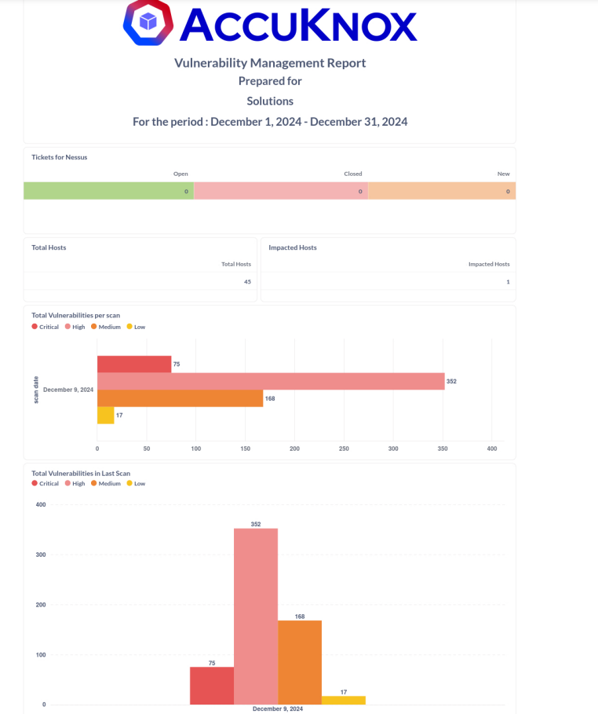
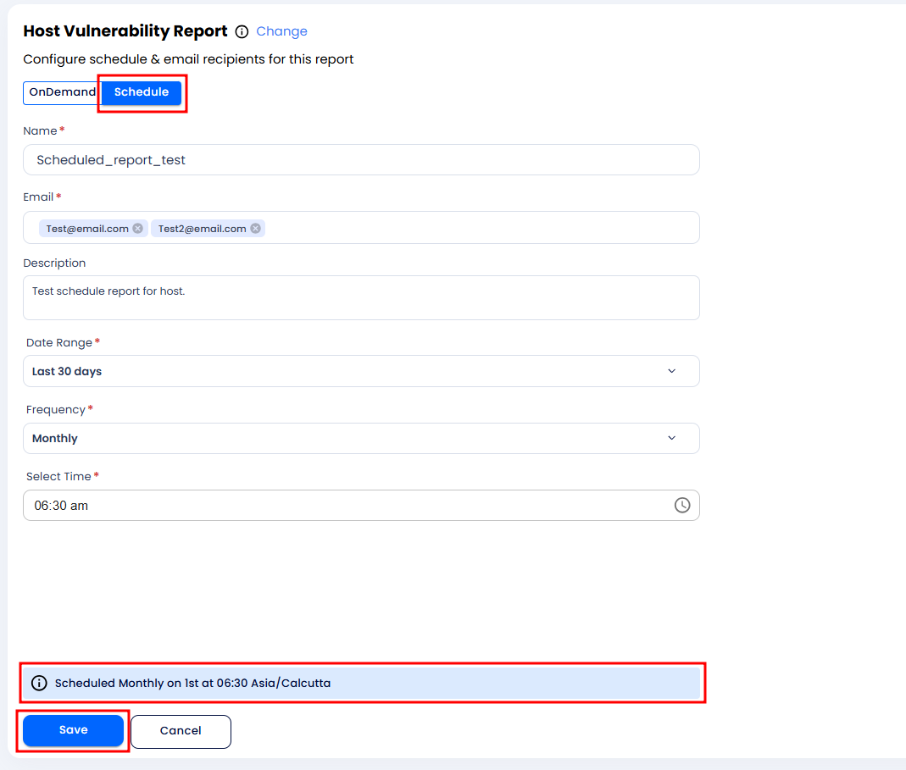
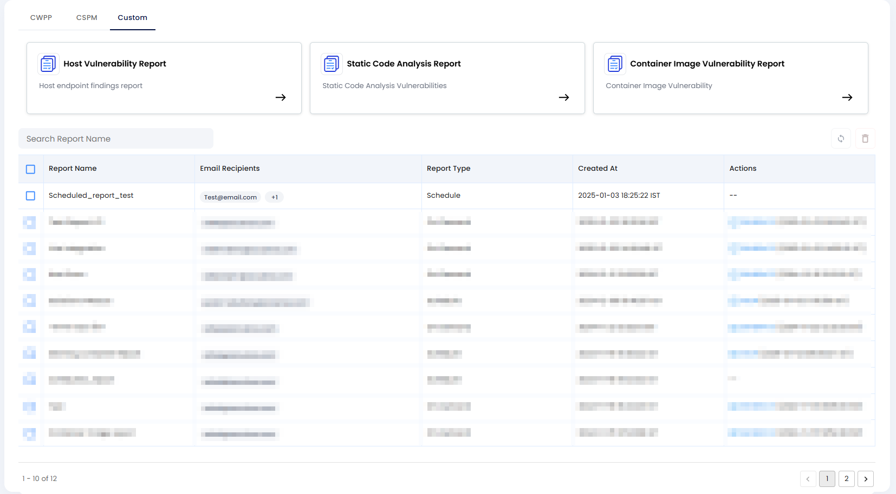

# Generate Host Vulnerability Report

AccuKnox's latest feature update provides new custom reporting feature capabilities that can help users get the reports customized as per their requirements.

!!!info NOTE
    To enable this feature, customers must inform the AccuKnox Support team (<support@accuknox.com>) regarding their requirements. The Support team will configure the report template from the backend, enabling users to generate on-demand or scheduled reports.

To generate an on-demand or scheduled report, users must follow the steps below for the **Host Vulnerability Report**.

### Accessing the Host Vulnerability Report

1. Navigate to the **Reports** section from the sidebar.

2. Go to the **Custom** tab.

1. Select the **Host Vulnerability Report** option.

### Report Generation Options

Users can generate reports in two ways:

1. **On-Demand Reports**

2. **Scheduled Reports**

### On-Demand Report Generation

**Steps to Generate an On-Demand Report:**

1. Configure the report by filling in the following details:

    - **Name**: Provide a name for the report.

    - **Report Name**: Enter the specific report name.

    - **Email**: Provide the email address to which the report should be sent.

    - **Description**: Add a description of the report.

    - **Date Range**: Choose a predefined date range (e.g., "Last 2 days").

2. Click **Save** to finalize the configuration.

1. Once saved, the report will appear in the UI with a progress state indicator.

1. After the report generation is completed:

    - The **Generate** option will appear in the UI.

    - The report will also be sent to the specified email address.

    - To view the report in the UI, click on **Generate Report**.

### Scheduled Report Configuration

**Steps to Schedule a Report:**

1. Configure the scheduled report by filling in the following details:

    - **Name**: Provide a name for the report.

    - **Report Name**: Enter the specific report name.

    - **Email**: Provide the email address to which the report should be sent. You can include multiple addresses if needed.

    - **Description**: Add a description of the report.

    - **Date Range**: Choose a predefined date range (e.g., "Last 2 days").

    - **Frequency**: Select the scheduling frequency. Options include:

        - **Daily**: Receive the report every day at a configured time.

        - **Weekly**: Schedule the report to generate on a specific day of the week.

        - **Monthly**: Configure the report to generate on the 1st of each month (user-defined dates will be supported soon).

    - **Select Time**: Specify the exact time for the report generation.

2. Click **Save** to finalize the configuration.

1. Once saved, the report will appear in the UI with a progress state indicator.

1. After the report generation is completed:

    - The **View** option will appear in the UI.

    - The report will also be sent to the specified email address.

    - To view the report in the UI, click on **View**.

### Additional Information

For more details on custom reports, refer to the guide: [**How to Configure Custom Reports**](https://help.accuknox.com/how-to/custom-reports/ "https://help.accuknox.com/how-to/custom-reports/") and [**Summarized Custom Report**](https://help.accuknox.com/how-to/summarized-custom-reports/ "https://help.accuknox.com/how-to/summarized-custom-reports/")
