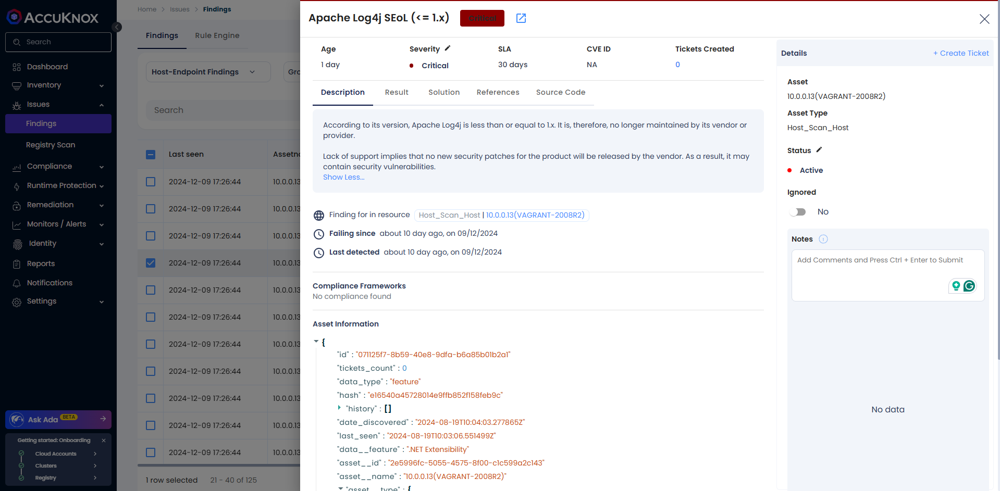
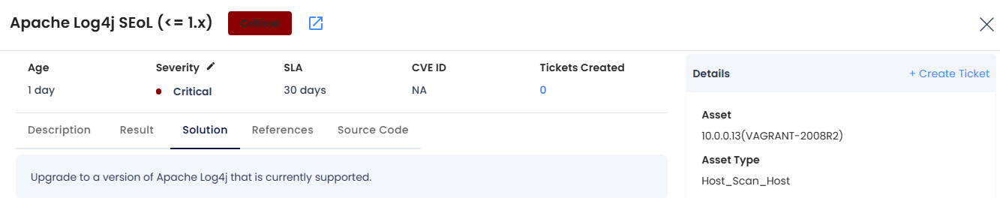
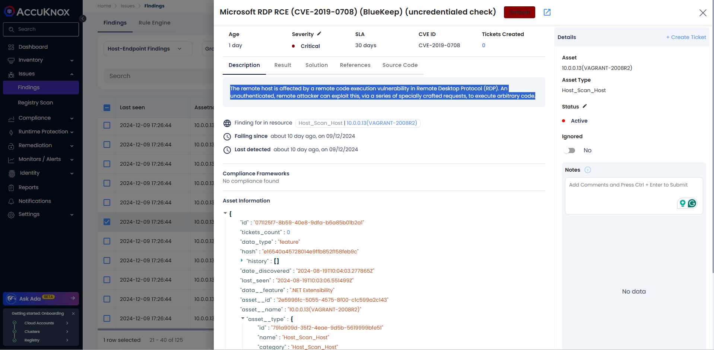
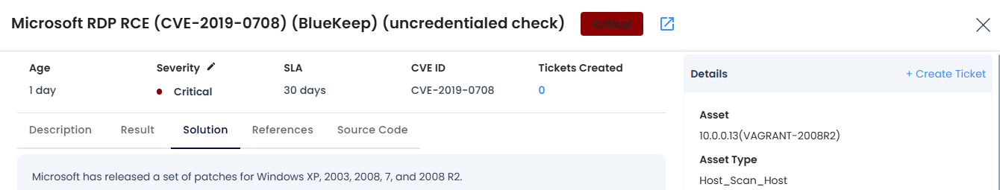
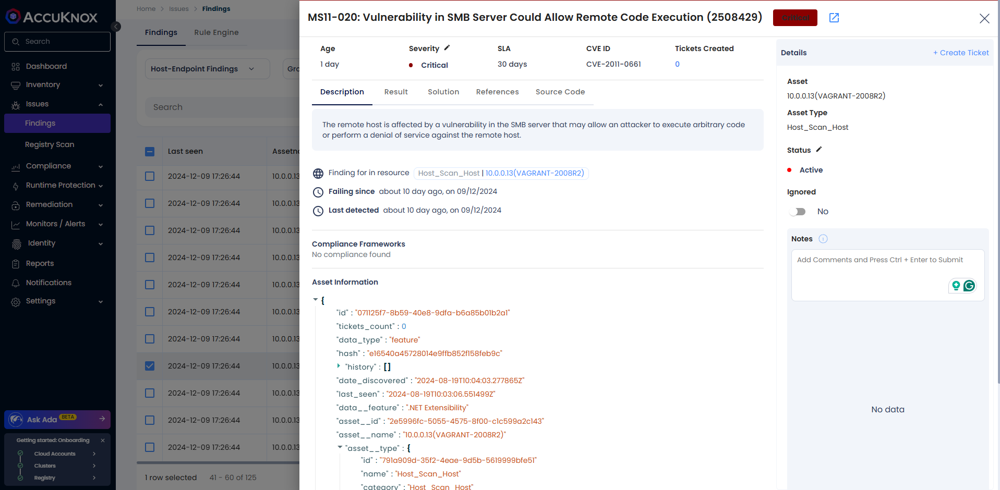
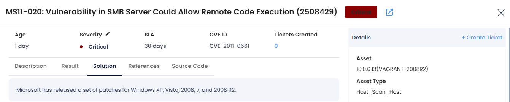

# Host Security Scan

AccuKnox provides host scanning capabilities through an integration with tools like Nessus

Nessus is a remote security scanning tool for vulnerability scanning by Tenable. IT Administration teams are using it to scan for vulnerabilities in the workstations and servers, routers, and switches which are planted all over the network both in LAN as well as WAN. It is also leveraged by professionals for Penetration Testing and compliance.

Nessus is a very advanced tool for mainly highlighting the server's configuration level, software level issues, and missing security patches. For network devices, it lists any configuration issues, outdated practices, or patches required for improving security.

By integrating Nessus with AccuKnox, the following additional security capabilities are unlocked:

- Asset discovery of On-Prem Hosts And Network Devices

- Penetration Testing Reconnaissance

- Active Directory (AD) Checks

- Unsupported OS and Third-Party Software reports

- Network Infrastructure and Database Configuration Audits

- External Attack Surface Discovery

- Malware Scan

- Automation and Remediation

- Alerting and Reporting

Thus, the integration allows AccuKnox to perform a deep scan of the On-Prem environment and provide a richer risk assessment, both for the Hosts and the Network infrastructure. This integrates seamlessly into the platform along with the findings that AccuKnox provides out of the box for the Cloud Accounts and Workloads.

Pre-requisite for Integration: [Host Scan -](https://help.accuknox.com/use-cases/host-sec/#pre-requisites-for-nessus-integration)

## Use-Cases

### **Apache Log4j**

The CVE-2021-44228 RCE vulnerability - affecting Apache's Log4j library, versions 2.0-beta9 to 2.14.1 - exists in the action the Java Naming and Directory Interface (JNDI) takes to resolve variables. According to the [CVE-2021-44228 listing](https://nvd.nist.gov/vuln/detail/CVE-2021-44228 "https://nvd.nist.gov/vuln/detail/CVE-2021-44228"), affected versions of Log4j contain JNDI features - such as message lookup substitution - that "do not protect against adversary-controlled LDAP [Lightweight Directory Access Protocol] and other JNDI related endpoints."

!!!info "note"
    The Apache [Log4j version 2.16.0 security update](https://logging.apache.org/log4j/2.x/security.html "https://logging.apache.org/log4j/2.x/security.html") that addresses the [CVE-2021-45046](https://nvd.nist.gov/vuln/detail/CVE-2021-45046 "https://nvd.nist.gov/vuln/detail/CVE-2021-45046") vulnerability disables JNDI.

#### Impact

An adversary can exploit CVE-2021-44228 by submitting a specially crafted request to a vulnerable system that causes that system to execute arbitrary code. The request allows the adversary to take full control over the system. The adversary can then steal information, launch ransomware, or conduct other malicious activity.

AccuKnox Host Scan detects critical vulnerabilities like Apache Log4j and provides remediation steps to remediate the critical findings

#### **Solution**

Upgrading the package to the latest supported version will remediate the vulnerability

### **Microsoft RDP RCE (CVE-2019-0708)**

A remote code execution vulnerability exists in Remote Desktop Services -- formerly known as Terminal Services -- when an unauthenticated attacker connects to the target system using RDP and sends specially crafted requests. This vulnerability is pre-authentication and requires no user interaction. An attacker who successfully exploited this vulnerability could execute arbitrary code on the target system. An attacker could then install programs; view, change, or delete data; or create new accounts with full user rights.

To exploit this vulnerability, an attacker would need to send a specially crafted request to the target systems Remote Desktop Service via RDP.

#### Impact

The remote host is affected by a remote code execution vulnerability in Remote Desktop Protocol (RDP). An unauthenticated, remote attacker can exploit this, via a series of specially crafted requests, to execute arbitrary code.

AccuKnox Detects the Microsoft RDP RCE and provides descriptive solutions to help organizations patch the critical vulnerability

#### Solution

Microsoft has released a set of patches for OS having CVE-2019-0708, Installing the security patch will remediate the vulnerability.

### **MS11-020: Vulnerability in SMB Server**

The remote host is affected by a vulnerability in the SMB server that may allow an attacker to execute arbitrary code or perform a denial of service against the remote host. This vulnerability depends on access to a Windows file share but does not necessarily require credentials.

#### Impact

It is possible to execute arbitrary code on the remote Windows host due to flaws in its SMB implementation.

AccuKnox scans the host to identify vulnerabilities related to outdated components, packages, operating systems, file systems, and more. It also provides detailed remediation steps to address these security issues effectively.

#### Solution

Microsoft has released the security patches which need to be installed to remediate the security issues

To remediate this:

Users can create tickets from AccuKnox Saas UI with the required details of the findings

