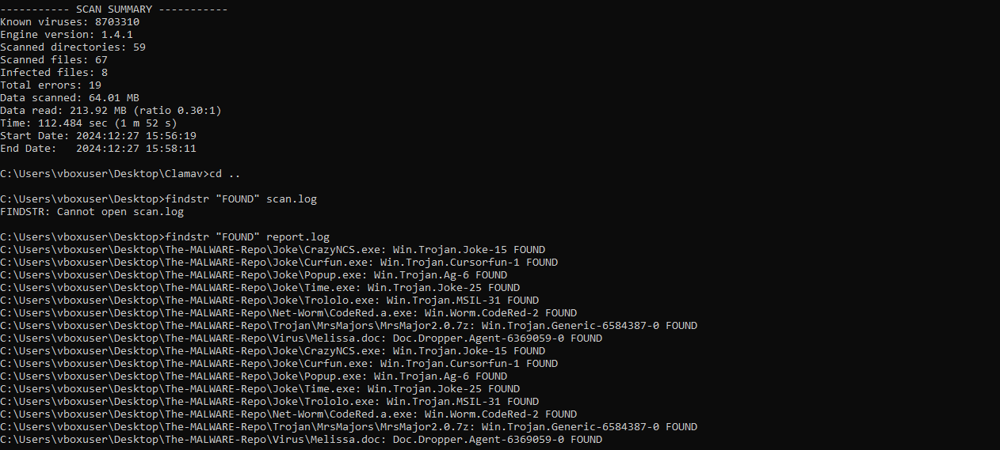

# Malware Scan

AccuKnox integrates with ClamAV to extend the host scanning capabilities to Windows/Linux machines.

ClamAV is an Open-source antivirus engine developed by Cisco, for detecting malware, viruses, trojans, and other security threats, specially designed for e-mail scanning on mail gateways.

## UseCases

### **Quick scan**

ClamAV is optimized to scan files. Scans can be triggered on multiple files or directories by using the include/exclude option. Users can see the scan results in the SaaS and quarantine or delete the infected files.

In the example below, the scan ran against the URL (<https://secure.eicar.org/eicar.com.txt>), which was a malicious text file. ClamAV detected and raised it in the scan results with the matched virus signature as cmdown below.

```cmd
$ curl https://secure.eicar.org/eicar.com.txt | clamscan -
  % Total    % Received % Xferd  Average Speed   Time    Time     Time  Current
                                 Dload  Upload   Total   Spent    Left  Speed
100    68  100    68    0     0     11      0  0:00:06  0:00:05  0:00:01    141.78M/8.71M sigs                 ]    1.77M/8.71M sigs    0.00K/8.71M sigs
Loading:    13s, ETA:   0s [========================>]    8.69M/8.69M sigs
Compiling:   4s, ETA:   0s [========================>]       41/41 tasks
stdin: Win.Test.EICAR_HDB-1 FOUND
----------- SCAN SUMMARY -----------
Known viruses: 8693157
Engine version: 1.2.1
Scanned directories: 0
Scanned files: 1
Infected files: 1
Data scanned: 0.00 MB
Data read: 0.00 MB (ratio 0.00:1)
Time: 18.313 sec (0 m 18 s)
Start Date: 2024:05:17 15:42:09
End Date:   2024:05:17 15:42:27
```


The CVD (ClamAV Virus Database) files are a collection of signatures, actively maintained by the Cisco Talos team. A digitally signed container that wraps the signatures to ensure no malicious third party can modify it. The SaaS integration can run scans against 8M+ trusted signatures.

### **Real-time protection for Linux**

The `ClamOnAcc` client utilizes the `ClamD` daemon to provide on-access scanning. This includes preventing access to a file until it has been scanned.

### **Protect against archive bombs**

A malicious archive file can disable a system or a program while unpacked. Archive bombs consume too much CPU and memory and excessively load the system.

The SaaS integration can protect from these malicious files by taking the archives as input and then extracting and scanning them against trusted ClamAV database out of the box. It can scan against the archive formats below:

- RAR (most versions)

- 7Zip

- Zip (exclude some extensions)

- Tar

- XZ

- Gzip

- Bzip2

- XAR

- ARJ

- IMG

- ISO 9660

- PKG

- Microsoft OLE2

- Microsoft OOXML (Office documents)

- Microsoft Cabinet Files (including SFX)

- Microsoft CHM (Compiled HTML)

- Microsoft SZDD compression format and others

### **Scan Windows Portable Executables(PE)**

Portable Executables(PE) is a data structure that contains the information required for the Windows OS loader to handle the executables. The ClamAV integration can scan Windows executable files for both 32/64 bit and protect them from attacks like process injection and back-door implementation. The below compression formats are supported for scanning:

- PeSpin

- UPX

- AsPack

- MEW

- FSG

- NsPack

- Petite

- Y0da Cryptor

- Upack

- wwpack32

### **Scan mail Attachments**

Mail attachments can contain malicious files that can trigger suspicious activities. From the AccuKnox SaaS, we can scan these mail attachments before opening or even downloading them and protect users from viruses, malware, or other potentially dangerous code. Almost all mail file formats can be scanned from the SaaS UI.

### **Detect PII in text files**

PII stands for personally identifiable information. The ClamAV integration will allow users to check for sensitive information in their emails e.g. bank details, credit card information, etc from the AccuKnox SaaS itself. It will utilize the `libclamav` package to detect and flag credit card information in the SaaS. The below credit card issuers are supported:

- VISA

- MasterCard

- AMEX

- Discover

- Diner's Club

- JCB

- U.S. social security numbers inside text files

## Scanning Windows files using ClamAV

`clamscan -r -i /[path-to-folder]`

- Sample file to be scanned: [Github_link](https://github.com/Da2dalus/The-MALWARE-Repo "https://github.com/Da2dalus/The-MALWARE-Repo")

- Clone the repo and provide the file path in clamscan

```cmd
C:\Users\vboxuser\Desktop\Clamav>clamscan -r \Users\vboxuser\Desktop\The-MALWARE-Repo --log=\Users\vboxuser\Desktop\report.log --bell --infected
```

-r = recursive

**Scan Summary**

```cmd
----------- SCAN SUMMARY -----------
Known viruses: 8703310
Engine version: 1.4.1
Scanned directories: 59
Scanned files: 67
Infected files: 8
Total errors: 19
Data scanned: 64.01 MB
Data read: 213.92 MB (ratio 0.30:1)
Time: 112.484 sec (1 m 52 s)
Start Date: 2024:12:27 15:56:19
End Date:   2024:12:27 15:58:11
```

### Findings

```cmd
C:\Users\vboxuser\Desktop>findstr "FOUND" report.log
C:\Users\vboxuser\Desktop\The-MALWARE-Repo\Joke\CrazyNCS.exe: Win.Trojan.Joke-15 FOUND
C:\Users\vboxuser\Desktop\The-MALWARE-Repo\Joke\Curfun.exe: Win.Trojan.Cursorfun-1 FOUND
C:\Users\vboxuser\Desktop\The-MALWARE-Repo\Joke\Popup.exe: Win.Trojan.Ag-6 FOUND
C:\Users\vboxuser\Desktop\The-MALWARE-Repo\Joke\Time.exe: Win.Trojan.Joke-25 FOUND
C:\Users\vboxuser\Desktop\The-MALWARE-Repo\Joke\Trololo.exe: Win.Trojan.MSIL-31 FOUND
C:\Users\vboxuser\Desktop\The-MALWARE-Repo\Net-Worm\CodeRed.a.exe: Win.Worm.CodeRed-2 FOUND
C:\Users\vboxuser\Desktop\The-MALWARE-Repo\Trojan\MrsMajors\MrsMajor2.0.7z: Win.Trojan.Generic-6584387-0 FOUND
C:\Users\vboxuser\Desktop\The-MALWARE-Repo\Virus\Melissa.doc: Doc.Dropper.Agent-6369059-0 FOUND
C:\Users\vboxuser\Desktop\The-MALWARE-Repo\Joke\CrazyNCS.exe: Win.Trojan.Joke-15 FOUND
C:\Users\vboxuser\Desktop\The-MALWARE-Repo\Joke\Curfun.exe: Win.Trojan.Cursorfun-1 FOUND
C:\Users\vboxuser\Desktop\The-MALWARE-Repo\Joke\Popup.exe: Win.Trojan.Ag-6 FOUND
C:\Users\vboxuser\Desktop\The-MALWARE-Repo\Joke\Time.exe: Win.Trojan.Joke-25 FOUND
C:\Users\vboxuser\Desktop\The-MALWARE-Repo\Joke\Trololo.exe: Win.Trojan.MSIL-31 FOUND
C:\Users\vboxuser\Desktop\The-MALWARE-Repo\Net-Worm\CodeRed.a.exe: Win.Worm.CodeRed-2 FOUND
C:\Users\vboxuser\Desktop\The-MALWARE-Repo\Trojan\MrsMajors\MrsMajor2.0.7z: Win.Trojan.Generic-6584387-0 FOUND
C:\Users\vboxuser\Desktop\The-MALWARE-Repo\Virus\Melissa.doc: Doc.Dropper.Agent-6369059-0 FOUND
```



### **Key Takeaways**

- Users can scan Windows/Linux filesystems using ClamAV.

- Users can automate the scan and reporting.

- After the scan, the data can be seen on AccuKnox SaaS.

- Users can create tickets to quarantine or remove the infected files from AccuKnox SaaS
