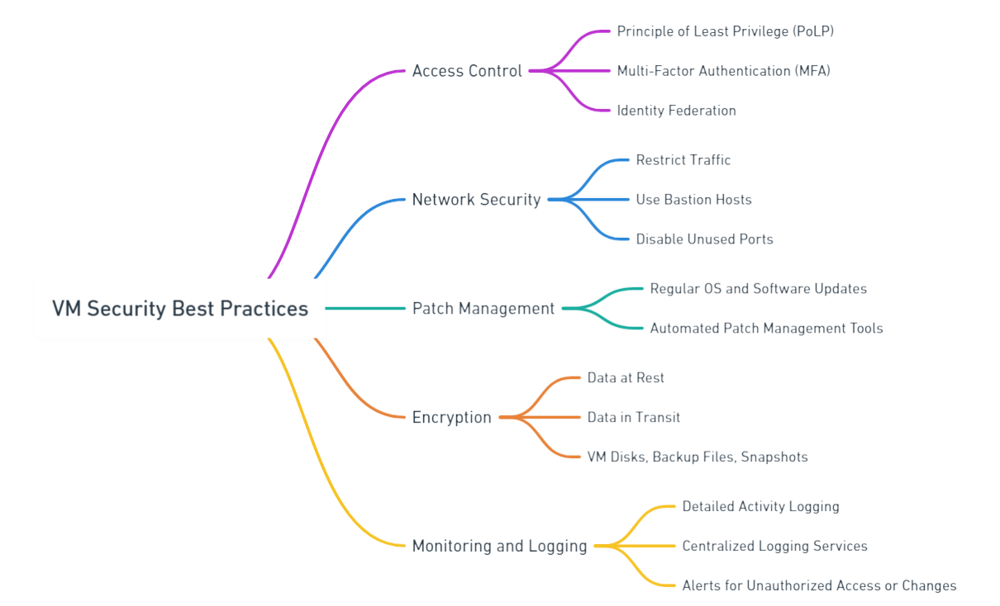

# Misconfiguration of Cloud-Hosted Virtual Machines

Cloud-hosted virtual machines (VMs) are an essential part of modern infrastructure. However, misconfigurations can lead to significant security vulnerabilities. This document provides a detailed guide to understanding and preventing misconfigurations in virtual machines hosted on AWS, GCP, and Azure.

::cards:: cols=3

- title: AWS Misconfiguration
  image: ../images/vm-misconfigurations/aws-vm.svg
  url: /use-cases/vm-aws/

- title: GCP Misconfiguration
  image: ../images/vm-misconfigurations/gcp-vm.svg
  url: /use-cases/vm-gcp/

- title: Azure Misconfiguration
  image: ../images/vm-misconfigurations/azure-vm.svg
  url: /use-cases/vm-azure/

::/cards::

## General Best Practices for VM Security

### 1. **Access Control**

- **Principle of Least Privilege (PoLP):** Ensure users and services have only the permissions they need.

- **Multi-Factor Authentication (MFA):** Require MFA for all accounts accessing the cloud environment.

- **Identity Federation:** Integrate with centralized IAM solutions for streamlined and secure access.

### 2. **Network Security**

- **Restrict Traffic:** Limit ingress and egress traffic using firewalls or security groups.

- **Use Bastion Hosts:** Restrict direct SSH/RDP access to VMs; use Bastion hosts for controlled access.

- **Disable Unused Ports:** Regularly review and close unnecessary ports to minimize attack surfaces.

### 3. **Patch Management**

- Regularly update the operating system and install software to address known vulnerabilities.

- Use automated patch management tools to streamline updates.

### 4. **Encryption**

- Use encryption for data at rest and in transit.

- Ensure VM disks, backup files, and snapshots are encrypted.

### 5. **Monitoring and Logging**

- Enable detailed logging for VM activities.

- Use centralized logging services to analyze logs and detect anomalies.

- Set up alerts for unauthorized access or changes to configurations.
