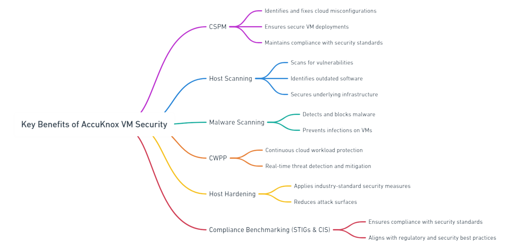

# Introduction to AccuKnox VM Security

**VM Security** refers to the practices and technologies used to protect virtual machines (VMs) from threats, vulnerabilities, and unauthorized access. Virtual machines are software-based emulations of physical computers that run an operating system and applications. Since VMs share physical resources and are often part of dynamic, cloud-based environments, securing them is critical to maintaining the integrity of systems and data.

### Key Objectives of VM Security

1. **Prevent Unauthorized Access**:
    Ensure that only authorized users and processes can access or manage VMs.

2. **Protect Data and Applications**:
    Safeguard data stored or processed within the VM from breaches or corruption.

3. **Maintain Compliance**:
    Adhere to industry regulations and security standards, such as GDPR, HIPAA, or PCI DSS.

4. **Ensure Isolation**:
    Prevent vulnerabilities in one VM or its host environment from affecting others.

### Key Components of VM Security

1. **Secure Configuration**:

    - Configure VMs with minimal privileges and follow security best practices.

    - Disable unnecessary services and use hardened operating systems.

2. **Patch Management**:

    - Keep the operating system, applications, and components up-to-date with the latest security patches.

3. **Access Control**:

    - Enforce strong authentication and role-based access controls (RBAC) for VM management.

4. **Network Security**:

    - Use virtual firewalls, segmentation, and encryption to protect communication between VMs.

5. **Monitoring and Logging**:

    - Monitor VM activities in real-time to detect anomalies or malicious actions.

    - Enable logging for audit trails and forensic investigations.

6. **Malware Protection**:

    - Regularly scan VMs for malicious software and implement endpoint protection tools.

7. **Backup and Recovery**:

    - Maintain regular backups of VM data and configurations to recover quickly in case of an attack or failure.

By implementing comprehensive VM security measures, organizations can effectively secure their virtualized infrastructure and reduce the risk of cyber threats.

## AccuKnox VM Security

AccuKnox enhances **VM security** by combining **CSPM**, **Host Scanning**, **Malware Scanning**, **CWPP**, **Host Hardening**, and **Compliance Benchmarking** (STIGs and CIS). These technologies offer comprehensive protection for virtual machines and hosts, ensuring both security and compliance.

### Key Benefits of AccuKnox VM Security

1. **CSPM**:
    Automatically identifies and fixes cloud misconfigurations, ensuring secure VM deployments and compliance with security standards.

2. **Host Scanning**:
    Scans for vulnerabilities and outdated software on VM hosts, securing the underlying infrastructure.

3. **Malware Scanning**:
    Detects and blocks malware, preventing infections on VMs.

4. **CWPP**:
    Provides continuous protection for cloud workloads, detecting and mitigating security threats in real-time.

5. **Host Hardening**:
    Applies industry-standard security measures to secure the VM host, reducing attack surfaces.

6. **Compliance Benchmarking (STIGs & CIS)**:
    Ensures VMs and hosts comply with security standards like STIGs and CIS, aligning with regulatory and security best practices.

Open image (11)-20241230-093622.png

### Overall Benefits

- **Proactive Security**: Prevents threats with continuous monitoring and remediation.

- **Compliance Assurance**: Meets regulatory standards through STIGs and CIS compliance.

- **Real-Time Protection**: Secures VMs and hosts with layered defenses.

- **Reduced Attack Surface**: Minimizes risks with host hardening and compliance checks.

AccuKnox ensures comprehensive VM security while helping organizations stay compliant with industry standards.
