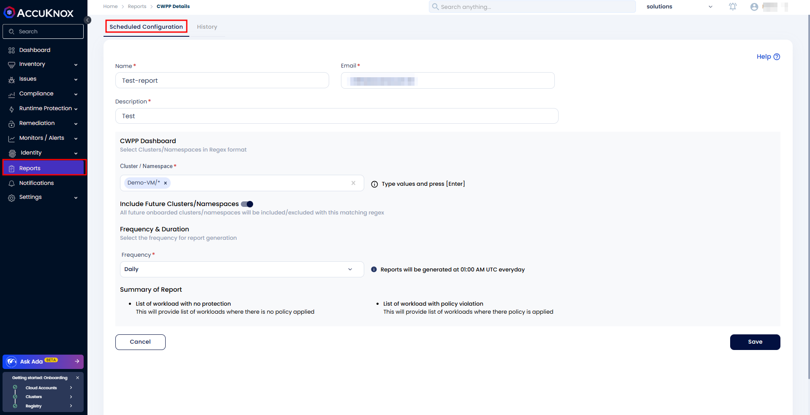

# **Reporting**

## **Overview**

CWPP supports generating comprehensive security reports for your VM's, either on demand or as per a scheduled frequency. The reports help in analyzing security postures, tracking violations, and ensuring compliance.

## **On-Demand Reports**

1. Generate reports immediately after configuration, allowing for quick analysis of current cluster activity.

**Steps:-**

1. Navigate to the Reports section in AccuKnox SaaS.

2. Choose "On Demand" from the report type drop-down menu.

3. Fill in the configuration details, including:

    - **Name and Description** for the report.

    - **VM Selection** using regex syntax.

4. Click "Save and Generate Report."

5. The report will be generated in PDF format for the selected clusters and namespaces.

**Scenario**

You need a detailed security posture analysis of vm `Testvm`. Use the regex `Testvm` and generate an on-demand report to assess violations and configurations.

## **Scheduled Reports**

1. Automatically generate reports at predefined intervals (e.g., daily, weekly, or monthly).

**Steps:-**

1. Navigate to the Reports section in AccuKnox SaaS.

2. Choose "Scheduled" from the report type drop-down menu.

3. Fill in the configuration details, including:

    - **Name and Email** for the recipient.

    - **VM Selection** using regex syntax.

    - **Frequency** of the report (daily, weekly, or monthly).

1. Click "Save" to Schedule Report.

2. The report will be automatically sent to the configured email address daily at 01:00 AM UTC.

**Scenario**

A compliance officer requires a weekly report summarizing activity across all clusters and namespaces. Use the regex `*/*` and configure a scheduled report to be delivered every Monday.
