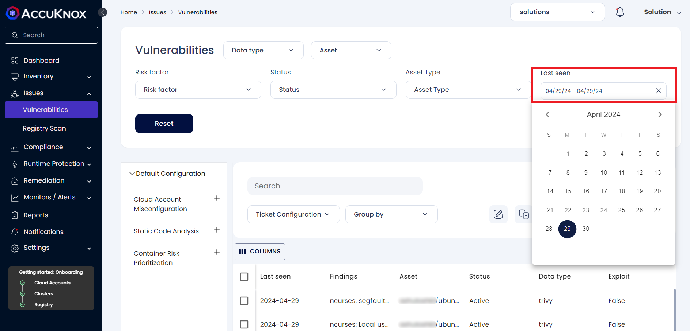
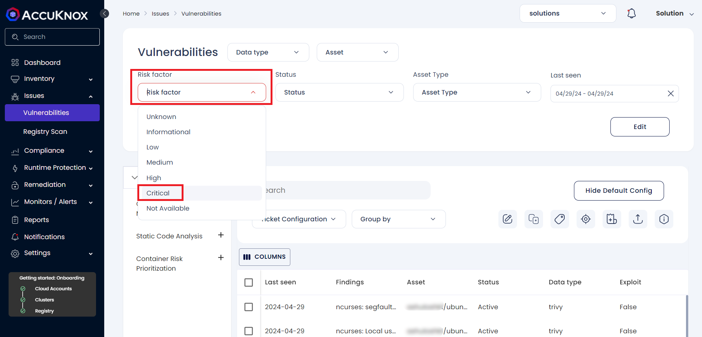
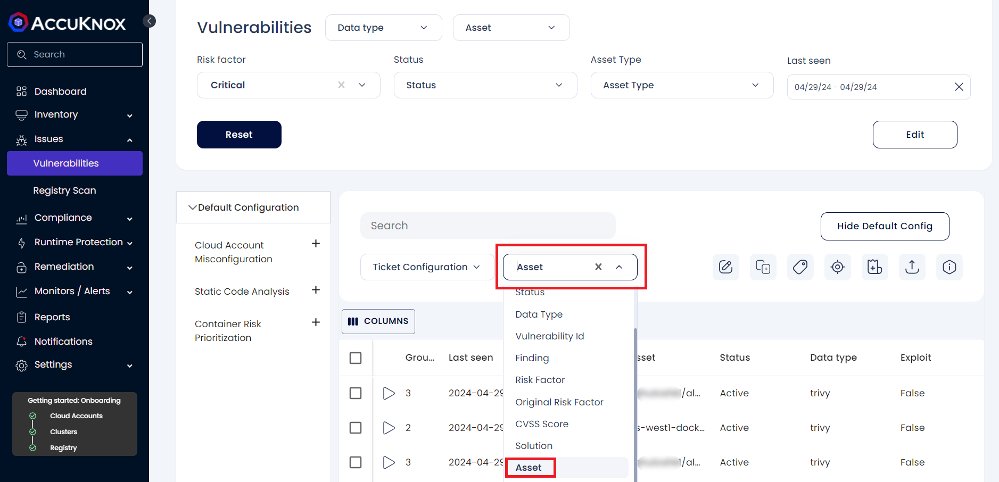
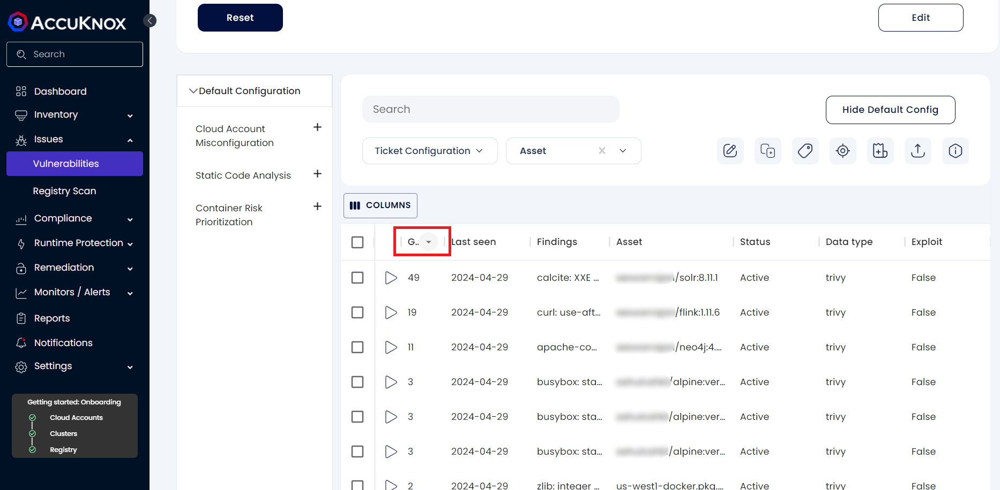
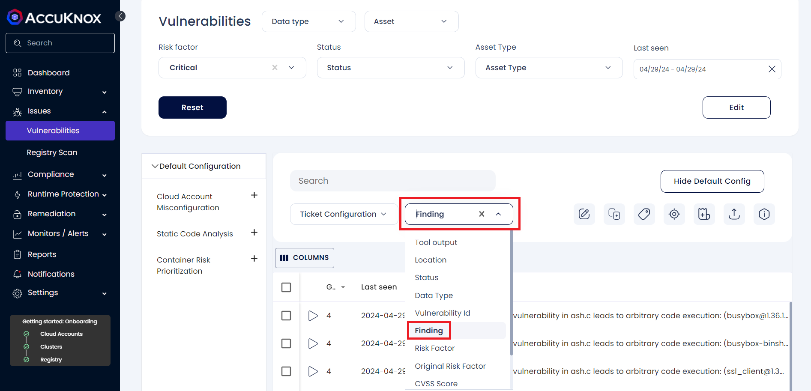
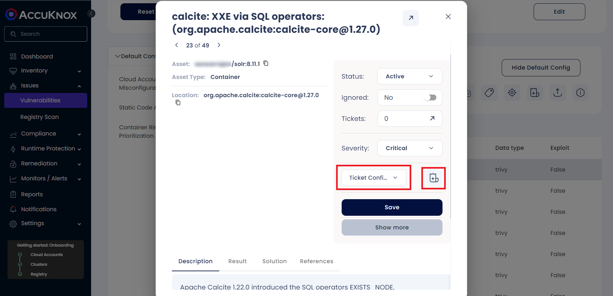

---
hide:
  - toc
---

AccuKnox SaaS allows managing the findings from multiple vectors starting from the code phase to the runtime all from a single screen. Navigate to Issues → Vulnerabilities to make use of the advanced threat management capabilities including grouping, sorting and filtering based on a multitude of criteria simultaneously.

For example, let’s consider a scenario where the user would like to work on the most critical findings observed today

**Step 1**: To view the most recent findings, set the **Last seen** filter to today. Click on the filter and click on today’s date twice.

This list will now show only the findings from today, the most recent vulnerabilities and misconfigurations found to be active.

**Step 2**: Select the **Risk Factor** as **Critical** to view only the findings that need to be prioritized.

**Step 3**: Select **Asset** from the **Group By** drop down to map the critical findings to particular Assets.

**Step 4**: Click on the first column twice to sort by descending order. This will show the Asset with the highest number of critical findings associated with it at the top.

Thus we have identified the asset with highest risk, active today that needs to be worked upon immediately.

Similarly, we can group by **Findings** to view the high criticality Finding that is observed in multiple Assets

**Step 5**: Click on the first row to open a detailed view where we can create a single ticket that contains details of the finding and group of assets associated with it along with the solution, if available. Select a **Ticket Configuration** and click on the Create a Ticket icon.

This screen also provides options to change the status, severity and also to ignore the findings if required. We can also click on the Arrow Icon at the top right to view a more detailed view of the particular finding, history and other assets impacted by it.

 - - - 
[SCHEDULE DEMO](https://www.accuknox.com/contact-us){ .md-button .md-button--primary }
