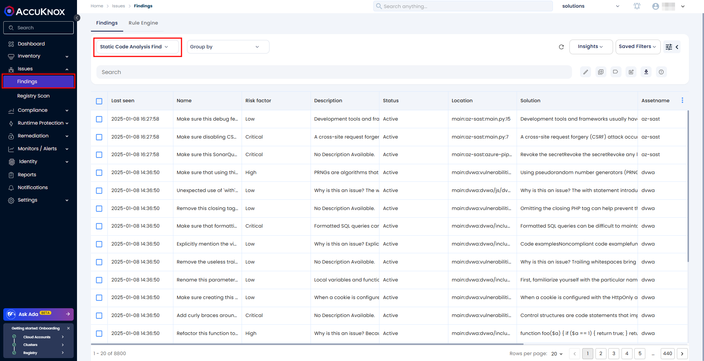
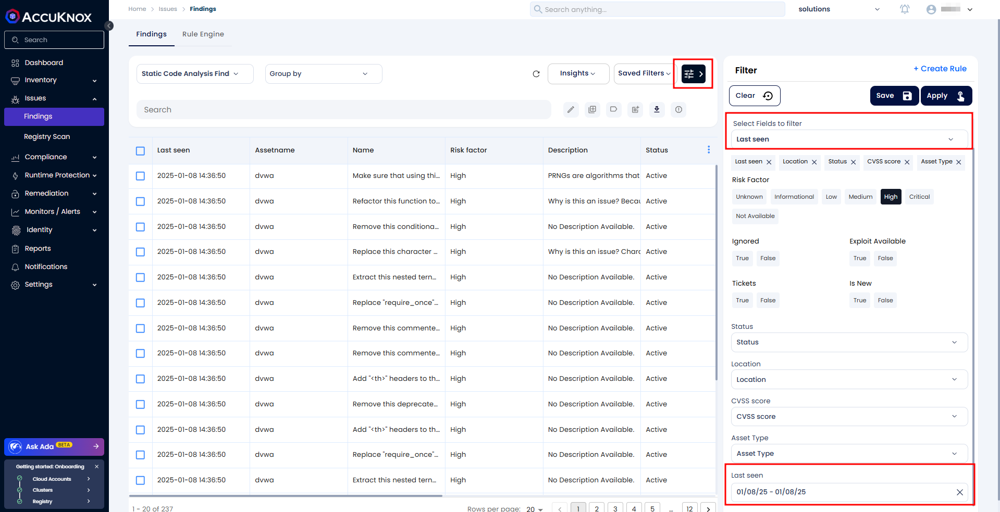
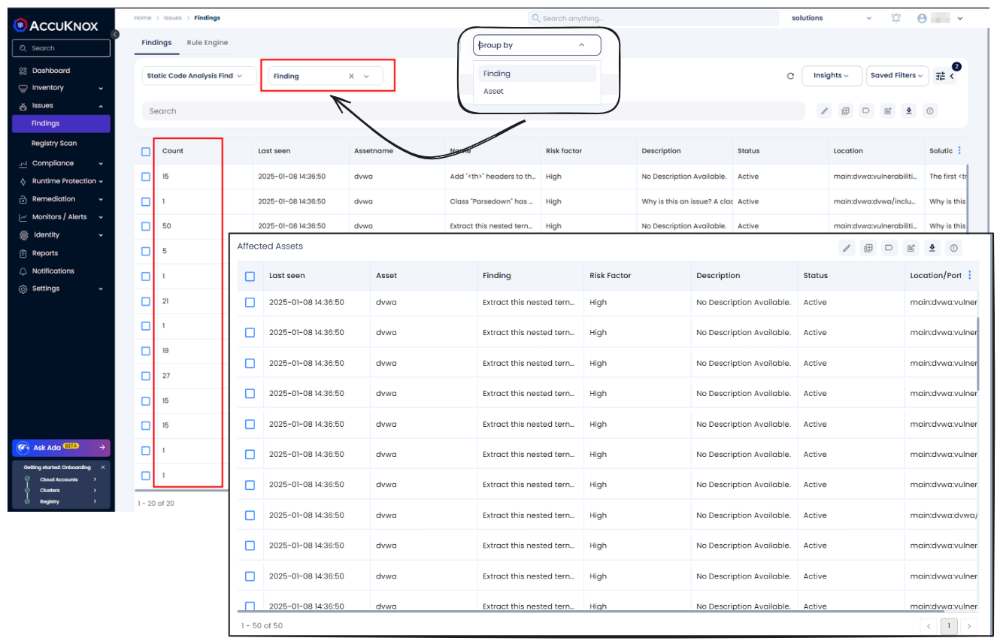
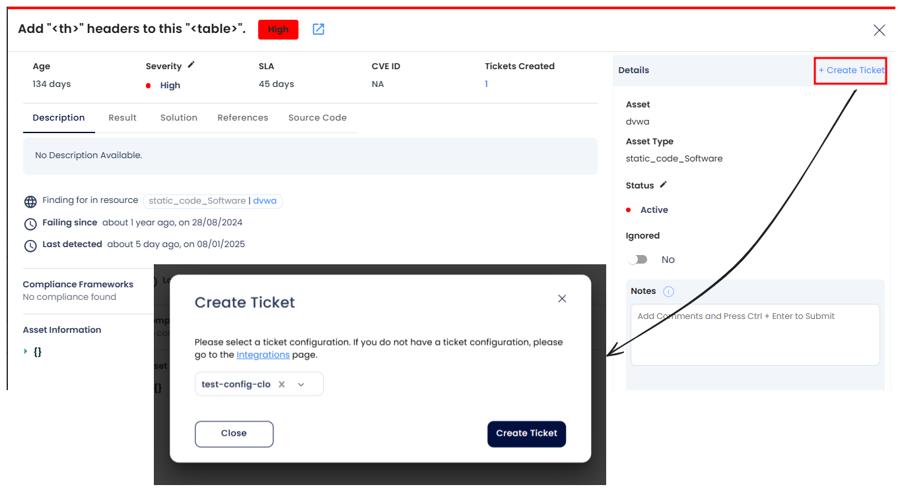
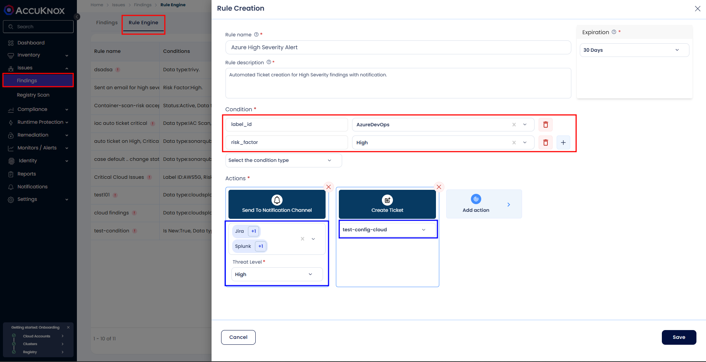

# Vulnerability Management

AccuKnox SaaS provides a centralized platform for managing findings across various stages, from code development to runtime operations. By navigating to **_Issues → Findings_**, users can efficiently leverage advanced threat management features such as grouping, sorting, and filtering findings based on multiple criteria, ensuring streamlined analysis and prioritization.

## Use Case: Prioritizing Critical Findings Observed Today

To demonstrate the functionality, let's consider a scenario where a user wants to work on the most critical findings detected today.

### Step 1: Filter Findings by Date

1. Navigate to the **Issues → Findings** page and select the type of findings you want to see..

2. Use the **Advanced Filter** option to set the **Last Seen** filter to today's date:

   - Click on the Fields to filter add **Last Seen** filter.

   - Click on **Last Seen Filter,** Select today's date twice to narrow the results to the most recent findings.

The displayed list now contains vulnerabilities and misconfigurations identified today and still active.

### Step 2: Focus on Critical Findings

1. Set the **Risk Factor** filter to **Medium, High, Critical**:

   - This will show only the findings that require immediate attention.

### Step 3: Group Findings by Asset

1. Select **Asset** or **Findings** from the **Group By** dropdown menu:

   - Grouping by **Asset** maps critical findings to specific assets, enabling targeted remediation.

   - Grouping by **Findings** highlights similar findings affecting different assets, helping identify patterns and common issues.

### Step 4: Sort Findings

1. Click the first column header twice to sort by descending order:

   - The asset with the highest number of critical findings will appear at the top of the list.

With this process, you can identify the highest-risk asset with active issues detected today that need immediate action.

### Step 5: View Details and Create Tickets

1. Click on the any finding to open a detailed view of a finding.

2. From this view, you can:

   - Create a single ticket that includes:

     - Details of the finding.

     - Grouped assets affected.

     - Available solutions.

   - Select a **Ticket Configuration** and click on the **Create a Ticket** icon.

## Rule Engine

The Rule Engine enables automation for improved efficiency:

- Create rules for specific type of finding to:

    - Change the status of findings.

    - Create tickets.

    - Send notifications via email, Slack, or SIEM tools.

For further details on configuring the Rule Engine, refer to this [page](https://help.accuknox.com/use-cases/rules-engine-ticket-creation/?h=rules "https://help.accuknox.com/use-cases/rules-engine-ticket-creation/?h=rules").

By leveraging these tools, AccuKnox SaaS ensures efficient and effective vulnerability management across your organization.

---

[SCHEDULE DEMO](https://www.accuknox.com/contact-us){ .md-button .md-button--primary }
