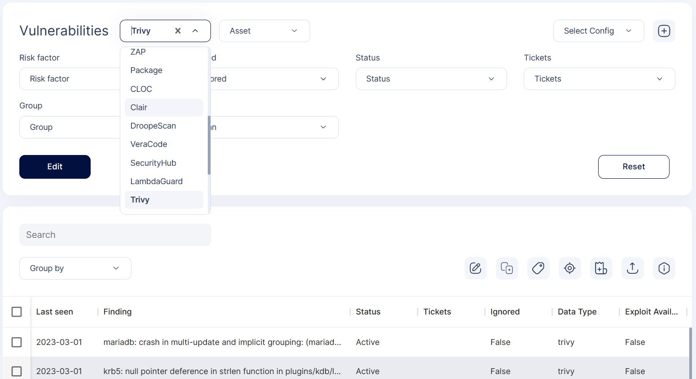
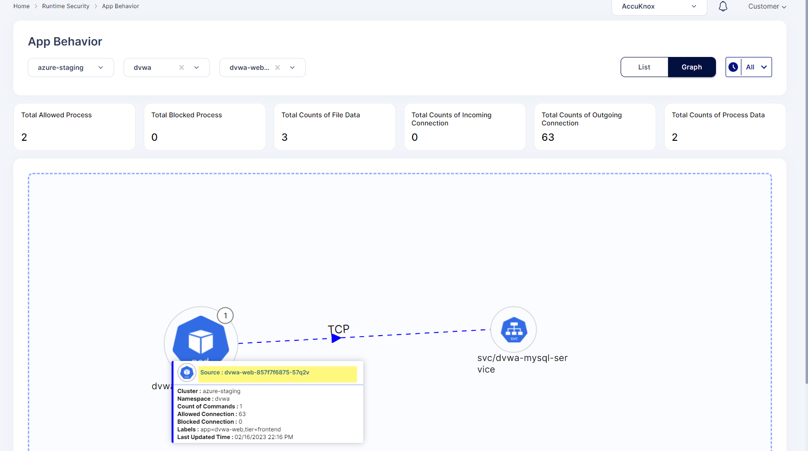
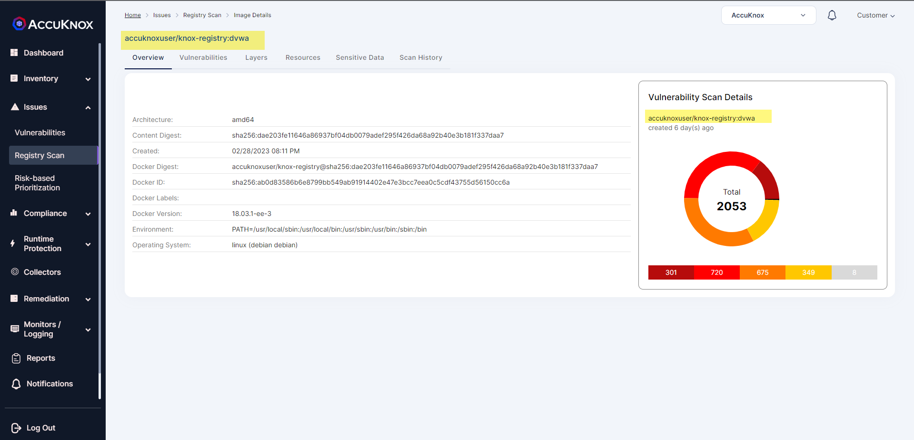
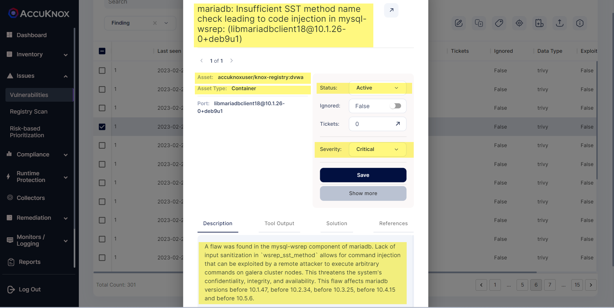
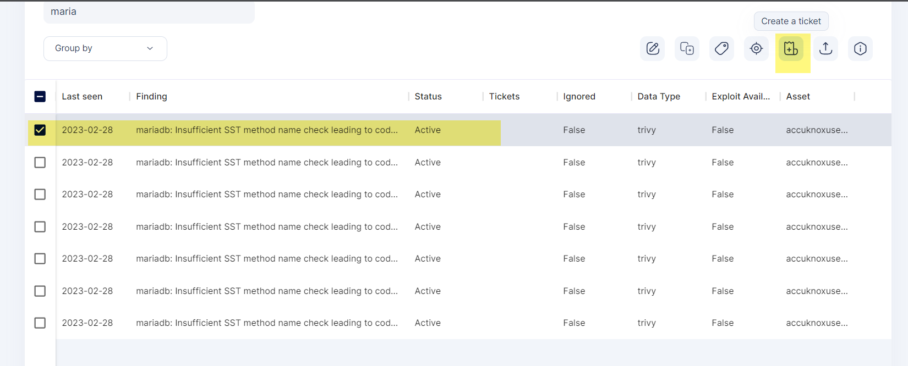
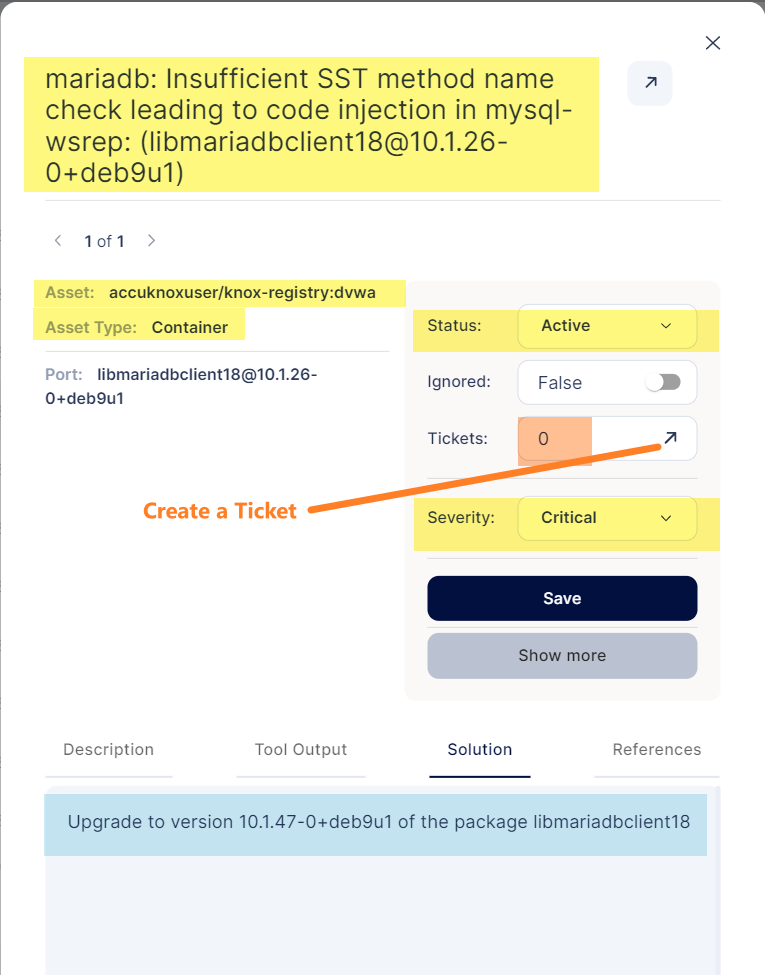

**Vulnerability Assessment and Management**

Vulnerability assessment is an important aspect for securing application lifecycle for cloud native environments by readily integrating to CI pipeline for a continuous monitoring which can be resolved with patching and configuration of security settings.

In the Static Security solution, unlike other ASPM tools, AccuKnox provides flexibility to integrate a variety of open source and commercial security scanning tools through built-in parsers to provide you a composite security posture of your infrastructure. We help to automate collection and execution through “Playbooks Builder” where we provide flexibility to define security tools of choice to assess the infrastructure. We correlate and normalize results from a variety of security scanning tools and provide detailed results of vulnerabilities prioritization across entire infrastructure

Lets understand this by an example - **Securing DVWA application against Vulnerabilities**

 + Onboard and scan DVWA web application image from here - GitHub - digininja/DVWA: Damn Vulnerable Web Application (DVWA) 

 + Once you scan the image, Go to the Vulnerabilities Section to filter all or specific data type to see the data collectors

 + See the findings using specific or all tools in the SELECT tab in list view format. Findings can also be group by Status, Data Type, Asset or Finding type

 + See the application behavior of DVWA with respect to network connections its making -

 +  Scanned image details with vulnerabilities, layers and sensitive data history can be found in Registry Scan

 + Vulnerabilities associated to DVWA application could be found in Vulnerabilities section where user can see Asset its associated to, severity, Description and Tickets associated, if any.

 

 + Handle the findings by updating the status generating a ticket for common issues, see general description, solution and references w.r.t to that particular finding

 

 

 - - - 
[SCHEDULE DEMO](https://www.accuknox.com/contact-us){ .md-button .md-button--primary }
