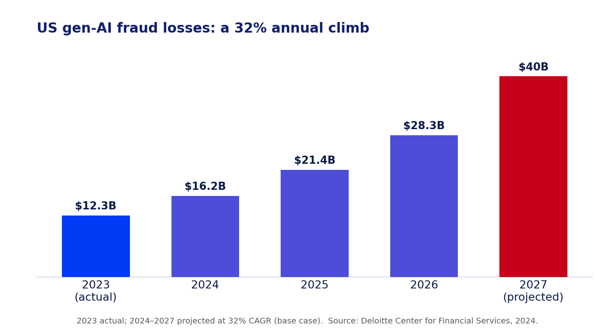
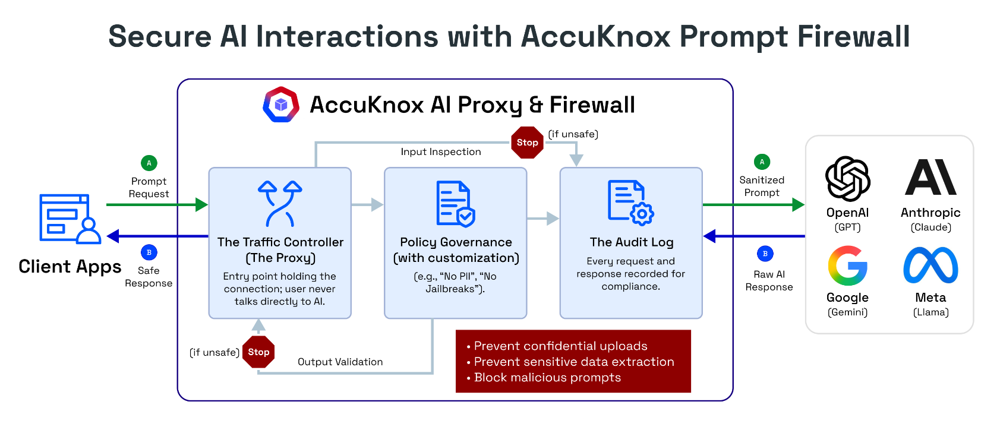
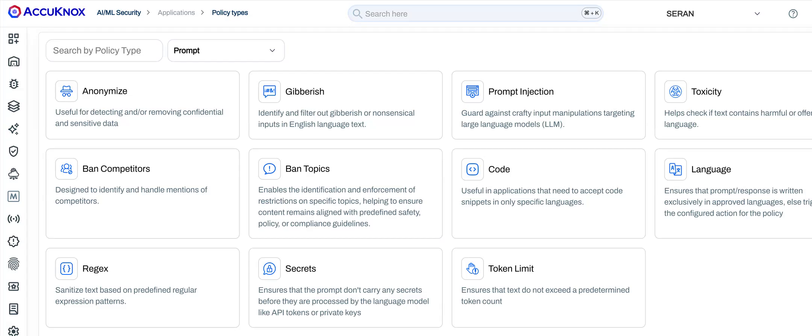

# Voice Is the Next Attack Surface, and It Needs a Firewall

*Part 1 of 3 in the series "Why You Need Prompt Guardrails: Advanced AI Attack Vectors."*

**TL;DR**

- Voice is becoming the primary way people, and soon machines, give instructions to AI. Enterprises are wiring it into help desks, banking, and support agents.
- A microphone verifies a *voice*, not an *intent*. That gap is now being used for real fraud, not lab demos.
- Losses are compounding fast: from $243,000 in the first known AI voice fraud case in 2019 to $25 million in the Arup deepfake call five years later.
- Voice attacks build across a full conversation. Tone, authority, and urgency do the work. A filter that scores one utterance and moves on never sees the play develop.
- Voice agents need a guardrail that carries state across the whole session. That is the case for a stateful prompt firewall.

## Voice became the new keyboard while nobody was guarding it

For thirty years, "input" meant a keyboard, and security grew up around that idea: sanitize the field, validate the payload, rate-limit the endpoint. Voice broke the assumption. It now sits in call centers, banking apps, cars, wearables, and the AI agents companies are shipping to talk to customers directly. The next wave, physical AI and robotics, will take instructions almost entirely by voice, because a robot working alongside people cannot depend on a keyboard. Voice is turning into the default control plane for AI, and control planes are what attackers go after.

The uncomfortable part is that we bolted voice onto systems that were never designed to treat sound as a security boundary. A typed command arrives as structured text you can inspect against a schema. A spoken command arrives as raw, continuous, analog signal that bundles three things at once: who is speaking, what they are saying, and what they actually intend. Most deployments pull out the words, act on them, and quietly discard the other two. That is the opening.

## The five-year timeline that should worry every CISO

Look at how fast the losses have compounded. In March 2019, fraudsters used AI-cloned audio of a German parent company's CEO, complete with his accent and speech cadence, to convince a UK energy firm's chief executive to wire €220,000, about $243,000, in what researchers called the [first known case of AI voice fraud](https://www.forbes.com/sites/jessedamiani/2019/09/03/a-voice-deepfake-was-used-to-scam-a-ceo-out-of-243000/). The technology behind it was described at the time as commercial voice-cloning software, nothing exotic.

Five years later, in 2024, a finance employee at the engineering firm Arup joined a video call with what looked and sounded like the company's CFO and several colleagues, all deepfakes, and [transferred roughly $25 million](https://www.cnn.com/2024/05/16/tech/arup-deepfake-scam-loss-hong-kong-intl-hnk) across 15 payments. Same playbook, same trust exploited, but the loss grew roughly a hundredfold while the technical bar to pull it off dropped. Cloning tools that once needed a specialist now run from a laptop with a few minutes of public audio. That curve does not bend back down on its own, and it is the reason voice security cannot wait for the next incident to become the next case study.

These two cases are the leading edge of a market-wide trend. Deloitte's Center for Financial Services projects that generative-AI-enabled fraud in the US will climb from $12.3 billion in 2023 to [$40 billion by 2027](https://www.deloitte.com/us/en/insights/industry/financial-services/deepfake-banking-fraud-risk-on-the-rise.html), a 32% compound annual growth rate. Deepfake vishing is a big part of that curve, and it is aimed squarely at the workflows voice agents now run: approvals, transfers, and credential resets.

*Figure 1: US gen-AI fraud losses, 2023 actual and 2024 to 2027 projected at a 32% CAGR. Source: Deloitte Center for Financial Services.*

## The attack families you are already exposed to

A decade of research shows almost every layer of a voice pipeline has a working exploit. They cluster into a few families that every security and AI team should recognize.

**Deepfake and cloned voices.** A few seconds of audio from a webinar, earnings call, or voicemail is enough to clone a voice. Studies of commercial assistants found that systems without speaker verification, such as Amazon Alexa in its default state, will act on anyone, and that even text-dependent verification on Siri and Bixby can be beaten by high-fidelity clones trained on enough samples. Cloning is now the cheapest way past "the voice sounded right."

**Inaudible and ultrasonic injection.** Attacks such as DolphinAttack, NUIT, and SurfingAttack ride frequencies humans cannot hear, or travel through a solid surface like a table, to trigger a device and issue commands with no audible trace. The victim hears nothing while the assistant takes orders.

**Hidden and unintelligible commands.** Audio that sounds like noise or garble to a person can still be transcribed as a clean command by a speech model, because the model and the human ear do not perceive sound the same way.

**Third-party skill abuse.** Voice squatting registers a function whose name sounds like a legitimate one, so "Capital Won" hijacks a request meant for "Capital One." Voice masquerading fakes a hand-off and keeps listening after the user thinks the session ended. Research on virtual assistant marketplaces found skills that passed vetting, then changed their behavior on the backend afterward.

**Conversational manipulation.** The newest and most dangerous class uses no single malicious sentence at all. The attacker builds authority, familiarity, and urgency across several turns until the request lands as reasonable. This is social engineering, upgraded with a voice the target trusts.

## Your executives are already cloneable, and you cannot patch that

Here is the uncomfortable arithmetic. McAfee's researchers cloned a voice to an [85% match from just three seconds of audio](https://www.mcafee.com/blogs/privacy-identity-protection/artificial-imposters-cybercriminals-turn-to-ai-voice-cloning-for-a-new-breed-of-scam/), and to a 95% match with a handful of clips, using tools they found free online. Three seconds. Every public-facing executive generates far more than that as a matter of routine: earnings calls, conference keynotes, podcast interviews, internal all-hands recordings uploaded to a shared drive, even a voicemail greeting. All of it is harvestable, none of it can be recalled once it exists, and most of it was published deliberately because visibility is part of the job. The same McAfee study found that one in four adults had already encountered an AI voice scam, and 77% of those targeted lost money. You cannot patch a CEO's voice the way you patch a server. The only lever left is what happens on the receiving end of the call, which is exactly why detection has to shift from "is this the real voice" to "does this request make sense given everything said so far."

## Anatomy of a voice takeover

Strip away the jargon and most voice fraud runs the same four steps:

1. **Harvest.** Collect a few seconds of the target's voice from a webinar, interview, podcast, or voicemail.
2. **Clone.** A model turns that sample into a live, convincing voice, sometimes with matching video.
3. **Call.** On the call, the fake voice carries rank and pressure. "This is the CFO. The deal is confidential. Wire it now."
4. **Comply.** The human, or the AI agent, verifies the voice, not the intent, and acts.

This is not hypothetical. It is the exact shape of both the 2019 case and the Arup call, five years and a hundred times the money apart. A year after Arup, the crew behind the [MGM Resorts breach simply phoned the IT help desk](https://www.cshub.com/attacks/news/a-full-timeline-of-the-mgm-resorts-cyber-attack), posed as an employee they had researched on LinkedIn, and talked an agent into resetting credentials. That single call cascaded into an estimated $100 million in damage and days of downtime. Three different targets, three different payloads, one identical flaw: the system trusted the voice and never questioned the intent.

**[AI-GENERATED IMAGE, suggested filename: voice-attack-anatomy.png]**
> **Prompt (Claude / DALL·E / SDXL):** A clean four-step horizontal flow diagram titled "Anatomy of a voice takeover." Four labeled nodes connected by arrows: 1) Harvest (a small audio clip icon), 2) Clone (a voice waveform being duplicated), 3) Call (a phone / video-call icon), 4) Comply (a bank-transfer / unlock icon). Flat vector style, AccuKnox palette: navy #11206D text, electric blue #003BF6 and purple-blue #4D4DD9 nodes, one alert-red #C80019 accent on the final step. White background, generous spacing, small clear labels only.
> **Midjourney:** minimal four-step flow diagram, harvest clone call comply, flat vector icons, navy and electric blue palette, white background, infographic --ar 16:9 --style raw --v 6

*Figure 2: Most voice fraud follows the same four steps. Verification happens once; the manipulation happens across the whole call.*

## Why liveness detection is a race you cannot win

Every mainstream voice defense scores a single moment and then trusts what follows. Liveness detection tries to tell a live human from a replayed recording, and it does stop many attacks, but it also rejects a real share of genuine speech, so teams turn the sensitivity down until legitimate callers stop getting locked out, widening the gap attackers walk through. Signal purification strips some adversarial noise, but it degrades real audio and fails against the strongest over-the-air attacks. Speaker verification confirms identity at the start of a session, then assumes the person on the other end never changes and never gets coerced.

Here is the structural problem: liveness detection and cloning are on the same treadmill, and the side generating the fakes gets to move first. Every time detection gets better at spotting synthetic artifacts, the next generation of cloning model is trained to remove exactly those artifacts. It is the audio equivalent of an arms race with no ceasefire, and defenders who only invest in "detect the fake" will always be one model generation behind. The way off that treadmill is to stop trying to win a race you did not start, and instead ask a different question entirely: does this request, in the context of everything said in this call so far, make sense coming from this person right now? That question does not care whether the voice is synthetic. It cares whether the ask fits the conversation, and that is a judgment only a system with memory of the whole call can make.

## The stakes are not theoretical for security leaders

For a CISO, three things make voice urgent right now. First, the raw material is free, as the section above shows, so every executive is a target and there is nothing to lock down after the fact. Second, the money is real and already moving: the 2019, Arup, and MGM cases were not proofs of concept, and voice-enabled help desks and banking lines are direct paths to funds and credentials today. Third, the trust cost compounds. When customers learn that your support line or your voice agent can be impersonated, the reputational damage outlives any single fraudulent transaction. Regulators are also turning attention to synthetic media and to the controls firms use to authorize high-value actions, which means "the voice sounded right" is fading fast as a defensible control. For teams deploying voice agents, this is no longer a research topic to watch. It is an exposure to close.

## A stateful prompt firewall for voice

This is where [AccuKnox Prompt Firewall](https://help.accuknox.com/use-cases/prompt-firewall-overview/) changes the model. After speech is transcribed to text, the firewall sits inline between that input and the AI, inspecting every prompt and every response against your policies before either side passes, and it does so statefully: instead of a single pass or fail, it carries context across the whole session and scores cumulative risk across turns, so it can catch a request that only looks dangerous once you account for everything said before it. It links each prompt to its response as one audited interaction, applies Zero Trust decisions on every turn rather than once at the wake word, and can block, sanitize, or monitor in real time. AccuKnox's own research on stateful defenses found that [layering session context brought multi-turn attack success down from roughly 73% to under 9%](https://accuknox.com/blog/stateful-prompt-firewall-guardrail-for-ai-security), while keeping false positives under 0.5%, which is the exact trade a voice deployment needs: catch the slow-building fraud without locking out real customers.

*Figure 3: The AccuKnox Prompt Firewall sits inline between your application and the model, inspecting traffic in both directions and logging every interaction.*

Every transcribed turn is checked against a set of policy classes before it reaches the model, including prompt injection, PII and secrets anonymization, toxicity, and banned topics. For a voice agent, that means a caller cannot smuggle in an injection or coax out sensitive data just because they got past the wake word.

*Figure 4: A sample of the Prompt Firewall policy classes applied to every turn, on both the incoming prompt and the model's response.*

## The five-question voice agent audit

Before you trust a voice deployment, or a vendor's claims about one, run it through five questions. Screenshot these if you need to:

1. **Continuity.** Do you re-check identity and intent through the whole conversation, or only once at the start?
2. **Trajectory.** Can your guardrail see a slow build of authority and urgency across turns, or does it grade each sentence alone?
3. **Cloning resilience.** Does your defense assume voices can and will be cloned, or does it still treat "the voice matched" as sufficient proof?
4. **Proof.** Is every interaction logged with policy scores you can hand to auditors and incident responders after the fact?
5. **Failure mode.** When the system is unsure, does it step up verification or quietly let the request through?

If more than one of these gets a weak answer, you have the same exposure that cost Arup $25 million. Voice is the next keyboard, and it deserves a firewall to match. Part 2 turns to the attack that hides inside the conversation itself: multi-turn jailbreaks.

## FAQs

**What is a voice agent attack?**
Any technique that uses voice to fool a person or an AI system, including deepfake voice cloning, vishing (voice phishing), inaudible ultrasonic commands, malicious third-party skills, and multi-turn social engineering over a call.

**Can AI voice cloning really beat voice authentication?**
Yes. High-fidelity cloning defeats many speaker-verification systems, and cloned voices have driven real fraud, from the first documented case in 2019 to the $25 million Arup deepfake call in 2024.

**Why can't a normal content filter stop this?**
Standard filters score one prompt at a time. Voice attacks build over a full conversation, so any single utterance looks harmless. Catching them needs a guardrail that keeps state across the session.

**How does AccuKnox Prompt Firewall help with voice?**
Once speech is transcribed, the firewall inspects each turn inline, tracks cumulative risk across the conversation, and applies Zero Trust policy decisions per turn instead of trusting everything after the wake word. See the [Prompt Firewall overview](https://help.accuknox.com/use-cases/prompt-firewall-overview/).
