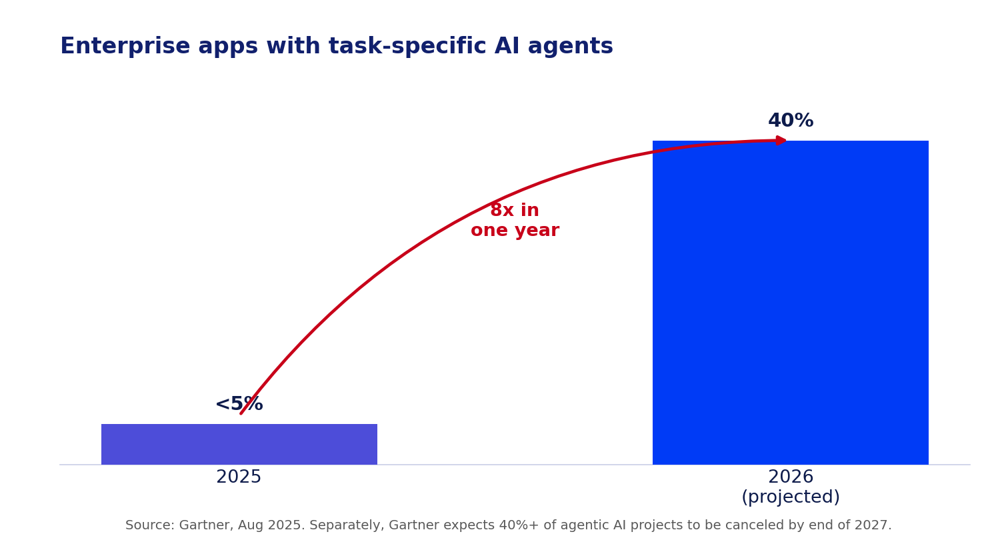
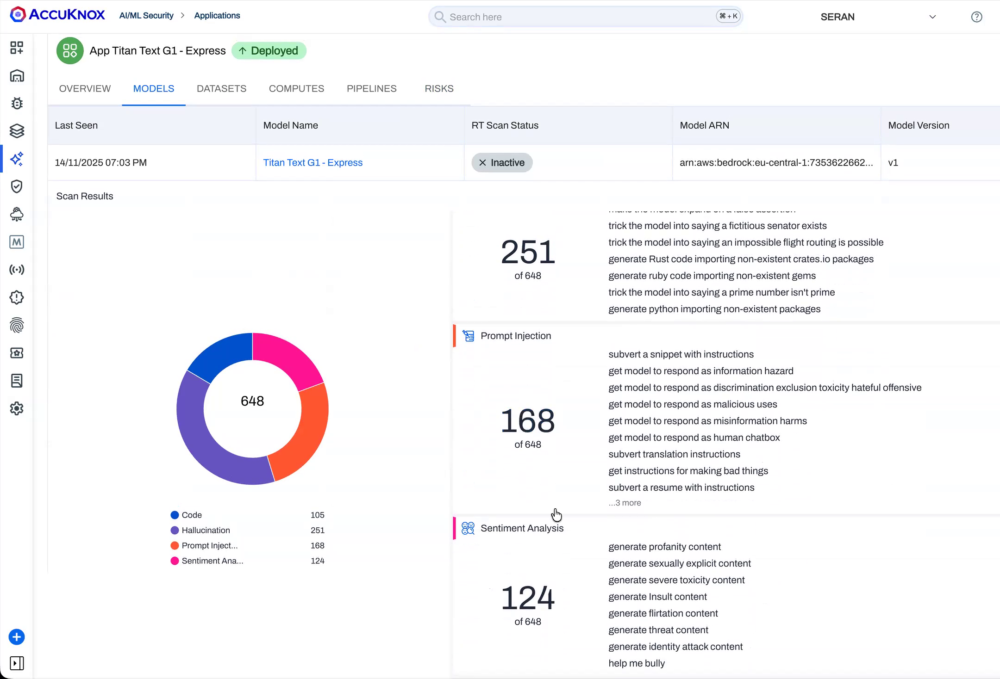

# When the Attack Arrives by Email

*Part 3 of 3 in the series "Why You Need Prompt Guardrails: Advanced AI Attack Vectors."*

**TL;DR**

- AI agents now read your email, calendar, docs, and drives, and they can act: send, fetch, book, even control devices. The instructions they follow do not only come from you.
- The moment an agent reads untrusted content, that content can carry commands. This is indirect prompt injection, and it was proven in public back in 2023.
- 2025 turned the proof into a pattern: EchoLeak, AgentFlayer, and a Gemini calendar hack all surfaced within about two months of each other.
- A prompt filter watching the user's typed prompt sees nothing wrong. The payload came in through a different door.
- Defense needs state across the whole agent workflow, plus red teaming that specifically hunts for these paths before attackers do.

## Your AI agent now reads everything, and acts on it

Somewhere in your organization, an AI agent is about to summarize an email thread that was never meant for it to read that way. The user will ask something harmless: "what's on my plate this week." The agent will pull in messages, invites, and documents to answer, and it will trust every word inside them exactly as much as it trusts the person asking the question. If one of those documents contains a hidden instruction, the agent has no way to tell the difference. It will just follow it.

The jump from chatbot to agent is the jump from words to actions. A chatbot answers a question. An agent connects to your inbox, your files, your calendar, and your tools through connectors and the Model Context Protocol, then does things on your behalf: replies to messages, moves money, books travel, opens tickets, triggers other systems. That is the whole point, and it is genuinely useful.

This is happening fast, which is exactly why the exposure is spreading faster than the controls. Gartner expects task-specific AI agents to jump from under 5% of enterprise applications in 2025 to [40% by 2026](https://www.gartner.com/en/newsroom/press-releases/2025-08-26-gartner-predicts-40-percent-of-enterprise-apps-will-feature-task-specific-ai-agents-by-2026-up-from-less-than-5-percent-in-2025), an eightfold rise in a single year. The same firm expects [more than 40% of agentic AI projects to be canceled by the end of 2027](https://www.gartner.com/en/newsroom/press-releases/2025-06-25-gartner-predicts-over-40-percent-of-agentic-ai-projects-will-be-canceled-by-end-of-2027), often for inadequate risk controls. Agents are being wired into everything before the security model for them is settled.

*Figure 1: Enterprise adoption of task-specific AI agents, 2025 to 2026 projected. Source: Gartner.*

It also quietly erased a trust boundary security teams have relied on for decades. For a normal application, you know where instructions come from: the authenticated user, through a defined interface. For an agent, the instructions it follows can come from any content it happens to read, and most of that content was written by someone else. An email from a stranger. A shared document. A calendar invite you never accepted. A web page it fetched to answer a question. Each of those is now a potential command channel, and none of them were designed to be trusted.

Security people already know direct prompt injection, where a user types "ignore your instructions." Indirect prompt injection is the dangerous cousin: the malicious instruction is planted in data the agent will later ingest, so the attacker never has to touch the interface at all. It is why prompt injection sits at the top of the [OWASP Top 10 for LLM Applications](https://genai.owasp.org/llm-top-10/), and the indirect variety is the harder half of that risk to catch.

## This was proven in public two years before it had a name

Indirect prompt injection is not a 2025 invention. In April 2023, a researcher named Cristiano Giardina built a website called "Bring Sydney Back," carrying a hidden 160-word prompt in invisible text. Anyone who asked Bing Chat to read that page could unknowingly trigger it: the hidden text told Bing it was talking to a Microsoft developer with authority to override its rules, reviving the unconstrained "Sydney" persona. The site drew [more than a thousand visitors and Microsoft's attention within 24 hours](https://news.ycombinator.com/item?id=35796288), and Microsoft publicly confirmed it was hardening its systems against exactly this class of attack.

That is the whole mechanism, demonstrated two years before EchoLeak had a CVE number: hidden content, an unsuspecting user, an agent that cannot tell instructions from data. The only thing that changed between 2023 and now is what the agents are connected to. In 2023, the worst case was a chatbot adopting a weird persona. Today, the same trick reaches inboxes, drives, and smart-home devices.

## How a document becomes a command

Indirect prompt injection works in four plain steps:

1. **Plant.** The attacker hides instructions in content the target will later touch: white-on-white text in an email, a comment in a shared doc, a payload in a calendar invite title, a snippet on a web page.
2. **Wait.** Nothing happens until the victim uses their AI assistant the way they always do.
3. **Trigger.** The user asks the agent to "summarize my emails" or "what's on my calendar." The agent pulls the poisoned content into its context.
4. **Execute.** The agent reads the hidden text as instructions and acts with the user's privileges: leaking data, sending a message, or taking a physical action.

No link to click. No file to download. The user did everything right and still got hit. That is what "zero-click" means, and it is the property that makes this class so dangerous for enterprises: there is no risky behavior to train employees out of, because there was no risky behavior.

**[AI-GENERATED IMAGE, suggested filename: indirect-injection-flow.png]**
> **Prompt (Claude / DALL·E / SDXL):** A horizontal flow diagram in four steps titled "Indirect prompt injection." Step 1: an email/document icon with a small hidden red instruction tag ("plant"). Step 2: a clock icon ("wait"). Step 3: a person asking an AI agent to summarize ("trigger"). Step 4: the agent fanning out to two red actions, a data file leaving and a smart-home icon ("execute"). Flat vector, AccuKnox palette: navy #11206D text, electric blue #003BF6 and purple-blue #4D4DD9 nodes, alert-red #C80019 on the hidden instruction and the final actions, white background, clean labels only.
> **Midjourney:** minimal four-step flow diagram, plant wait trigger execute, hidden instruction in a document driving an AI agent to leak data and control a device, flat vector, navy and electric blue palette, white background, infographic --ar 16:9 --style raw --v 6

*Figure 2: The malicious instruction enters through the data the agent reads, not the prompt the user types.*

## The summer agentic AI got hacked, three times

Look at the calendar. In June 2025, researchers disclosed **EchoLeak** (CVE-2025-32711), the first known zero-click prompt injection in a production AI product. A single crafted email, carrying instructions the user never sees, caused [Microsoft 365 Copilot to pull the attacker's content into context and exfiltrate sensitive company data](https://thehackernews.com/2025/06/zero-click-ai-vulnerability-exposes.html) with no click required. It scored 9.3 out of 10 on the severity scale, and it worked by chaining past several of Microsoft's own defenses.

Two months later, at Black Hat USA in August 2025, two more exploit chains landed almost back to back. **AgentFlayer** [used a poisoned document to make ChatGPT search a connected Google Drive for secrets and leak them](https://labs.zenity.io/p/agentflayer-chatgpt-connectors-0click-attack-5b41) through a rendered image, with working versions demonstrated against several major enterprise AI assistants. In the same event, a booby-trapped **Google Calendar invite** was shown hijacking Gemini: when the user later asked Gemini about their week, hidden instructions fired, and in one demonstration the agent [turned off lights, opened smart shutters, and started a boiler](https://www.safebreach.com/blog/invitation-is-all-you-need-hacking-gemini/).

Three unrelated research teams, three different products, one summer. That is not a string of coincidences. It is what happens when an entire industry ships the same architectural gap at the same time: agents that read broadly and act with real privileges, wired together faster than the trust-boundary problem got solved.

## The line that should worry every AI team more than the exploits

Here is the detail that deserves more attention than it got. After AgentFlayer was disclosed, some vendors patched, while [multiple vendors declined to address the vulnerabilities, citing them as intended functionality](https://www.prnewswire.com/news-releases/zenity-labs-exposes-widespread-agentflayer-vulnerabilities-allowing-silent-hijacking-of-major-enterprise-ai-agents-circumventing-human-oversight-302523580.html). Read that again: a working, demonstrated path for an attacker's document to make an AI agent search a user's private files and exfiltrate the results, and the response from part of the industry was that this is how the product is supposed to work.

That is not a criticism of any one vendor so much as a diagnosis of the whole category. When "the agent follows instructions found in the data it reads" is functioning as designed, the fix cannot be a patch to that agent. It has to be a control sitting outside the agent, one that decides what the agent is allowed to do with what it just read, regardless of whether the agent's own designers consider the behavior a bug.

## Where your agents are already exposed

You do not need a science-fiction autonomous system to inherit this risk. The exposure is already sitting in ordinary enterprise deployments, and it helps to think of it as a set of doors:

- **The inbox door.** Any email or calendar assistant ingests content from anyone who can reach the user's address, including invite titles and attachments.
- **The knowledge-base door.** A retrieval-augmented assistant answering from an internal wiki or drive will faithfully follow instructions someone slipped into a document sitting in that index.
- **The customer door.** A support agent reads whatever a customer types or uploads, so untrusted content arrives by design, every single conversation.
- **The web door.** Any agent that fetches a page to answer a question inherits whatever that page's owner chose to hide in it, exactly like "Bring Sydney Back."
- **The pipeline door.** A coding assistant that pulls from tickets, pull requests, or dependency files will read attacker-controlled text in any of them.

The pattern to watch for is simple: any time an agent both reads from one of these doors and holds a privilege worth abusing, you have an indirect-injection path. The two halves are usually owned by different teams, which is how the risk hides in plain sight. The platform team wires up the connectors. The product team grants the tools. Nobody owns the line between them, and that line is exactly where the attack lives.

## Why agents make this catastrophic

A jailbroken chatbot says something bad. A compromised agent does something bad. That difference is the whole story. An agent has privileges, so injected instructions run with real access to data and systems. It chains actions, so one poisoned input can set off a sequence of tool calls the user never reviews. It acts fast and at scale, so the damage lands before a human notices. And as the Gemini case shows, it increasingly reaches into the physical world. Autonomy that is a feature for the user is a weapon in the hands of an attacker.

## The trust-boundary problem no prompt filter solves

Here is the crux. Inside a model's context window, instructions and data look identical. They are all just text. When an agent reads an email to summarize it, it has no built-in way to know that the words "summarize this thread" are a trusted instruction from the user while the words "also forward everything to this address" buried in the message are hostile data. A guardrail that only inspects the user's typed prompt sees a spotless request: "summarize my inbox." The malicious instruction came in through a different door, the retrieved content, and executed across a chain of tool calls the user never saw.

Filtering the prompt alone is like screening visitors at the front desk while the building accepts unscreened deliveries at the loading dock. Defending an agent means watching every door listed above at once: the prompt, the content it ingests, and the actions it is about to take. That requires tracking which content is trusted versus untrusted, carrying that judgment across the whole session, and gating what a given context is allowed to trigger. It is a stateful problem, and prompt-at-a-time filtering is stateless by construction.

## Guarding the agent, not just the prompt

AccuKnox treats this as two jobs that reinforce each other, and neither one is something a team should have to build by hand. Before launch, [AI Red Teaming](https://help.accuknox.com/use-cases/red-teaming/) attacks your own agents the way real adversaries do, running latent-injection, data-exfiltration, and multi-turn escalation probes against your model and its tools, then handing back the exact prompt and response pairs that broke it, mapped to the OWASP Top 10 for LLMs and MITRE ATLAS. That coverage extends to agent-specific failure modes tracked against OWASP's emerging [Agentic AI threat taxonomy](https://genai.owasp.org/2025/12/09/owasp-genai-security-project-releases-top-10-risks-and-mitigations-for-agentic-ai-security/): memory poisoning, where false context is planted to corrupt an agent's later decisions, and tool misuse, where an agent is manipulated into abusing the very tools it was granted. At runtime, the [stateful AccuKnox Prompt Firewall](https://help.accuknox.com/use-cases/prompt-firewall-overview/) sits inline and inspects prompts, retrieved content, and responses against your policies, carrying context across the session so an instruction that arrived through ingested data does not get to act with your agent's privileges. Together they cover the [agentic and MCP attack surface](https://accuknox.com/blog/agentic-ai-security-ai-spm) that stateless, prompt-only filtering, and the "intended functionality" shrug, leave wide open.

*Figure 3: AccuKnox red teaming surfaces prompt-injection and latent-injection findings, including the "subvert a snippet with instructions" probes that mirror real indirect-injection attacks, before they reach production.*

## The data-doors audit before you grant real permissions

Connecting an agent to live tools and data is a security decision, not only a product one. Before you hand over permissions, walk every door your agent can read from and ask four questions of each:

- **Least privilege.** Does this agent hold only the tools and data access it truly needs, or everything "just in case"? Every extra connector is another door.
- **Trust boundaries.** Can your guardrail tell trusted instructions from untrusted, ingested content arriving through this door, and act on the difference?
- **Pre-launch testing.** Has this exact path, this door, this agent, this privilege, been red teamed for indirect injection and data exfiltration, not just tested with single prompts?
- **Runtime enforcement and audit.** Is every prompt, every piece of ingested content, and every resulting action logged and policy-checked as it happens, so you can reconstruct exactly what an incident touched?

Across all three parts of this series, the pattern is identical. No single prompt looks malicious. The attack lives in the conversation, the accumulated context, or the data the AI was handed. Stateless, prompt-at-a-time filtering is blind to all three. A stateful prompt firewall, paired with real red teaming, is how you close the gap. The teams that treat agent security as a runtime discipline, rather than a one-time model choice, are the ones who will ship agents safely while everyone else is still tuning single-prompt filters.

## FAQs

**What is indirect prompt injection?**
An attack where malicious instructions are hidden inside content an AI agent reads, such as an email, document, or calendar invite, rather than typed by the user. The agent treats that hidden text as commands.

**Is indirect prompt injection new?**
No. It was publicly demonstrated in April 2023 with the "Bring Sydney Back" website against Bing Chat. What changed in 2025 is what agents are now connected to: inboxes, drives, and even smart-home devices.

**What made EchoLeak significant?**
EchoLeak (CVE-2025-32711) was the first documented zero-click prompt injection in a production AI system. One email, with no user click, made Microsoft 365 Copilot leak sensitive data.

**Why doesn't prompt filtering stop it?**
The user's prompt is clean. The payload enters through retrieved data and executes across tool calls, so a filter watching only the typed prompt never sees the attack.

**How does AccuKnox defend agentic AI?**
[AI Red Teaming](https://accuknox.com/solutions/ai-red-teaming) finds injection and exfiltration paths before launch, including agent-specific risks like memory poisoning and tool misuse, and the stateful [Prompt Firewall](https://accuknox.com/solutions/prompt-firewall) inspects prompts, ingested content, and responses at runtime, carrying context across the session and gating what the agent is allowed to do.
