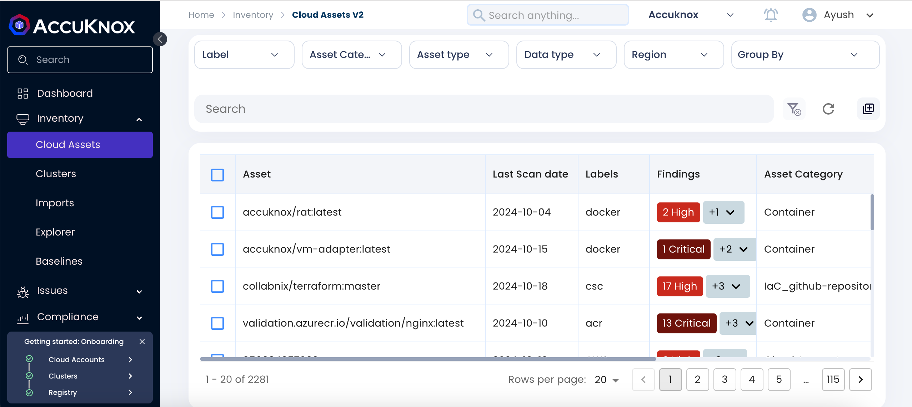
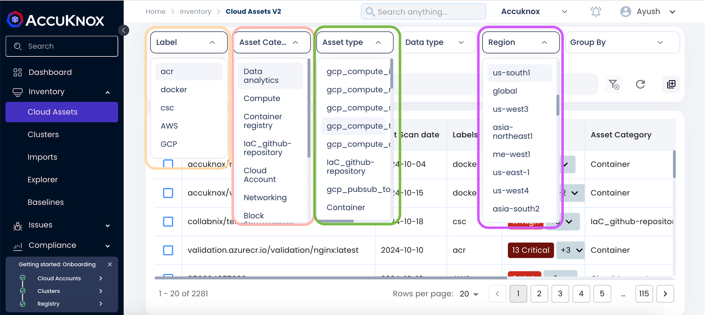
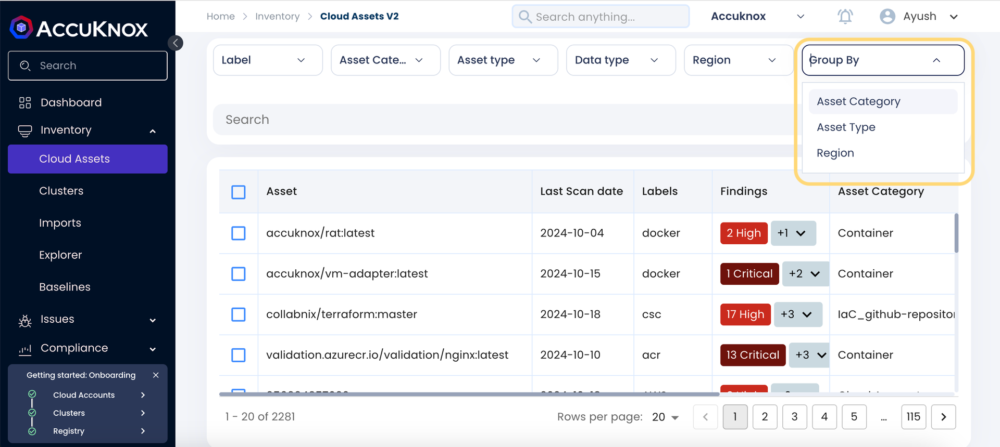
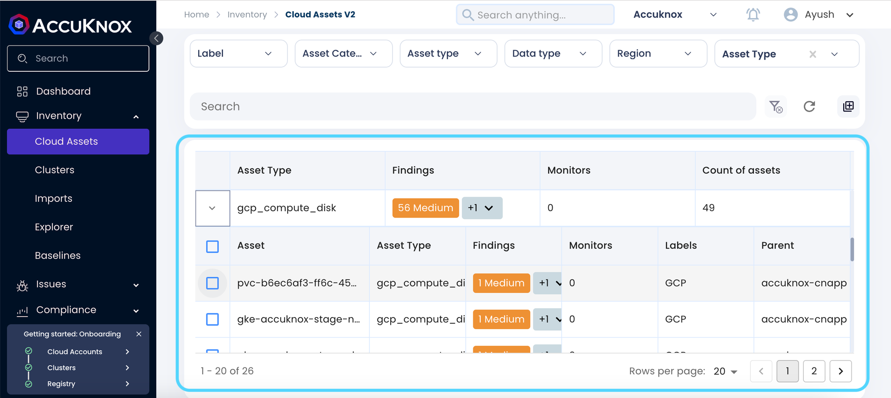

# Cloud Assets

Managing assets across diverse environments can be challenging, especially when users have multiple workloads distributed across different platforms. Traditionally, this requires frequent switching between various consoles, making it difficult to get a holistic view of all assets. AccuKnox addresses this issue by offering a unified solution that consolidates all assets, whether from cloud accounts or other sources, into a single, easy-to-navigate interface. This simplifies asset management and enhances visibility.

## Key Features of AccuKnox Cloud Asset Inventory

### Unified Asset Management

AccuKnox's Cloud Security Posture Management (CSPM) tool collects data from onboarded sources, providing a centralized view of all assets, including hosts, applications, web APIs, containers, clusters, and more.

- Users no longer need to switch between different consoles; all assets are displayed in one place.
- The platform continuously monitors onboarded sources and updates asset counts based on changes, ensuring users always have the latest overview.

### Asset Categorization

Each asset is categorized based on the type of service or source, making it easier to manage and filter. Examples include:

- **Cloud Account**: Accounts from providers like AWS, GCP, and Azure, onboarded by the user.
- **Cluster**: Orchestration clusters, such as Kubernetes, deployed in cloud or on-premises environments.
- **Hosts**: This will inform you about the number of instances across cloud
- **IaC GitHub Repository**: Infrastructure as Code repositories linked to cloud resources.
- **Container Registry**: Repositories for storing container images (e.g., Docker, ECR, Nexus).
- **Block Storage**: Storage resources like S3 buckets or Azure Blob Storage within cloud accounts.

### Granular Asset Type Management

Each asset category is further refined by asset types, allowing detailed management. Examples include:

- **Container Registry**: Specific repositories like `gcp_artifact_registry_repository`.
- **Cloud Account**: Individual accounts on platforms like AWS or GCP.
- **Block Storage**: Resources such as `gcp_compute_disk`, indicating specific storage solutions.
- **Cluster**: Resources like `aws_eks_cluster` or `gcp_compute_address` for IP management.

### Periodic Scanning

The CSPM tool periodically scans onboarded sources, automatically updating the asset inventory to ensure users always have the latest information. Changes such as newly created or removed resources are promptly reflected on the platform.

### Security Findings

Each asset displays a summary of security findings (e.g., high, critical), enabling users to quickly identify and address potential issues. Vulnerabilities can be prioritized based on severity, ensuring the most critical threats are handled first.

### Customizable Filtering

The asset screen offers various filters (e.g., by label, asset category, asset type, and region), allowing users to customize their view to suit specific needs. Assets can be grouped to provide insights into particular environments or organizational requirements.

## Group By Functionality

### a. Group by Asset Category

AccuKnox allows users to group assets based on their respective categories, providing a clear overview of each category's security posture and asset distribution.

**Key Elements:**

- **Asset Category Overview**: Each category (e.g., Block Storage, Cluster, Container Registry, Cloud Account) is listed with:
  - **Findings**: Summarized by severity (e.g., 10 Medium, 7 Low, 3 High).
  - **Count of Assets**: The total number of assets in that category.
- **Detailed View**: Expanding a category reveals individual assets with:
  - **Asset Name**: The specific name or identifier of the asset.
  - **Asset Type**: The detailed classification of the asset (e.g., `gcp_compute_disk`, `aws_eks_cluster`, `docker_repository`).
  - **Findings**: Security issues identified for that particular asset, highlighted by severity (e.g., 1 Medium, 3 High).
  - **Labels**: Label associated with the onboarded account or registries (e.g., GCP, AWS, ECR).
  - **Parent**: The source or origin from which the asset was onboarded (e.g., `accuknox-cnapp`, specific cloud account names).

### b. Group by Region

The "Group by Region" feature provides a consolidated view of assets distributed across different geographical regions.

**Key Elements:**

- **Region Overview**: Each region (e.g., `asia-east1`, `africa-south1`) displays:
  - **Total Findings**: Aggregated by severity (e.g., 1 Medium).
  - **Count of Assets**: Number of assets in that region.
- **Detailed View**: Expanding a region shows:
  - **Asset Name, Type, Findings, Labels, and Parent** (origin source).

### c. Group by Asset Type

The "Group by Asset Type" feature organizes assets based on specific classifications (e.g., `aws_eks_cluster`, `gcp_compute_address`, Container), allowing users to quickly assess security findings and asset counts.

**Key Elements:**

- **Asset Type Overview**: Each type is displayed with:
  - **Total Findings**: Summarized by severity (e.g., 1 High, 14 Critical).
  - **Count of Assets**: Number of assets under each type.
- **Detailed View**: Expanding an asset type provides:
  - **Asset Name, Type, Findings, Labels, and Parent** (specific cloud accounts).

## How It Works

1. **Onboarding Sources**: Users can onboard various sources (e.g., cloud accounts, GitHub, Docker repositories). The CSPM tool scans these and brings all assets under the AccuKnox platform for centralized management.
2. **Real-Time Monitoring**: Continuous monitoring ensures that any changes in assets are immediately reflected.
3. **Asset Management**: Users can search, filter, and group assets, with detailed information and findings available for each resource.

## Conclusion

AccuKnox's Cloud Asset Inventory provides a comprehensive, integrated solution for managing assets across different platforms. With real-time monitoring, customizable filters, and a centralized view, users can efficiently oversee and secure their assets, eliminating the need for multiple consoles and enhancing productivity.

- - -
[SCHEDULE DEMO](https://www.accuknox.com/contact-us){ .md-button .md-button--primary }