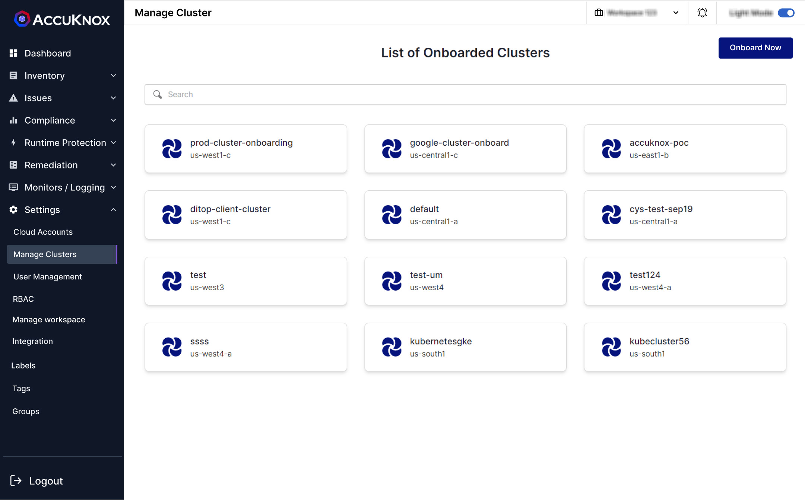

 In this section users can view and manage the onboarded clusters. This section gives users the options to delete and modify the clusters. This section gives the name of the cluster and region where the cluster is present.

 For onboarding cluster into AccuKnox SaaS [click here](./../getting-started/cluster-onboarding-managed.md)

 - - -
[SCHEDULE DEMO](https://www.accuknox.com/contact-us){ .md-button .md-button--primary }
