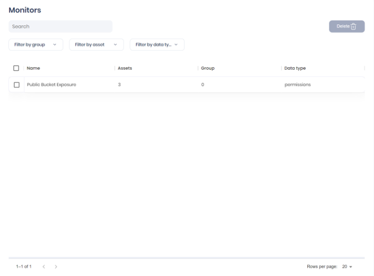
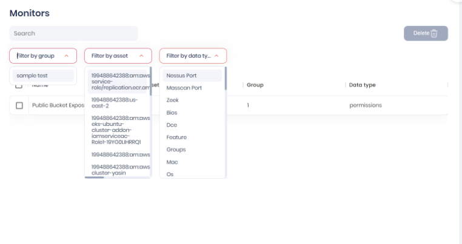
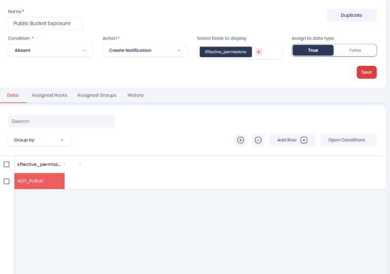
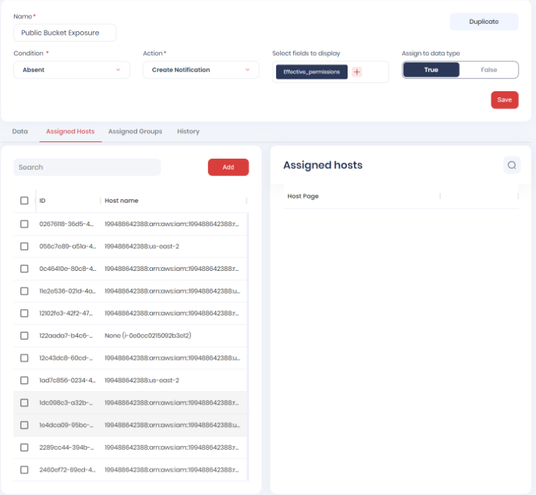

## **Monitors**

Monitors section helps the users to monitor the assets that are present in the cloud account that is onboarded to the AccuKnox platform.

+ In the Monitor dashboard, we can view the monitor list here, the Monitor list consists of columns such as Names, Assets, Groups, and Data types.

+ The user has the ability to Delete multiple Monitors on the dashboard.

+ The user has the ability to filter the list, user can filter through groups, assets, and data types.

+ The user can view Monitor Configuration after clicking on one of the Monitors in the Dashboard.

+ Monitor Configuration consists of Name, condition, Action, Select fields to display and Assign to data type.

+ The user has the ability to duplicate the configuration.

+ The user can view Data, Assigned Hosts, Assigned Groups, and History.

+ The user can add hosts and can view Assigned hosts under the ‘Assigned Hosts’ section.

- - -
[SCHEDULE DEMO](https://www.accuknox.com/contact-us){ .md-button .md-button--primary }