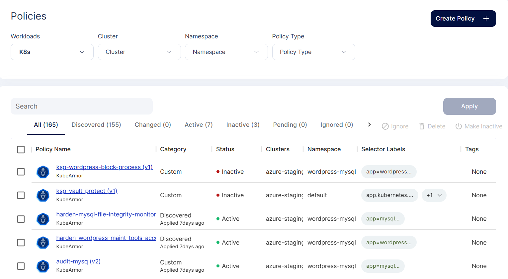
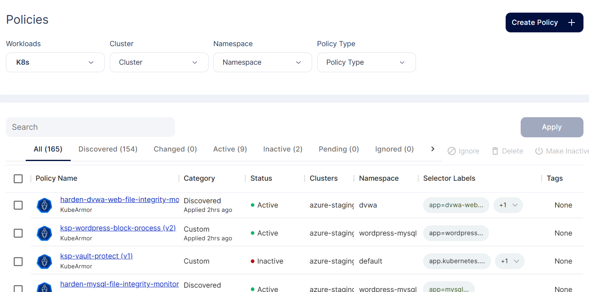
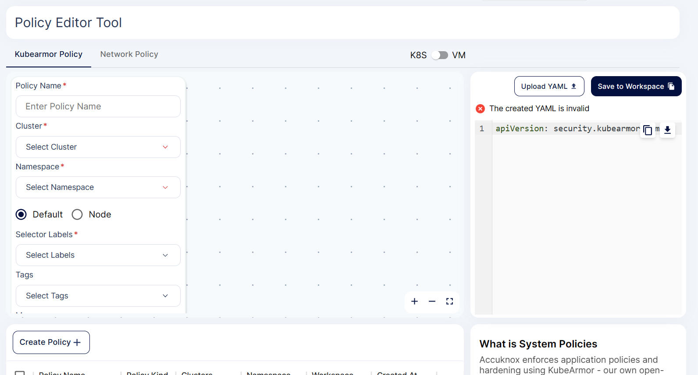
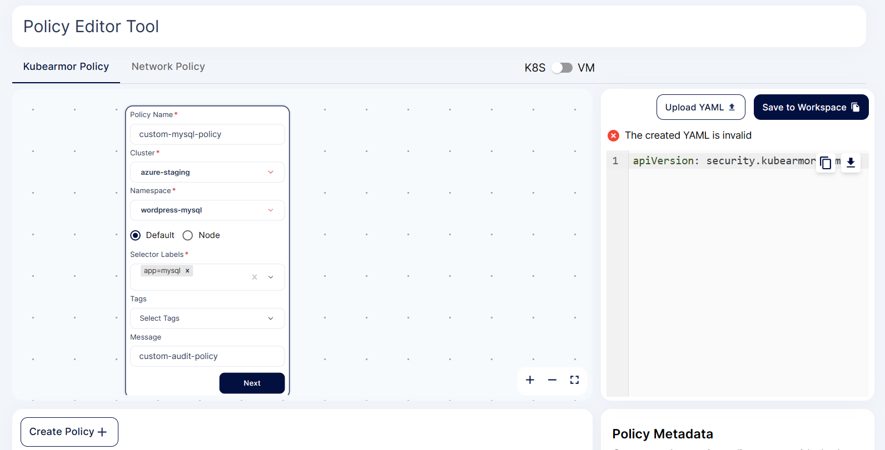
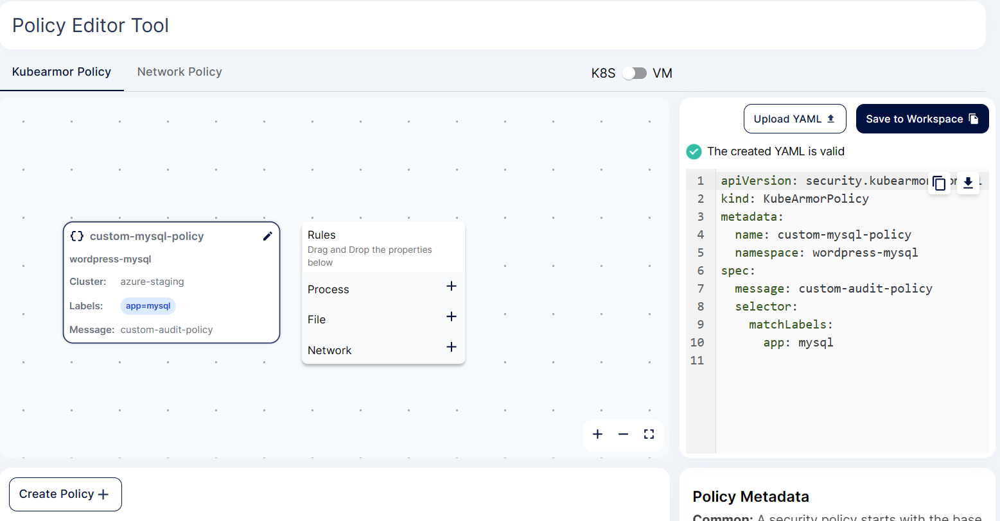
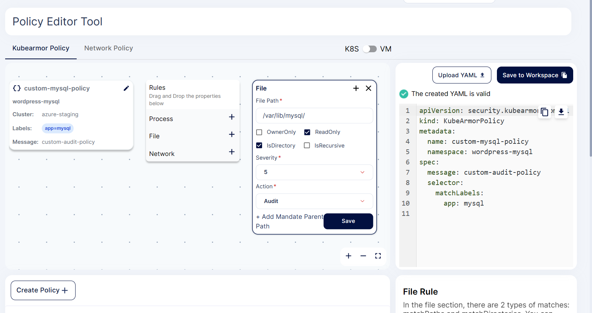
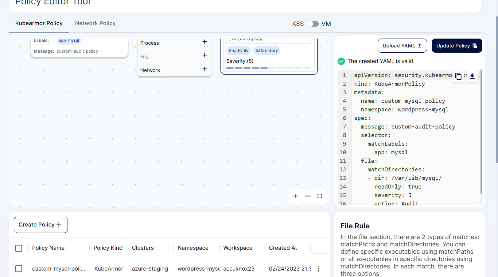
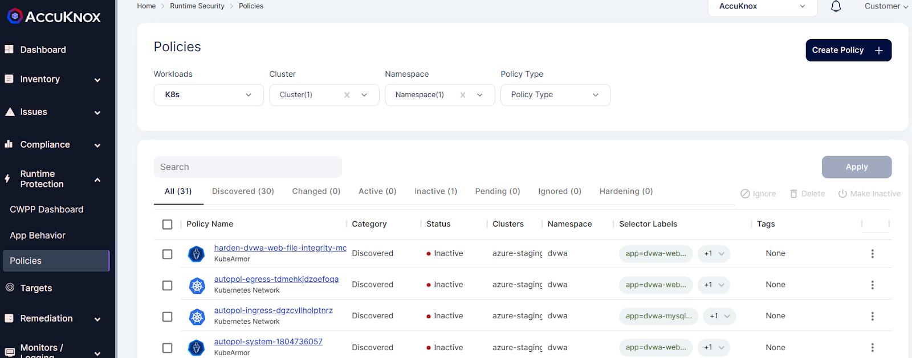
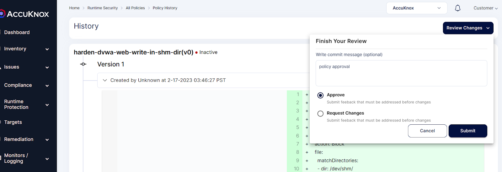
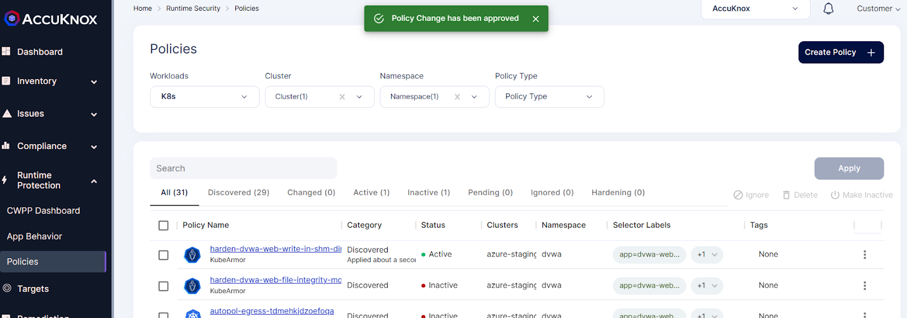

## **Policies:**

Policies section gives the user information about the runtime protection policies that are applied in the cluster. Policies are classified as Discovered, Active, inactive, Pending, Hardening and so on. We can see the policies based on the cluster, Namespace and policy type that we select in the filters shown in the page. We have option to see the policies related to particular namespace. Along with the discovered and Hardening policies users can also create custom policy by using the policy editor tool.

**Creating a custom Policy:**

**Step 1:** Users can create a custom policy by clicking the Create policy option the screen

**Step 2:** When user clicks the create policy option, user will be directed to the Policy editor screen

**Step 3:** Users can either upload their policy yaml file by clicking the upload yaml option or they can create the policy using editor tool. In this example, we are creating policy in the policy editor tool. For that user needs to fill Policy name, cluster to which policy must be applied, label of the pod to which policy must apply and tags and message. Then user needs to click Next option.

**Step 4:** when User clicks the Next option, the yaml code in the editor is updated the user given information.

**Step 5:** Now user needs to give the policy rule for Process/File/Network.  Once the user gives the rule and clicks save. The policy yaml will be updated.

**Step 6:** User needs to save the custom policy to the workspace by clicking save to workspace option.

**Step 7:**  Custom policy will be saved to the workspace.

**Applying Hardening policy:**

Users can follow this section to apply the hardening policies that are generated based on the workloads in the cluster.

**Step 1:** Select your cluster and namespace from this Policies screen.

**Step 2:** Selecting the below hardening policy to apply

**Step 3:** After applying the above hardening policy, it goes into pending state

**Step 4:** To make it active the user with admin privilege needs to give approval

**Step 5:**  After approval policy goes into active state. The hardening policy is applied successfully in the cluster.

- - -
[SCHEDULE DEMO](https://www.accuknox.com/contact-us){ .md-button .md-button--primary }
