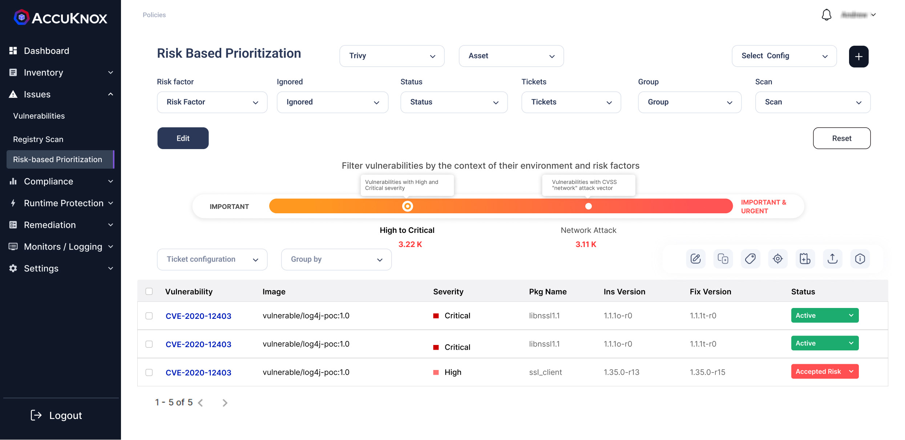
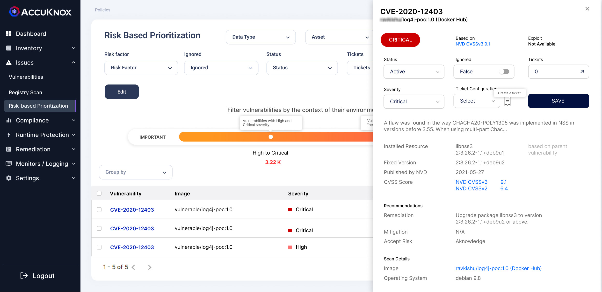

In this section, users will be given a comprehensive risk analysis that is found in their onboarded environment. The risks that are identified are classified as High to critical based on the severity of those risks. Users will get details about the risks associated with images, and their CVSS scores identified based on which source and severity of the risk. 

When a user clicks on the risk from the list, they will be getting more details related to the risks like the package associated with the risk. It also gives details related to the risks, the CVSS score of the risk, and the associated image where the risk is present.

 

 - - - 
[SCHEDULE DEMO](https://www.accuknox.com/contact-us){ .md-button .md-button--primary }