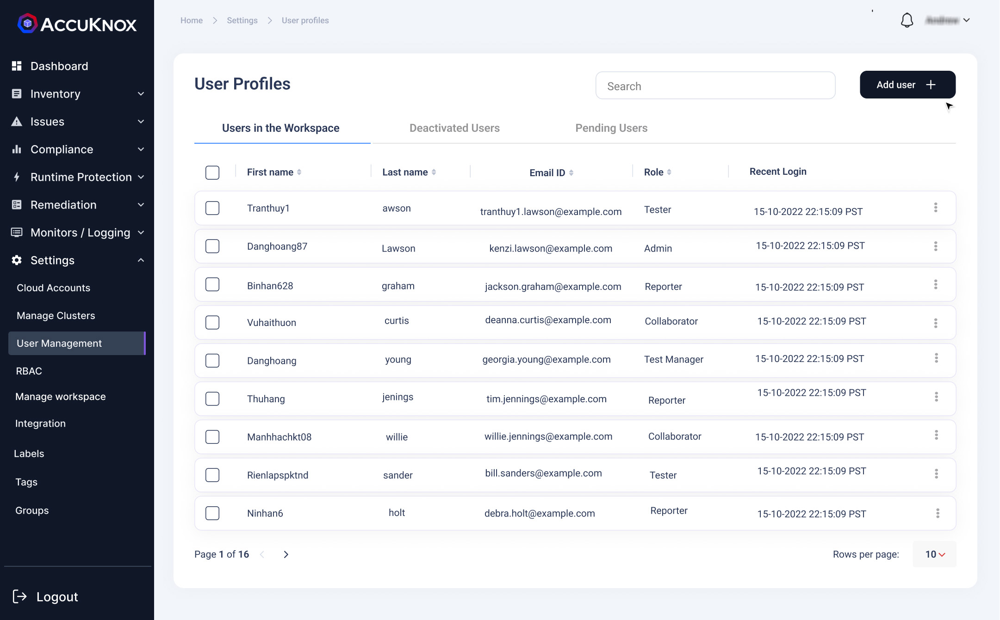
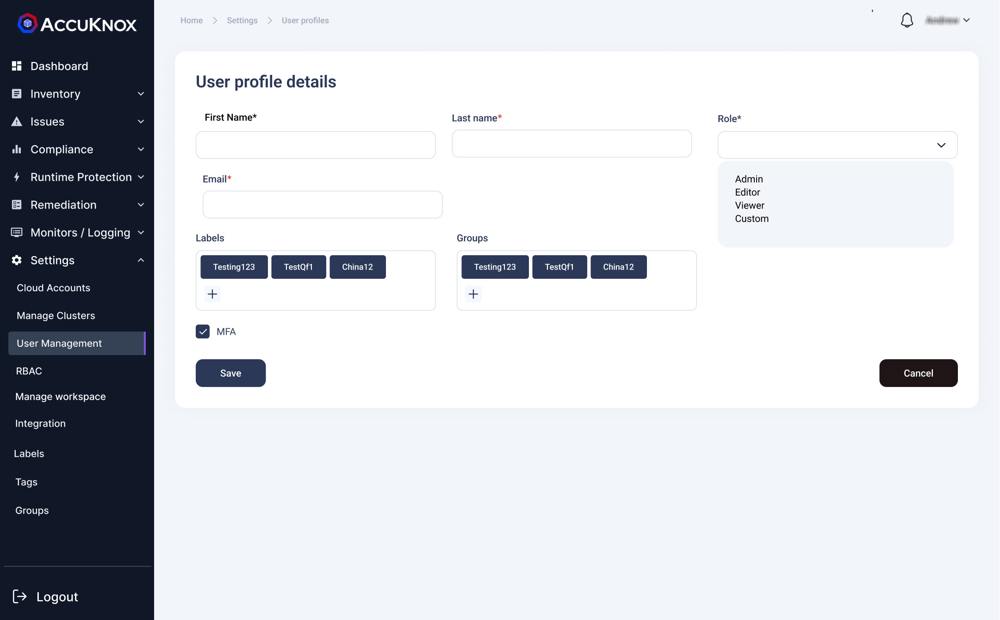
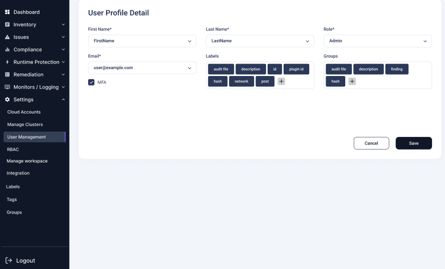
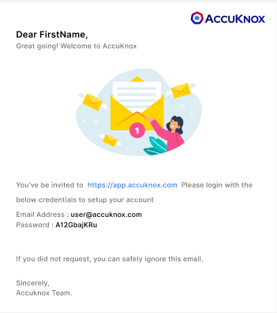
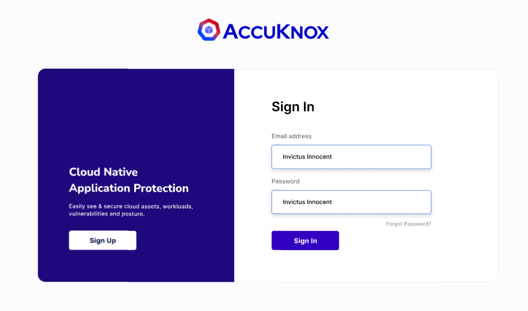
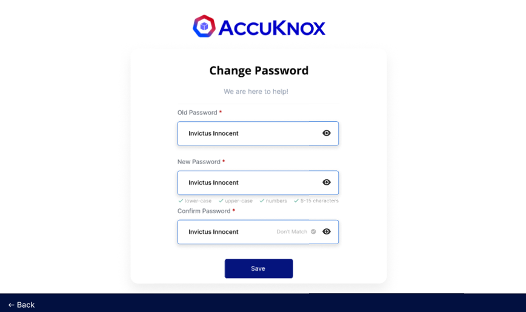
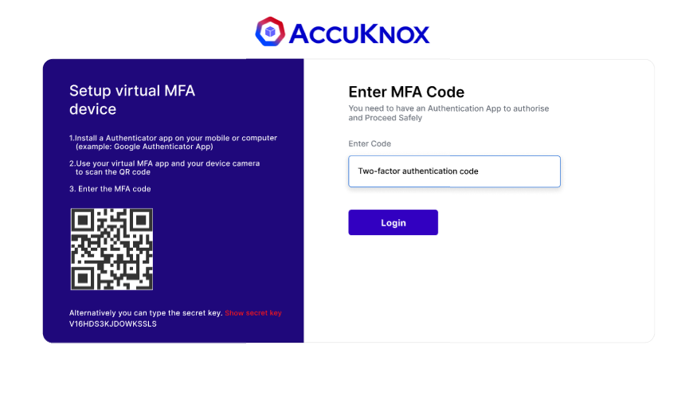
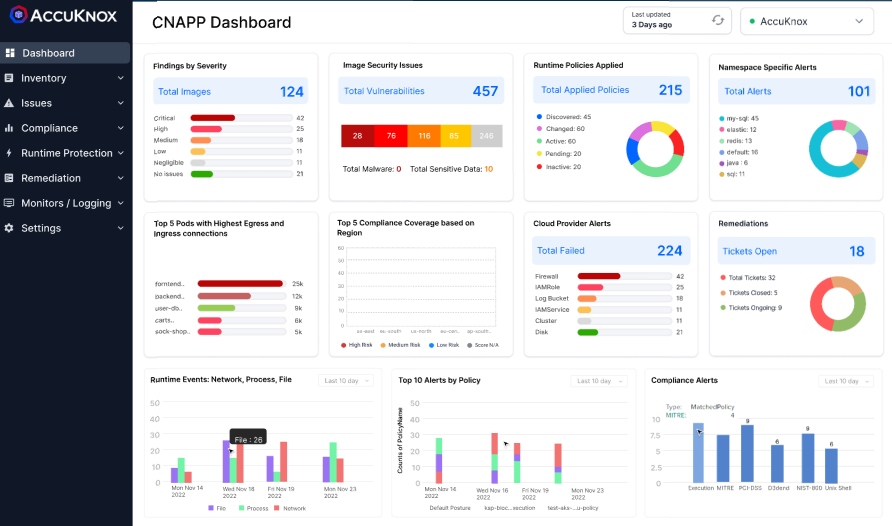

AccuKnox SaaS provides the ability to authenticate and authorize multiple users to access and utilize the Saas platform. Inside the user management section user can create profiles for other users and these profiles are displayed in form of a list. From the list, users can View Permissions, Edit, Deactivate, and delete user profiles. Permission is given to users by assigning roles while creating a user profile. These roles are created in the RBAC section. Deactivated users can be viewed under the Deactivated Users subsection. Creating a user sends an invite to their email id, invites that are not yet accepted are present inside the Pending Invites subsection.

**Inviting new user:**

**Step 1:** we can invite a new user to the tenant by clicking on the Add user option provided on the screen. In the below screen new user details need to be given for inviting him to this tenant id.

**Step 2:** Fill the necessary details for the user invite

**Step 3:** After we click save, the new user will be getting an user invite email with username, password and sign in link to the mentioned email id

**Step 4:** The user needs to sign in with the credentials provided in the email.

**Step 5:** After signing in user will be prompted to change password.

**Step 6:**  Once the password is changed, user will need to set MFA for his account using any Authenticator Application.

**Step 7:** After successful login user will be directed to the Dashboard screen.

- - -
[SCHEDULE DEMO](https://www.accuknox.com/contact-us){ .md-button .md-button--primary }
