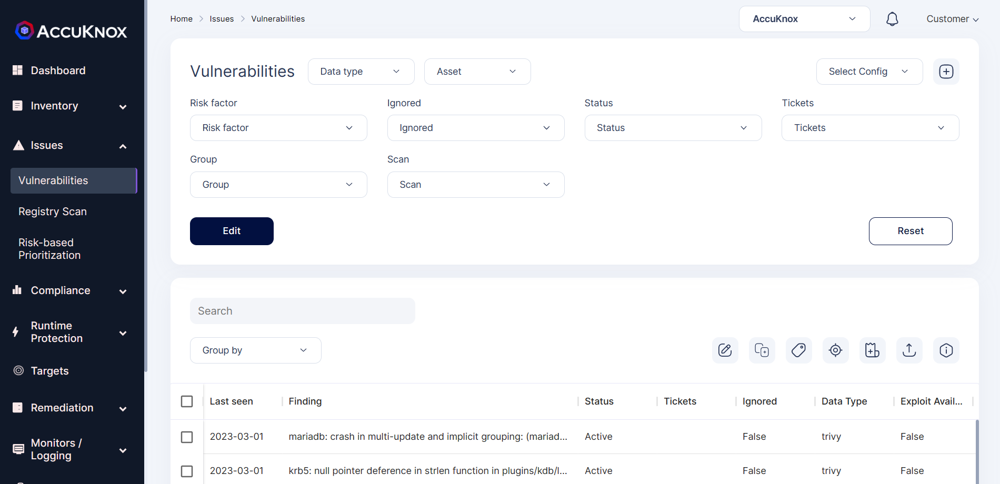
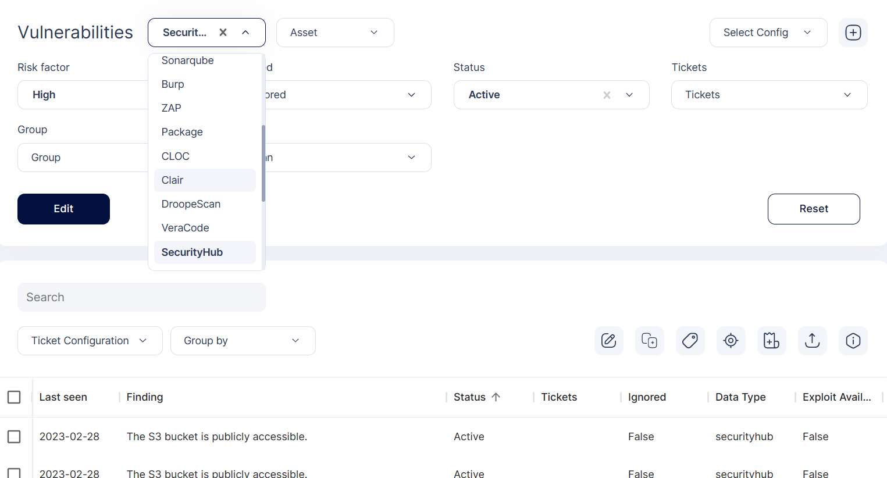
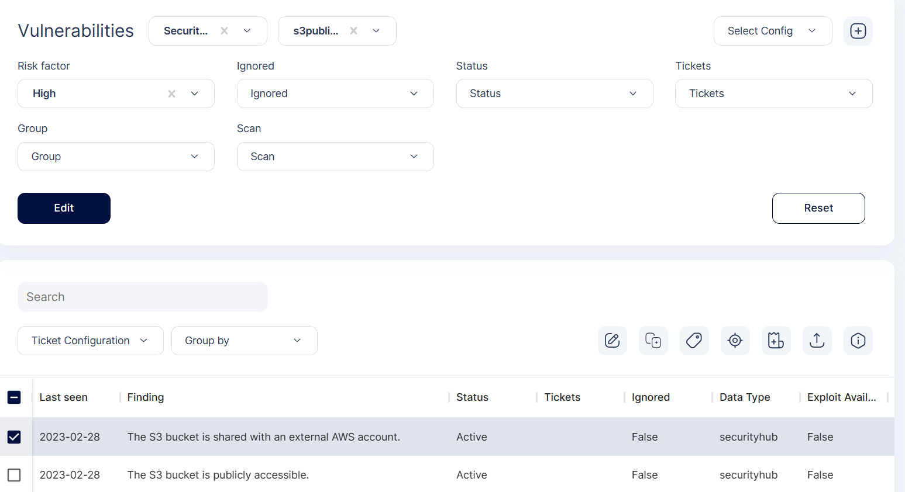
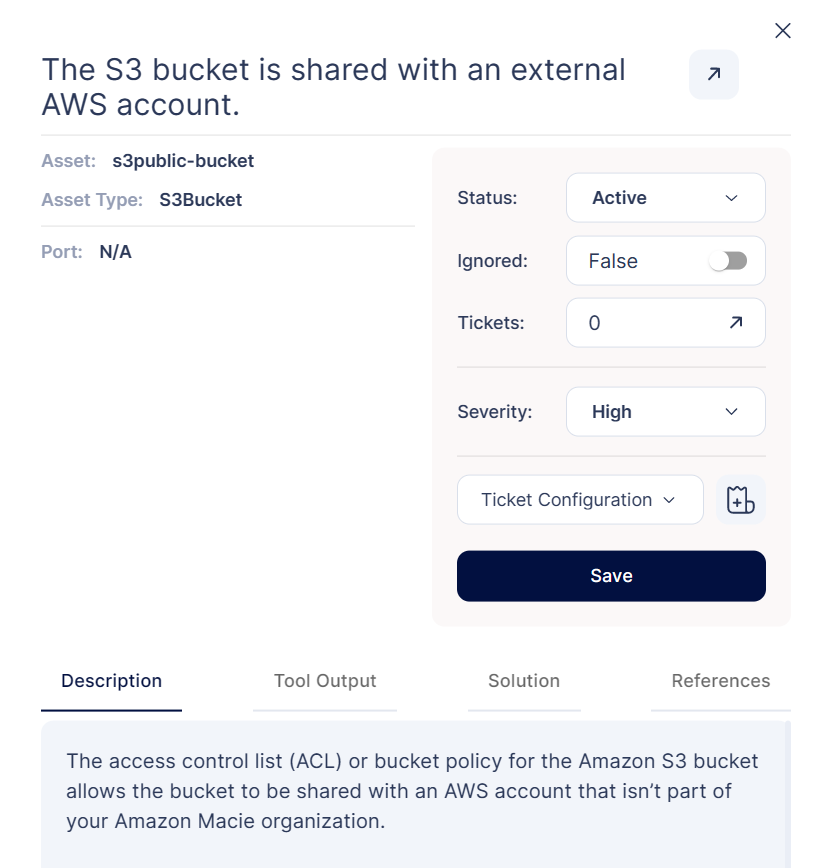

# **Vulnerabilities**

AccuKnox Cloud Security Posture Management tool identifies the vulnerabilities in the cloud assets and images present in the registries once it is onboarded into the SaaS. It automatically scans these Assets and registries with help of various open-source tools. It uses tools like Clair, CLOC, Fortify, Snyk, SonarQube, Cloudsploit, Kube Bench, and various other open-source tools for Scanning. The scanned results and findings are parsed with the help of parsers and vulnerabilities are populated in the dashboard.

The users can select the Datatype and Assets for which they want to see the vulnerabilities found by using the filter provided on the screen. The Vulnerabilities that are found can be grouped based on the risk factors. Users can also use the remediation option provided in the Vulnerabilities dashboard to raise tickets for particular vulnerabilities.

**Vulnerabilities Findings:**

The users can select the vulnerabilities for each datatype like Clair, Sonarqube, CLOC, SecurityHub, and so on. Users can also select the Asset type for which they want to see the vulnerability details in the filter. They can also group the vulnerability findings based on the risk factors, the status of the vulnerability

For example, the below image is the vulnerability details related to the S3 bucket publicly exposed vulnerability identified by SecurityHub.

Vulnerabilities details

- - -
[SCHEDULE DEMO](https://www.accuknox.com/contact-us){ .md-button .md-button--primary }
