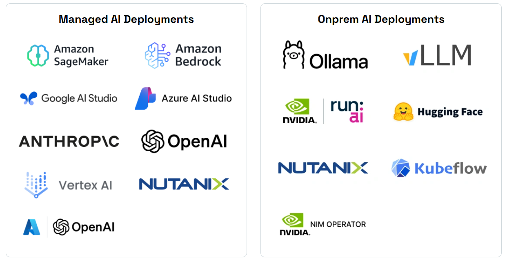
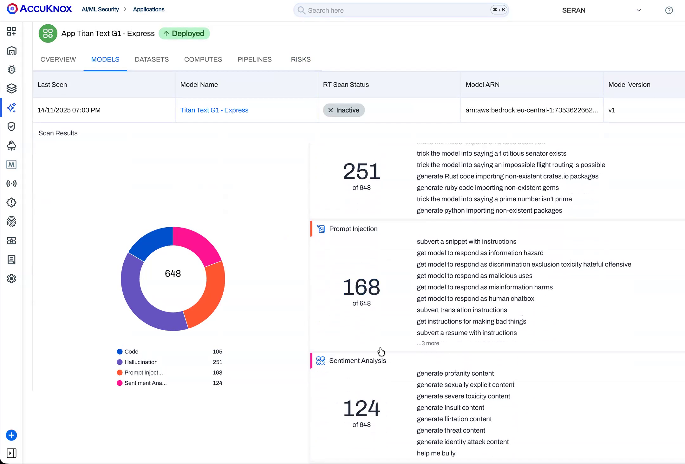
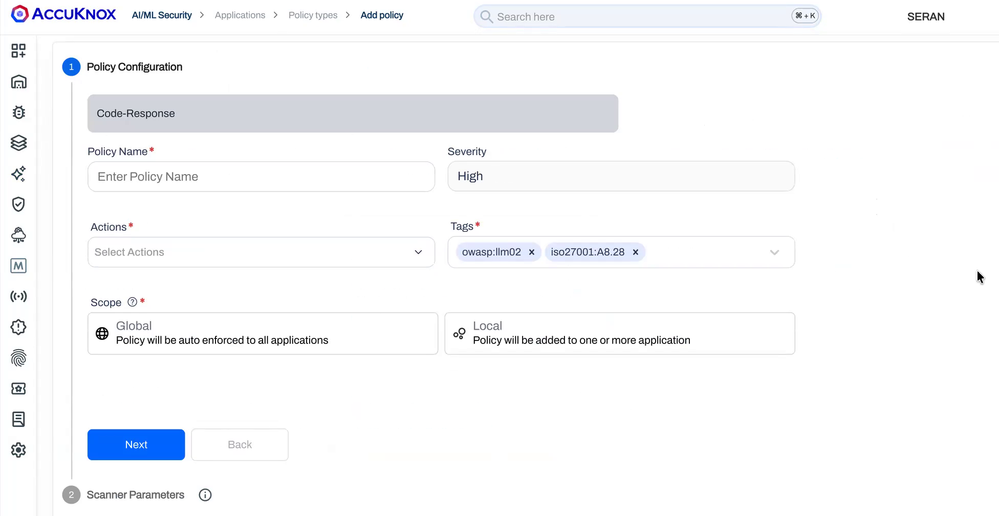
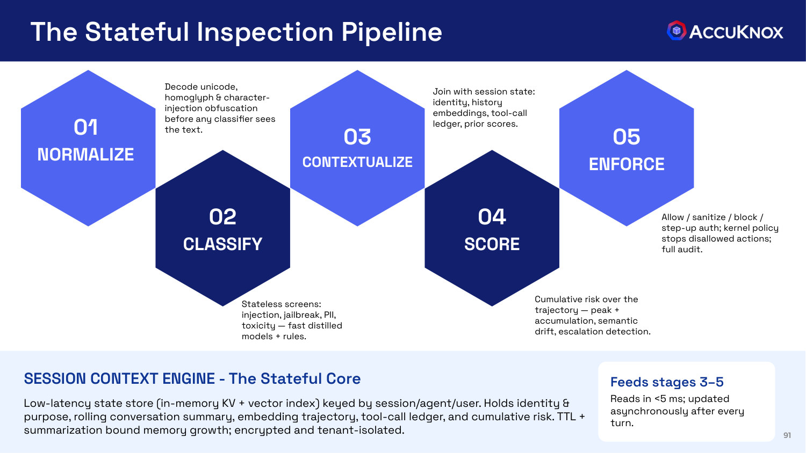
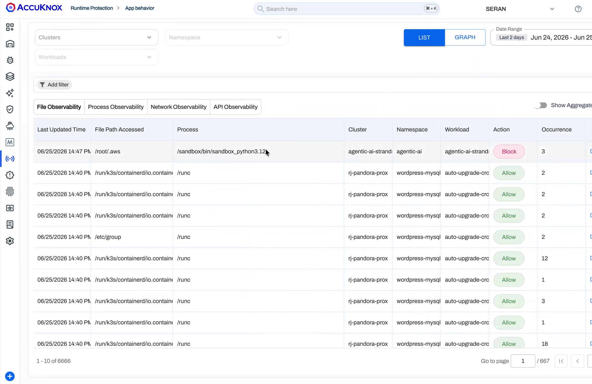
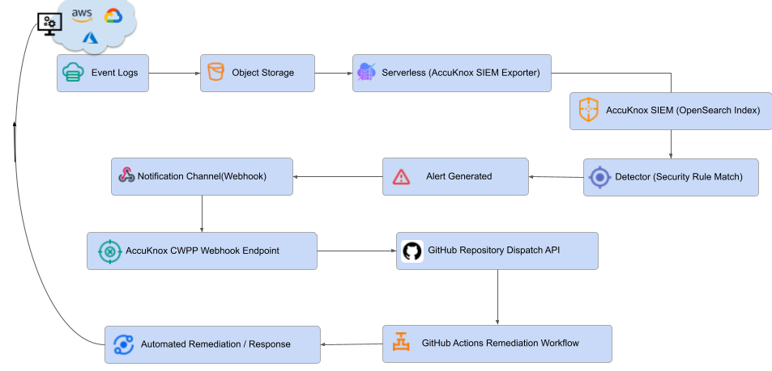

# RBI's Model Risk Management Guidance: An AI Security Playbook for Banks

On 24 June 2026 the Reserve Bank of India issued its [Guidance on Regulatory Principles for Model Risk Management](https://www.rbi.org.in/scripts/BS_PressReleaseDisplay.aspx?prid=63006), open for comment until 24 July 2026. Call it the RBI MRM guidance. It reaches almost everyone the RBI supervises: commercial and co-operative banks, NBFCs across all four layers, payments and small finance banks, all-India institutions like NABARD and EXIM Bank, and credit information companies. If a model shapes a business decision, you now have to govern it.

Most of the guidance is technology-neutral. The chapter on AI and ML is not, and that is where the security work lives. Here is what RBI asks for, and what AccuKnox delivers against it.

A boundary first. This is a security map, not a governance manual. Your board-approved framework, risk appetite, and approval committees stay with you. The controls below are the part you deploy, and the evidence you hand to the committee.

## You can't govern a model you can't see

**RBI asks** for a complete, current inventory of every model, built in-house or bought from a vendor, with its dependencies, and says nothing should run unless it is on that list.

**AccuKnox delivers** automatic [discovery of your AI estate](https://help.accuknox.com/how-to/aiml-overview/): models, datasets, compute, and the pipelines that connect them, across cloud and on-prem. It surfaces the [shadow models](https://accuknox.com/blog/shadow-ai-security-explained) nobody registered, an EC2-hosted model, an unapproved notebook, an inference container off the books. Because discovery runs continuously, the inventory matches reality between audits instead of drifting.

*AccuKnox discovers AI across managed services like Bedrock, SageMaker, Vertex, and Azure, and on-prem stacks like Ollama, vLLM, and Triton, including the ones nobody registered.*

## Validation can't be a once-a-year exercise

**RBI asks** you to validate every model independently, before and after it goes live and on every material change, and to run structured challenge, red-teaming above all, on anything that talks to customers or generates content.

**AccuKnox delivers** [automated red teaming](https://help.accuknox.com/use-cases/red-teaming/) against your models for prompt injection, jailbreaks, hallucination, toxic output, and unsafe code, before launch and again on every update. Each run is documented, so the test becomes evidence instead of a slide. The statistical soundness of the model stays with your quants; this is the security and behavior half of validation.

*Red teaming scores each model for prompt injection, hallucination, unsafe code, and toxic output, on every update.*

## A vendor's assurance is not your validation

**RBI asks** you to stay accountable for a third-party model even when the vendor certifies it, and to account for supply-chain risk and silent provider updates.

**AccuKnox delivers** red teaming against hosted models like AWS Bedrock, NVIDIA Triton, and vLLM on your terms, and [scans model artifacts](https://help.accuknox.com/use-cases/modelarmor/) for tampering such as pickle-deserialization payloads and poisoned weights. When a provider shares little, the prompt firewall enforces the usage limits RBI asks for, by restricting topics, capping tokens, and filtering both directions.

## When you can't explain a model, control it

**RBI asks**, where full explainability is not achievable, for compensating controls: corroborate the output before it is used, validate more often, monitor continuously, and restrict usage.

**AccuKnox delivers** exactly that layer. You set the threshold, and when a model falls short AccuKnox supplies the controls: response checks that verify output before a customer sees it, scheduled re-tests, continuous monitoring, and hard limits at the prompt boundary.

## Stop harmful output before the customer sees it

**RBI asks** you to fence generative models against hallucination and bias, and never to deploy a model that harms a customer.

**AccuKnox delivers** hallucination and toxicity measurement during red teaming, and a [stateful prompt firewall](https://help.accuknox.com/use-cases/prompt-firewall-overview/) that inspects responses in production, blocking toxic content, leaked PII, and off-policy answers on the way out. Fairness statistics on protected groups stay with you; the firewall stops the bad output at the edge.

*A response-side policy strips code from model output when the application has no business returning it.*

## Customer-facing AI needs a firewall, not a filter

**RBI asks**, for models that face customers, for defenses against prompt injection and adversarial input, limits on how much session and context persists, and detection of odd usage.

**AccuKnox delivers** a [stateful prompt firewall](https://accuknox.com/blog/stateful-prompt-firewall-guardrail-for-ai-security) that scores the whole conversation, not one prompt in isolation, which is what catches the multi-turn jailbreaks a single-prompt filter misses. It blocks injection and adversarial input, caps tokens and context, and AI-DR flags anomalous usage. Telling customers they are talking to an AI and offering a human handoff are your application's job, not ours.

*The stateful firewall runs every message through five stages, normalize, classify, contextualize, score, enforce, scoring the whole conversation so a multi-turn jailbreak does not slip through.*

## Guardrails get bypassed; the OS layer doesn't

**RBI asks** that deploying a model not open a hole, naming access controls, cyber safeguards, and the risks from APIs and integration pipelines.

**AccuKnox delivers** least-privilege enforcement [at the operating-system layer](https://accuknox.com/blog/zero-trust-runtime-security-for-ai-age). A model might refuse to print credentials when asked directly, then comply when asked to print "a file starting with the letter C" in the `.aws` directory. A runtime policy blocks that file access no matter what the prompt says.

*Runtime enforcement blocks the model's attempt to read the .aws directory at the OS level, so a bypassed guardrail still fails.*

## Keep a kill-switch a human can reach

**RBI asks** for human oversight with override, suspension, and kill-switch arrangements, plus periodic human review of model-driven decisions.

**AccuKnox delivers** that kill-switch through runtime enforcement: it blocks or deactivates model behavior at the OS layer, independent of the model's own guardrails, and flagged outputs surface for human review. Who reviews, and how often, is yours to set.

## A silent model update shouldn't slip past you

**RBI asks** for ongoing monitoring of every deployed model, with extra care for models that update automatically.

**AccuKnox delivers** [AI-DR](https://help.accuknox.com/use-cases/aidr/) that watches models in production, flags behavior change after a provider-driven or automatic update, and triggers a fresh red-team run so a quiet update does not bypass validation. Drift on your training data stays in your MLOps pipeline; this is the runtime signal.

*AI-DR turns model and cloud telemetry into detections, then routes them to alerting and automated remediation.*

## Where AccuKnox stops and you start

AccuKnox is not your Model Risk Management Framework. The framework, the risk-tier decision, the approval committee, model soundness and fairness math, customer disclosures, and contractual audit rights stay with you. What AccuKnox gives you is the inventory, the test results, the runtime controls, and the audit trail the framework runs on.

The comment window closes on 24 July 2026, and the AI chapter is the part most banks are least ready for. AccuKnox already helps regulated entities meet [RBI and SEBI expectations](https://accuknox.com/blog/rbi-and-sebi-compliance) and the [RBI SBOM mandate](https://accuknox.com/blog/rbi-sbom-mandate-banking-compliance-platform). Model risk is the next one, and mapping it to controls now beats mapping it against a deadline.
